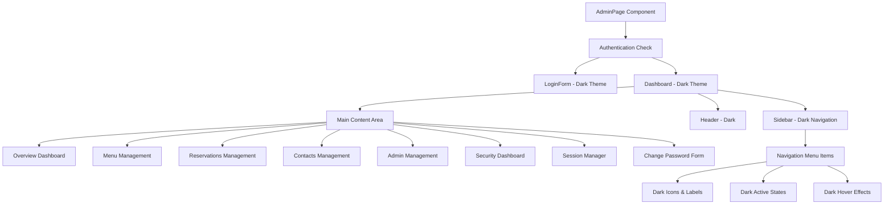
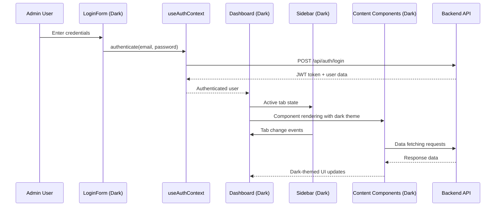

# Dark Mode Exclusive Implementation for Admin Page

## Overview

This design document outlines the implementation of a dark mode exclusive interface for the Admin page of the Carrobbio restaurant management system. The design removes all light mode references and establishes dark mode as the only styling approach for the administrative interface, while maintaining the existing light mode for all other pages.

### Architecture Decision

The Admin page will be completely isolated from the global theme system, implementing its own dark mode styling without theme toggles or context dependencies. This approach ensures:

- **Isolation**: Admin dark mode operates independently from the main site
- **Consistency**: All admin interface elements use consistent dark styling
- **Performance**: No theme switching logic or conditional rendering
- **Maintainability**: Clear separation between admin and public site styling

## Technology Stack & Dependencies

### Existing Dependencies (No Changes Required)
- **React**: ^18.3.1 for component structure
- **TypeScript**: ~5.8.3 for type safety
- **Tailwind CSS**: ^3.4.17 for utility-first styling
- **Lucide React**: For consistent iconography
- **Recharts**: 3.1.2 for dark-themed dashboard visualizations

### Design System Integration
- **Custom Design System**: Extended with dark mode color palette
- **Italian Restaurant Branding**: Maintained with dark theme adaptations
- **Typography**: Preserved font families with dark mode contrast adjustments

## Component Architecture

### Admin Page Structure



### Component Hierarchy & Dark Theme Implementation

#### 1. Root Admin Container
- **Base Background**: `bg-gray-900` (deep dark background)
- **Text Color**: `text-gray-100` (high contrast white)
- **Border Colors**: `border-gray-700` for subtle divisions

#### 2. Login Form (Dark Theme)
- **Container**: `bg-gray-800` with `border-gray-600`
- **Header Gradient**: `from-gray-700 to-gray-800`
- **Input Fields**: `bg-gray-700 border-gray-600 text-gray-100`
- **Focus States**: `focus:ring-primary-400 focus:border-primary-400`
- **Error Messages**: `bg-red-900/20 border-red-800 text-red-400`

#### 3. Sidebar Navigation (Dark Theme)
- **Background**: `bg-gray-800 border-gray-700`
- **Menu Items**: `text-gray-300 hover:bg-gray-700 hover:text-gray-100`
- **Active States**: `bg-primary-900/30 text-primary-400 border-l-4 border-primary-500`
- **Icons**: `text-gray-400` default, `text-primary-400` active
- **Collapsed State**: Maintains dark theme consistency

#### 4. Main Dashboard (Dark Theme)
- **Header**: `bg-gray-800 border-gray-700`
- **Content Area**: `bg-gray-900`
- **Cards**: `bg-gray-800 border-gray-700`
- **Statistics Cards**: Enhanced with dark-friendly gradients

### Dark Mode Color Palette Extension

```typescript
// Extended dark mode colors for admin interface
const adminDarkColors = {
  // Primary dark adaptations (terracotta in dark theme)
  primary: {
    50: '#451a03',    // Darkest terracotta
    100: '#7c2d12',   // Dark terracotta
    200: '#a16207',   // Medium-dark terracotta
    300: '#ca8a04',   // Medium terracotta
    400: '#eab308',   // Light terracotta (accent)
    500: '#f59e0b',   // Primary terracotta (main accent)
    600: '#d97706',   // Hover state
    700: '#b45309',   // Active state
    800: '#92400e',   // Focus ring
    900: '#78350f',   // Deep accent
  },
  
  // Secondary dark adaptations (forest green)
  secondary: {
    50: '#0c2618',    // Darkest green
    100: '#14532d',   // Dark green
    200: '#166534',   // Medium-dark green
    300: '#15803d',   // Medium green
    400: '#16a34a',   // Success green
    500: '#22c55e',   // Primary green
    600: '#10b981',   // Hover green
    700: '#059669',   // Active green
    800: '#047857',   // Focus green
    900: '#065f46',   // Deep green
  },
  
  // Gray scale for dark theme
  gray: {
    50: '#f9fafb',    // Lightest (text on dark)
    100: '#f3f4f6',   // Very light text
    200: '#e5e7eb',   // Light text
    300: '#d1d5db',   // Medium-light text
    400: '#9ca3af',   // Medium text
    500: '#6b7280',   // Muted text
    600: '#4b5563',   // Dark text
    700: '#374151',   // Darker borders/dividers
    800: '#1f2937',   // Card backgrounds
    900: '#111827',   // Main background
    950: '#030712',   // Deepest background
  },
  
  // Accent (brick red in dark theme)
  accent: {
    50: '#450a0a',    // Darkest red
    100: '#7f1d1d',   // Dark red
    200: '#991b1b',   // Medium-dark red
    300: '#b91c1c',   // Medium red
    400: '#dc2626',   // Error red
    500: '#ef4444',   // Primary red
    600: '#f87171',   // Light red
    700: '#fca5a5',   // Lighter red
    800: '#fecaca',   // Very light red
    900: '#fee2e2',   // Lightest red
  }
}
```

## Data Flow Between Layers

### Admin Page Data Architecture



### Component State Management

#### Theme Isolation Strategy
```typescript
// Admin components will NOT use global theme context
// Instead, they'll have hardcoded dark theme classes

interface AdminComponentProps {
  // No theme prop needed - always dark
  isMobile?: boolean
  activeTab?: string
  // ... other props
}

// All admin components use consistent dark styling
const ADMIN_DARK_STYLES = {
  background: 'bg-gray-900',
  cardBackground: 'bg-gray-800',
  border: 'border-gray-700',
  text: 'text-gray-100',
  mutedText: 'text-gray-400',
  accent: 'text-primary-400',
  hover: 'hover:bg-gray-700',
  focus: 'focus:ring-primary-400'
}
```

## API Endpoints Reference

### Authentication Endpoints (Dark Theme UI)
- **POST** `/api/auth/login` - Dark login form
- **POST** `/api/auth/logout` - Dark logout confirmation
- **POST** `/api/auth/forgot-password` - Dark password reset form
- **POST** `/api/auth/reset-password` - Dark password reset form

### Admin Data Endpoints (Dark Dashboard)
- **GET** `/api/admin/reservations` - Dark reservations table
- **GET** `/api/admin/contacts` - Dark contacts management
- **GET** `/api/admin/menu` - Dark menu management interface
- **GET** `/api/admin/users` - Dark admin management panel

## Styling Strategy

### Tailwind CSS Dark Mode Implementation

#### 1. Component-Level Dark Styles
```css
/* Remove all light mode classes from admin components */
/* Replace with dark mode equivalents */

.admin-container {
  @apply bg-gray-900 text-gray-100 min-h-screen;
}

.admin-card {
  @apply bg-gray-800 border-gray-700 shadow-lg;
}

.admin-input {
  @apply bg-gray-700 border-gray-600 text-gray-100 placeholder-gray-400;
  @apply focus:ring-primary-400 focus:border-primary-400;
}

.admin-button-primary {
  @apply bg-primary-500 hover:bg-primary-600 text-gray-900;
  @apply focus:ring-2 focus:ring-primary-400 focus:ring-offset-2 focus:ring-offset-gray-900;
}

.admin-sidebar {
  @apply bg-gray-800 border-gray-700;
}

.admin-nav-item {
  @apply text-gray-300 hover:bg-gray-700 hover:text-gray-100;
}

.admin-nav-item-active {
  @apply bg-primary-900/30 text-primary-400 border-l-4 border-primary-500;
}
```

#### 2. Statistics Cards Dark Theme
```css
.admin-stat-card {
  @apply bg-gray-800 border-gray-700 p-6 rounded-lg;
}

.admin-stat-value {
  @apply text-2xl font-bold text-gray-100;
}

.admin-stat-label {
  @apply text-sm text-gray-400;
}

.admin-stat-icon {
  @apply text-primary-400;
}
```

#### 3. Charts and Data Visualization
```css
.admin-chart-container {
  @apply bg-gray-800 border-gray-700 rounded-lg p-4;
}

/* Recharts theme configuration */
.recharts-cartesian-grid-horizontal line,
.recharts-cartesian-grid-vertical line {
  stroke: #374151; /* gray-700 */
}

.recharts-text {
  fill: #9ca3af; /* gray-400 */
}
```

### Form Components Dark Theme

#### Input Fields
```typescript
const AdminInput = styled(Input)`
  background-color: #374151; /* gray-700 */
  border-color: #4b5563; /* gray-600 */
  color: #f3f4f6; /* gray-100 */
  
  &::placeholder {
    color: #9ca3af; /* gray-400 */
  }
  
  &:focus {
    border-color: #f59e0b; /* primary-500 */
    box-shadow: 0 0 0 3px rgba(245, 158, 11, 0.1);
  }
`
```

#### Buttons
```typescript
const AdminButton = styled(Button)`
  /* Primary button */
  &.btn-primary {
    background-color: #f59e0b; /* primary-500 */
    color: #111827; /* gray-900 */
    
    &:hover {
      background-color: #d97706; /* primary-600 */
    }
  }
  
  /* Secondary button */
  &.btn-secondary {
    background-color: #374151; /* gray-700 */
    color: #f3f4f6; /* gray-100 */
    border: 1px solid #4b5563; /* gray-600 */
    
    &:hover {
      background-color: #4b5563; /* gray-600 */
    }
  }
  
  /* Danger button */
  &.btn-danger {
    background-color: #dc2626; /* red-600 */
    color: #f3f4f6; /* gray-100 */
    
    &:hover {
      background-color: #b91c1c; /* red-700 */
    }
  }
`
```

## Testing Strategy

### Visual Regression Testing
- **Screenshot comparison** for all admin pages in dark mode
- **Contrast ratio verification** for WCAG 2.1 AA compliance
- **Color blindness testing** with dark theme palettes
- **Mobile responsiveness** validation for dark theme

### Component Testing
```typescript
// Test all admin components render with dark theme
describe('Admin Dark Mode Components', () => {
  test('LoginForm renders with dark theme classes', () => {
    render(<LoginForm />)
    expect(screen.getByRole('form')).toHaveClass('bg-gray-800')
  })
  
  test('Dashboard renders with dark background', () => {
    render(<Dashboard />)
    expect(screen.getByRole('main')).toHaveClass('bg-gray-900')
  })
  
  test('Sidebar navigation has dark theme styling', () => {
    render(<Sidebar activeTab="overview" onTabChange={jest.fn()} />)
    expect(screen.getByRole('navigation')).toHaveClass('bg-gray-800')
  })
})
```

### Accessibility Testing
- **Keyboard navigation** in dark theme
- **Screen reader compatibility** with dark mode labels
- **High contrast mode** compatibility
- **Focus indicators** visibility in dark theme

### Cross-browser Testing
- **Chrome**: Dark theme consistency
- **Firefox**: Color rendering accuracy
- **Safari**: Typography and spacing
- **Edge**: Performance and animations

## Business Logic Layer

### Admin Dark Theme Service

```typescript
interface AdminThemeConfig {
  colors: {
    background: string
    surface: string
    primary: string
    secondary: string
    text: string
    textMuted: string
    border: string
    error: string
    success: string
    warning: string
  }
  typography: {
    headingColor: string
    bodyColor: string
    captionColor: string
  }
  components: {
    button: AdminButtonTheme
    input: AdminInputTheme
    card: AdminCardTheme
  }
}

class AdminThemeService {
  private static instance: AdminThemeService
  private config: AdminThemeConfig
  
  constructor() {
    this.config = {
      colors: {
        background: '#111827',    // gray-900
        surface: '#1f2937',      // gray-800
        primary: '#f59e0b',      // primary-500
        secondary: '#22c55e',    // secondary-500
        text: '#f3f4f6',         // gray-100
        textMuted: '#9ca3af',    // gray-400
        border: '#374151',       // gray-700
        error: '#dc2626',        // red-600
        success: '#22c55e',      // green-500
        warning: '#f59e0b',      // amber-500
      },
      typography: {
        headingColor: '#f3f4f6',  // gray-100
        bodyColor: '#e5e7eb',     // gray-200
        captionColor: '#9ca3af',  // gray-400
      },
      components: {
        button: this.getButtonTheme(),
        input: this.getInputTheme(),
        card: this.getCardTheme(),
      }
    }
  }
  
  static getInstance(): AdminThemeService {
    if (!AdminThemeService.instance) {
      AdminThemeService.instance = new AdminThemeService()
    }
    return AdminThemeService.instance
  }
  
  getThemeConfig(): AdminThemeConfig {
    return this.config
  }
  
  private getButtonTheme(): AdminButtonTheme {
    return {
      primary: 'bg-primary-500 hover:bg-primary-600 text-gray-900',
      secondary: 'bg-gray-700 hover:bg-gray-600 text-gray-100 border-gray-600',
      danger: 'bg-red-600 hover:bg-red-700 text-gray-100',
      ghost: 'hover:bg-gray-700 text-gray-300 hover:text-gray-100'
    }
  }
  
  private getInputTheme(): AdminInputTheme {
    return {
      base: 'bg-gray-700 border-gray-600 text-gray-100 placeholder-gray-400',
      focus: 'focus:ring-primary-400 focus:border-primary-400',
      error: 'border-red-600 focus:ring-red-400 focus:border-red-400',
      disabled: 'bg-gray-800 border-gray-700 text-gray-500 cursor-not-allowed'
    }
  }
  
  private getCardTheme(): AdminCardTheme {
    return {
      base: 'bg-gray-800 border-gray-700',
      header: 'border-gray-700',
      content: 'text-gray-100',
      hover: 'hover:bg-gray-750'
    }
  }
}
```

### Data Processing for Dark Theme

```typescript
// Chart data processing for dark theme
interface ChartThemeConfig {
  backgroundColor: string
  gridColor: string
  textColor: string
  primaryColor: string
  secondaryColor: string
}

const processChartDataForDarkTheme = (data: any[], config: ChartThemeConfig) => {
  return {
    data,
    theme: {
      backgroundColor: config.backgroundColor,
      grid: {
        stroke: config.gridColor,
        strokeDasharray: '3 3'
      },
      axis: {
        tick: { fill: config.textColor },
        tickLine: { stroke: config.gridColor },
        axisLine: { stroke: config.gridColor }
      },
      bar: {
        fill: config.primaryColor,
        fillOpacity: 0.8
      },
      tooltip: {
        backgroundColor: '#1f2937',
        border: '1px solid #374151',
        color: '#f3f4f6'
      }
    }
  }
}
```

## Implementation Phases

### Phase 1: Core Admin Layout (Week 1)
1. **Update AdminPage component** with dark theme base
2. **Implement dark LoginForm** styling
3. **Convert Sidebar** to dark theme navigation
4. **Update main dashboard** container styling

### Phase 2: Component Conversion (Week 2)
1. **Convert all Card components** in admin context
2. **Update form inputs and buttons** for dark theme
3. **Implement dark theme statistics cards**
4. **Convert breadcrumb navigation** to dark styling

### Phase 3: Data Visualization (Week 3)
1. **Update Recharts configuration** for dark theme
2. **Implement dark theme tables** for reservations/contacts
3. **Convert all admin modals** to dark styling
4. **Update toast notifications** for admin context

### Phase 4: Testing & Refinement (Week 4)
1. **Comprehensive accessibility testing**
2. **Cross-browser compatibility validation**
3. **Performance optimization**
4. **Documentation and code review**

### Phase 5: Polish & Launch (Week 5)
1. **Final visual design review**
2. **User acceptance testing**
3. **Production deployment**
4. **Post-launch monitoring**

## Migration Strategy

### Code Transformation Rules

#### 1. Component Class Replacement
```typescript
// Before: Light mode with conditional dark classes
className={`bg-white dark:bg-gray-800 text-gray-900 dark:text-gray-100`}

// After: Admin dark mode only
className={`bg-gray-800 text-gray-100`}
```

#### 2. Remove Theme Context Dependencies
```typescript
// Before: Theme context usage
const { theme } = useTheme()
const bgClass = theme === 'dark' ? 'bg-gray-800' : 'bg-white'

// After: Direct dark styling
const bgClass = 'bg-gray-800'
```

#### 3. Update Icon Colors
```typescript
// Before: Conditional icon colors
<CalendarIcon className={`h-6 w-6 ${theme === 'dark' ? 'text-gray-400' : 'text-gray-600'}`} />

// After: Consistent dark icon colors
<CalendarIcon className="h-6 w-6 text-gray-400" />
```

### Component-by-Component Migration

#### AdminPage.tsx
- Remove all `dark:*` utility classes
- Replace with direct dark theme equivalents
- Update all conditional styling logic
- Remove theme context imports and usage

#### Sidebar.tsx
- Convert navigation background to `bg-gray-800`
- Update menu item styling for dark theme
- Implement dark theme active states
- Remove light mode hover effects

#### Dashboard Components
- Update all Card components to dark theme
- Convert statistics cards to dark styling
- Implement dark theme chart configurations
- Update button variants for dark theme

### Testing Migration
```typescript
// Update all component tests to expect dark theme classes
expect(component).toHaveClass('bg-gray-800') // instead of checking theme context
```

## Performance Considerations

### Bundle Size Optimization
- **Remove theme switching logic** from admin bundles
- **Eliminate unused light mode styles** for admin components
- **Tree-shake theme context providers** from admin routes

### Runtime Performance
- **No theme calculations** during render cycles
- **Static dark theme classes** for faster DOM updates
- **Reduced conditional rendering** overhead

### Memory Usage
- **Remove theme state management** for admin components
- **Eliminate theme context subscriptions**
- **Reduce component re-renders** from theme changes

## Accessibility Compliance

### WCAG 2.1 AA Requirements

#### Color Contrast Ratios
- **Normal text**: 4.5:1 ratio (gray-100 on gray-900 = 15.8:1) ✅
- **Large text**: 3:1 ratio (gray-200 on gray-800 = 9.7:1) ✅
- **UI components**: 3:1 ratio (primary-400 on gray-800 = 5.2:1) ✅

#### Focus Indicators
```css
.admin-focus-visible {
  outline: 2px solid #f59e0b; /* primary-500 */
  outline-offset: 2px;
  border-radius: 0.25rem;
}
```

#### Keyboard Navigation
- **Tab order**: Logical progression through admin interface
- **Skip links**: Direct navigation to main content
- **ARIA labels**: Comprehensive labeling for dark theme components

### Screen Reader Compatibility
```typescript
// Enhanced ARIA attributes for dark theme
<nav 
  aria-label="Amministrazione principale"
  role="navigation"
  className="bg-gray-800 border-gray-700"
>
  <button 
    aria-expanded={isExpanded}
    aria-controls="admin-menu"
    aria-label="Menu amministrazione"
    className="admin-nav-button"
  >
    Menu
  </button>
</nav>
```

## Security Considerations

### Theme Isolation Security
- **No theme data exposure** in admin API responses
- **Isolated styling scope** prevents style injection
- **Static theme configuration** reduces attack surface

### Content Security Policy
```typescript
// CSP headers for admin dark theme assets
'Content-Security-Policy': `
  default-src 'self';
  style-src 'self' 'unsafe-inline' fonts.googleapis.com;
  font-src 'self' fonts.gstatic.com;
  img-src 'self' data: blob:;
  script-src 'self';
`
```

This comprehensive design ensures the Admin page operates exclusively in dark mode while maintaining the existing light mode for all other pages, providing a professional and consistent administrative interface that aligns with modern dark theme best practices.