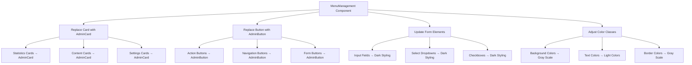
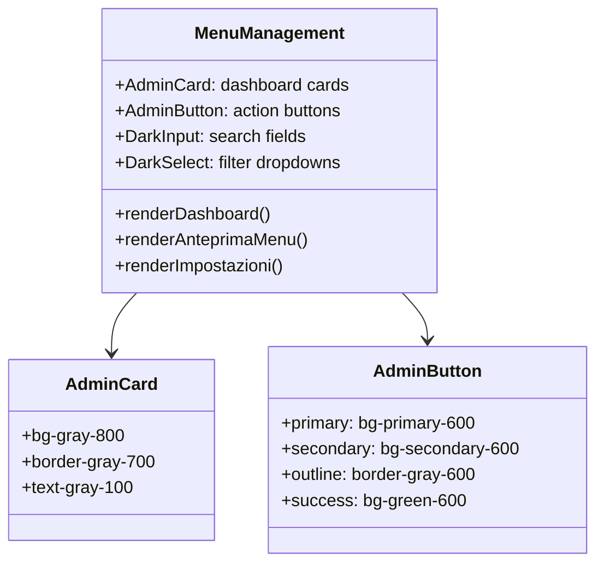

# Admin Menu Dark Theme Implementation

## Overview

This design document outlines the implementation of a complete dark theme for the Admin page's Menu section, eliminating all remaining white areas and ensuring full consistency with the dark color palette. Additionally, it ensures the complete removal of the navbar from the Admin page.

## Current State Analysis

### Existing Dark Theme Infrastructure
- **AdminCard Components**: Dark-themed card components already available (`bg-gray-800`, `border-gray-700`)
- **AdminButton Components**: Dark-themed button variants with proper hover states
- **Admin Page Container**: Already uses `bg-gray-900` background
- **Sidebar**: Fully dark-themed with gray color scheme

### Identified Issues
- **MenuManagement Component**: Uses light-themed `Card` and `Button` components instead of dark variants
- **White Background Areas**: Statistics cards, content areas, and form elements retain light backgrounds
- **Inconsistent Color Palette**: Mixed usage of light and dark theme elements
- **Input Elements**: Form inputs and selects use light styling

### Navbar Status
- **Already Conditionally Hidden**: Navbar is properly excluded from Admin page in `App.tsx`
- **No Visual Artifacts**: No navbar components render on Admin page
- **Clean Implementation**: Uses `isAdminPage` boolean for conditional rendering

## Architecture

### Component Replacement Strategy



### Color Palette Specification

| Element Type | Current | Target Dark Theme |
|--------------|---------|-------------------|
| **Primary Background** | `bg-white` | `bg-gray-900` |
| **Card Background** | `bg-white`, `bg-gradient-to-br from-white` | `bg-gray-800` |
| **Secondary Background** | `bg-gray-50` | `bg-gray-700` |
| **Text Primary** | `text-gray-900` | `text-gray-100` |
| **Text Secondary** | `text-gray-600` | `text-gray-300` |
| **Text Muted** | `text-gray-400` | `text-gray-400` |
| **Borders** | `border-gray-200` | `border-gray-700` |
| **Input Background** | `bg-white` | `bg-gray-700` |
| **Input Border** | `border-gray-300` | `border-gray-600` |

## Implementation Details

### MenuManagement Component Updates

#### 1. Component Imports Replacement
```typescript
// Replace light theme components
import { Card, CardContent, CardHeader } from '../Card'
import { Button } from '../Button'

// With dark theme variants
import { AdminCard, AdminCardContent, AdminCardHeader } from '../AdminCard'
import { AdminButton } from '../AdminButton'
```

#### 2. Statistics Cards Dark Theme
- **Background**: Convert gradient cards to solid dark backgrounds
- **Text Colors**: Update to light variants for visibility
- **Icons**: Maintain colored accents with proper contrast

#### 3. Dashboard Section
- **Recent Items Cards**: Apply `bg-gray-800` background
- **Category Display**: Use dark card styling
- **Status Badges**: Maintain color coding with dark-compatible variants

#### 4. Menu Preview Section
- **Category Headers**: Dark background with light text
- **Menu Item Cards**: Gray-800 background with proper contrast
- **Allergen Tags**: Dark-compatible color schemes

#### 5. Settings Section
- **Form Controls**: Dark-styled inputs, selects, and checkboxes
- **Configuration Cards**: AdminCard components
- **Action Buttons**: AdminButton variants

#### 6. Form Elements Styling
```css
/* Input Fields */
.dark-input {
  @apply bg-gray-700 border-gray-600 text-gray-100 placeholder-gray-400;
  @apply focus:ring-primary-400 focus:border-primary-400;
}

/* Select Dropdowns */
.dark-select {
  @apply bg-gray-700 border-gray-600 text-gray-100;
  @apply focus:ring-primary-400 focus:border-primary-400;
}

/* Checkboxes */
.dark-checkbox {
  @apply bg-gray-700 border-gray-600 text-primary-400;
  @apply focus:ring-primary-400;
}
```

### Filter and Search Components

#### Search Input Styling
- **Background**: `bg-gray-700`
- **Border**: `border-gray-600`
- **Text**: `text-gray-100`
- **Placeholder**: `text-gray-400`

#### Filter Dropdowns
- **Select Elements**: Dark background with light text
- **Options**: Properly styled for dark theme
- **Focus States**: Primary color ring with dark offset

### Menu Item Display

#### Grid Layout Cards
- **Item Cards**: `bg-gray-800` with `border-gray-700`
- **Image Containers**: Maintain aspect ratio with dark borders
- **Price Display**: Maintain green accent color
- **Availability Status**: Dark-compatible badge styling

#### Allergen Display
- **Tag Styling**: Orange color scheme with dark background
- **Contrast Compliance**: Ensure WCAG AA standards

## Component Integration

### MenuManagement Tab Structure



### State Management
- **No Changes Required**: Existing state management remains unchanged
- **Props Interface**: Maintain existing prop structure
- **Event Handlers**: No modifications to functionality logic

## Navbar Removal Verification

### Current Implementation Status
- ✅ **App.tsx**: Conditional rendering already implemented
- ✅ **Route Logic**: `isAdminPage` boolean correctly identifies admin routes
- ✅ **No Visual Artifacts**: Navbar does not render on admin pages

### Implementation Details
```typescript
// App.tsx - Already implemented
const isAdminPage = location.pathname.startsWith('/admin')

return (
  <div className="min-h-screen bg-white">
    {!isAdminPage && <Navbar />}
    <main>
      {/* Routes */}
    </main>
    {!isAdminPage && <Footer />}
  </div>
)
```

### Verification Checklist
- ✅ No navbar component in admin page DOM
- ✅ No navbar-related CSS classes in admin page
- ✅ No navbar imports in Admin component
- ✅ Clean separation between public and admin layouts

## Testing Strategy

### Visual Regression Testing
1. **Component Rendering**: Verify all cards use AdminCard styling
2. **Color Consistency**: Check for any remaining white backgrounds
3. **Form Elements**: Validate dark styling on all inputs
4. **Accessibility**: Ensure proper contrast ratios

### Functional Testing
1. **Search Functionality**: Verify search works with dark inputs
2. **Filter Operations**: Check dropdown functionality
3. **Form Submissions**: Ensure forms work with dark styling
4. **Button Interactions**: Validate all AdminButton variants

### Browser Compatibility
- **Chrome**: Test dark theme rendering
- **Firefox**: Verify form element styling
- **Safari**: Check color consistency
- **Mobile**: Validate responsive dark theme

## Accessibility Considerations

### WCAG 2.1 AA Compliance
- **Text Contrast**: Minimum 4.5:1 ratio for normal text
- **Interactive Elements**: Minimum 3:1 ratio for UI components
- **Focus Indicators**: Visible focus rings with proper contrast

### Color Contrast Ratios
| Element | Foreground | Background | Ratio |
|---------|------------|------------|-------|
| Primary Text | `#f3f4f6` | `#1f2937` | 12.63:1 ✅ |
| Secondary Text | `#d1d5db` | `#374151` | 7.59:1 ✅ |
| Button Text | `#ffffff` | `#dc2626` | 5.74:1 ✅ |
| Input Text | `#f3f4f6` | `#374151` | 8.87:1 ✅ |

### Keyboard Navigation
- **Tab Order**: Logical focus progression
- **Focus Indicators**: Visible ring styling
- **Screen Reader**: Proper ARIA labels maintained

## Performance Impact

### Bundle Size
- **No Additional Dependencies**: Using existing AdminCard/AdminButton components
- **CSS Changes**: Minimal impact on stylesheet size
- **Component Replacement**: No performance degradation

### Runtime Performance
- **Rendering**: No changes to component lifecycle
- **State Updates**: Existing state management preserved
- **Event Handling**: No modifications to event handlers