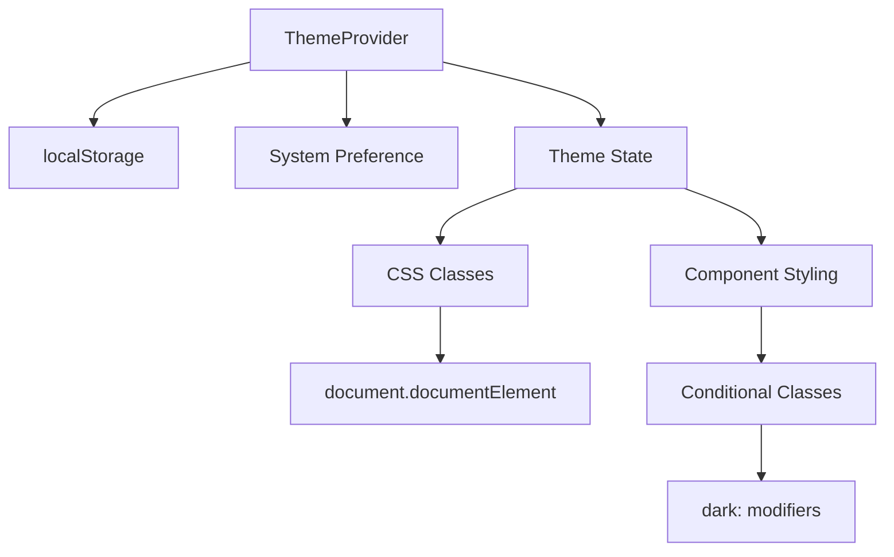
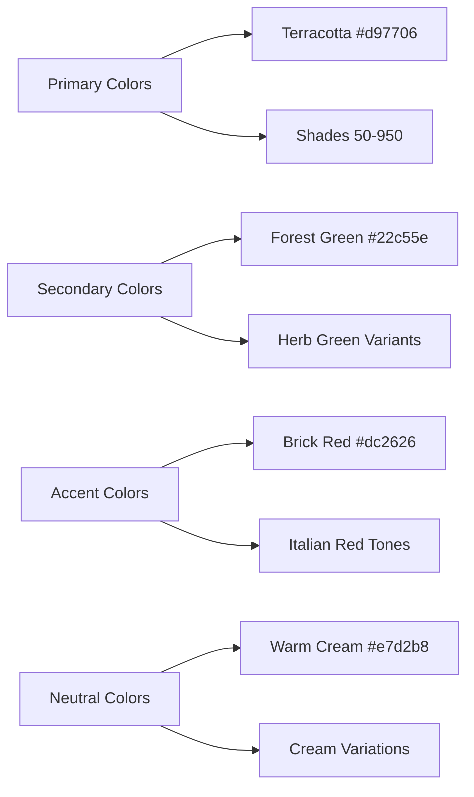
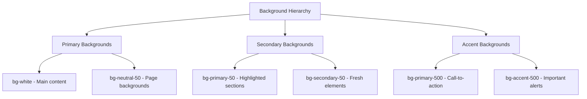
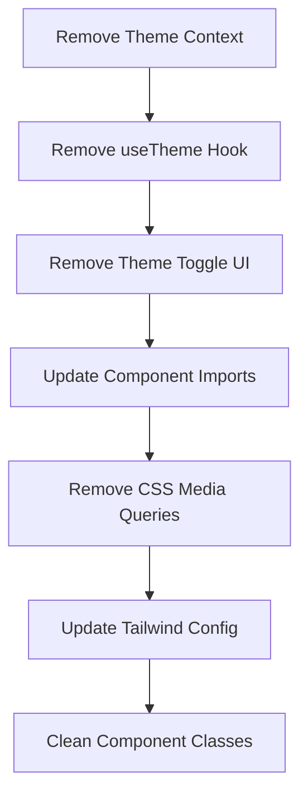
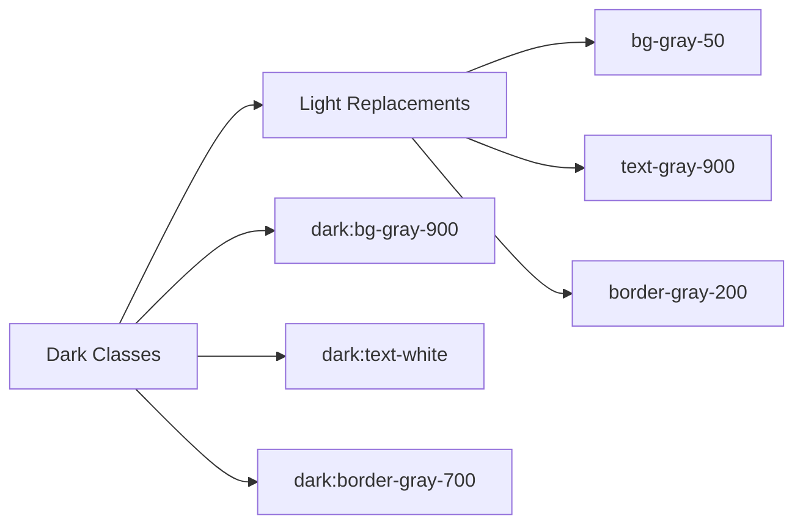
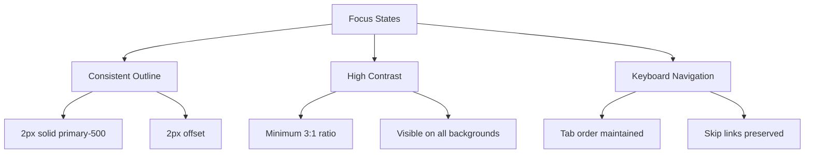
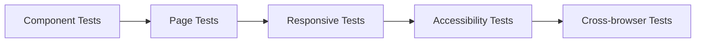
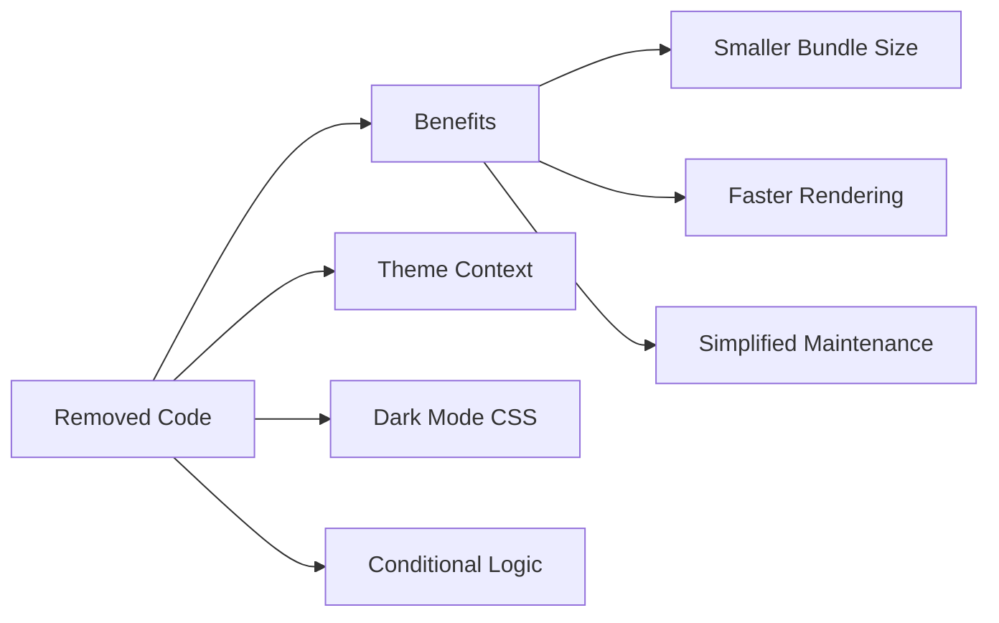

# Light Mode Only Implementation Design

## Overview

This design document outlines the complete removal of dark mode functionality from the Carrobbio restaurant website, maintaining exclusively the light mode as the universal styling approach. The implementation will eliminate all theme switching capabilities, dark mode CSS classes, color scheme preferences, and related conditional logic while preserving the elegant Italian restaurant aesthetic in light mode only.

## Technology Stack

The Carrobbio project uses:
- **Frontend**: React 18.3.1 with TypeScript
- **Styling**: Tailwind CSS 3.4.17 with custom Italian restaurant color palette
- **Theme Management**: Custom React Context (ThemeContext) and hooks
- **Build Tool**: Vite 6.3.5

## Current Dark Mode Implementation Analysis

### Theme Management Architecture



The current implementation includes:

1. **ThemeContext Provider**: Manages theme state with localStorage persistence
2. **System Preference Detection**: Uses `prefers-color-scheme: dark` media query
3. **CSS Class Management**: Applies `light`/`dark` classes to document root
4. **Conditional Styling**: Components use `dark:` Tailwind modifiers
5. **Theme Toggle**: UI controls for switching between themes

### Current Dark Mode Components

| Component | Dark Mode Elements |
|-----------|-------------------|
| ThemeContext | Theme state management, toggle function |
| useTheme hook | Alternative theme hook implementation |
| Navbar | Theme toggle button with Moon/Sun icons |
| Layout components | `dark:` CSS class modifiers |
| CSS Variables | `prefers-color-scheme: dark` media queries |
| Tailwind Config | `darkMode: "class"` configuration |

## Light Mode Design System

### Color Palette

The Italian restaurant light mode palette will be preserved and enhanced:



### Typography Hierarchy

| Level | Font Family | Usage | Color |
|-------|-------------|-------|--------|
| Display | Playfair Display | Hero headings | `text-neutral-900` |
| Heading | Montserrat | Section headers | `text-neutral-800` |
| Body | Source Sans Pro | Content text | `text-neutral-700` |
| Accent | Dancing Script | Special elements | `text-primary-600` |

### Background Strategy



## Implementation Architecture

### Phase 1: Theme System Removal



#### 1.1 Context and Hook Removal

**Files to Remove:**
- `src/context/ThemeContext.tsx`
- `src/hooks/useTheme.ts`

**App.tsx Updates:**
Remove ThemeProvider wrapper and related imports.

#### 1.2 CSS and Configuration Updates

**Tailwind Configuration:**
```javascript
// Remove darkMode configuration
export default {
  // Remove: darkMode: "class",
  content: ["./index.html", "./src/**/*.{js,ts,jsx,tsx}"],
  theme: {
    // Keep existing color palette and typography
  }
}
```

**CSS Media Query Removal:**
```css
/* Remove from src/index.css */
/* 
@media (prefers-color-scheme: dark) {
  :root {
    color-scheme: dark;
  }
}
*/
```

### Phase 2: Component Class Replacement

#### 2.1 Navigation Components

**Navbar Component Updates:**

| Current Dark Classes | Light Mode Replacement |
|---------------------|------------------------|
| `dark:text-gray-300` | `text-gray-700` |
| `dark:text-red-400` | `text-red-600` |
| `dark:bg-gray-900` | `bg-white` |
| `dark:bg-red-900/20` | `bg-red-50` |
| `dark:border-gray-700` | `border-gray-200` |

**Theme Toggle Removal:**
Remove toggle button component and related state management.

#### 2.2 Layout and Page Components

**Admin Page Classes:**



**Sidebar Component:**
- Remove all `dark:` prefixed classes
- Apply consistent light mode styling
- Maintain accessibility and hover states

#### 2.3 Form and Interactive Elements

**Password Reset/Login Forms:**

| Element | Current Dark Style | Light Mode Style |
|---------|-------------------|------------------|
| Background | `dark:bg-gray-900` | `bg-gray-50` |
| Card Background | `dark:bg-gray-800` | `bg-white` |
| Text Color | `dark:text-white` | `text-gray-900` |
| Input Border | `dark:border-gray-600` | `border-gray-300` |
| Hover States | `dark:hover:bg-gray-700` | `hover:bg-gray-50` |

### Phase 3: Component-Specific Updates

#### 3.1 HoursWidget Component

**Theme Logic Removal:**
```typescript
// Remove theme-based conditional styling
const getThemeClasses = () => {
  // Return only light mode classes
  return 'bg-gradient-to-br from-primary-50 to-secondary-50 border-primary-200'
}
```

#### 3.2 Utility Functions

**Class Name Utilities:**
Ensure `cn()` function from `utils.ts` properly handles light-mode-only classes without dark mode conflicts.

## Accessibility Considerations

### Color Contrast Compliance

All light mode colors must maintain WCAG 2.1 AA compliance:

| Background | Text Color | Contrast Ratio |
|------------|------------|----------------|
| `bg-white` | `text-gray-900` | 16.75:1 |
| `bg-gray-50` | `text-gray-800` | 12.63:1 |
| `bg-primary-50` | `text-primary-900` | 10.45:1 |

### Focus and Interactive States



### Alternative Accessibility Features

Since dark mode is removed, implement alternative accessibility features:
- High contrast mode detection
- Reduced motion preferences
- Font size scaling support
- Color-blind friendly indicators

## Testing Strategy

### Visual Regression Testing



**Test Coverage Areas:**
1. **Component Rendering**: Verify all components render correctly without dark mode classes
2. **Color Consistency**: Ensure color palette consistency across all elements
3. **Interactive States**: Test hover, focus, and active states
4. **Responsive Design**: Verify light mode works across all breakpoints
5. **Accessibility**: Screen reader compatibility and keyboard navigation

### Browser Compatibility

| Browser | Version | Light Mode Support |
|---------|---------|-------------------|
| Chrome | 90+ | Full support |
| Firefox | 88+ | Full support |
| Safari | 14+ | Full support |
| Edge | 90+ | Full support |

## Implementation Checklist

### Phase 1: System Removal
- [ ] Remove `ThemeContext.tsx`
- [ ] Remove `useTheme.ts` hook
- [ ] Update `App.tsx` to remove ThemeProvider
- [ ] Remove theme toggle from Navbar
- [ ] Update Tailwind config (remove `darkMode: "class"`)
- [ ] Remove CSS media queries for dark mode

### Phase 2: Component Updates
- [ ] Update Navbar component classes
- [ ] Update Admin page styling
- [ ] Update Sidebar component
- [ ] Update form components (Login, Reset, Forgot Password)
- [ ] Update HoursWidget component

### Phase 3: CSS and Styling
- [ ] Remove all `dark:` prefixed classes
- [ ] Replace with appropriate light mode classes
- [ ] Update custom CSS variables
- [ ] Verify background hierarchy
- [ ] Test color contrast ratios

### Phase 4: Testing and Validation
- [ ] Unit test component rendering
- [ ] Visual regression testing
- [ ] Accessibility audit
- [ ] Cross-browser testing
- [ ] Performance impact assessment

## Benefits and Outcomes

### Performance Improvements



### Maintenance Benefits

1. **Reduced Complexity**: Single styling system instead of dual mode management
2. **Consistent Experience**: Unified visual experience across all user sessions
3. **Simplified Testing**: Single theme to test and validate
4. **Enhanced Brand Consistency**: Focused Italian restaurant aesthetic

### User Experience

- **Consistent Branding**: Warm, inviting Italian restaurant atmosphere
- **Optimized Readability**: Light backgrounds ideal for content consumption
- **Reduced Cognitive Load**: No theme switching decisions required
- **Better Performance**: Eliminated theme calculation overhead

## Migration Considerations

### Backward Compatibility

Since this is a breaking change for users who prefer dark mode:
- Document the change in release notes
- Consider user feedback mechanisms
- Monitor analytics for user engagement impact

### Future Extensibility

While removing dark mode, maintain code architecture that could support:
- High contrast mode
- Custom color themes (seasonal variations)
- Accessibility-focused alternatives