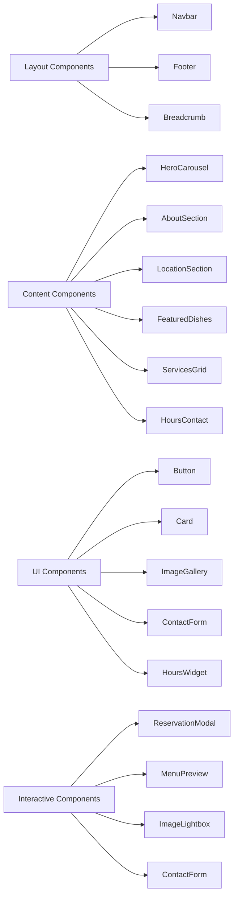
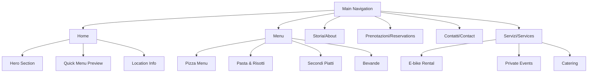
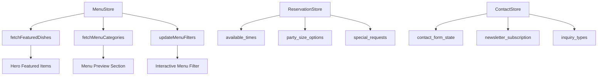
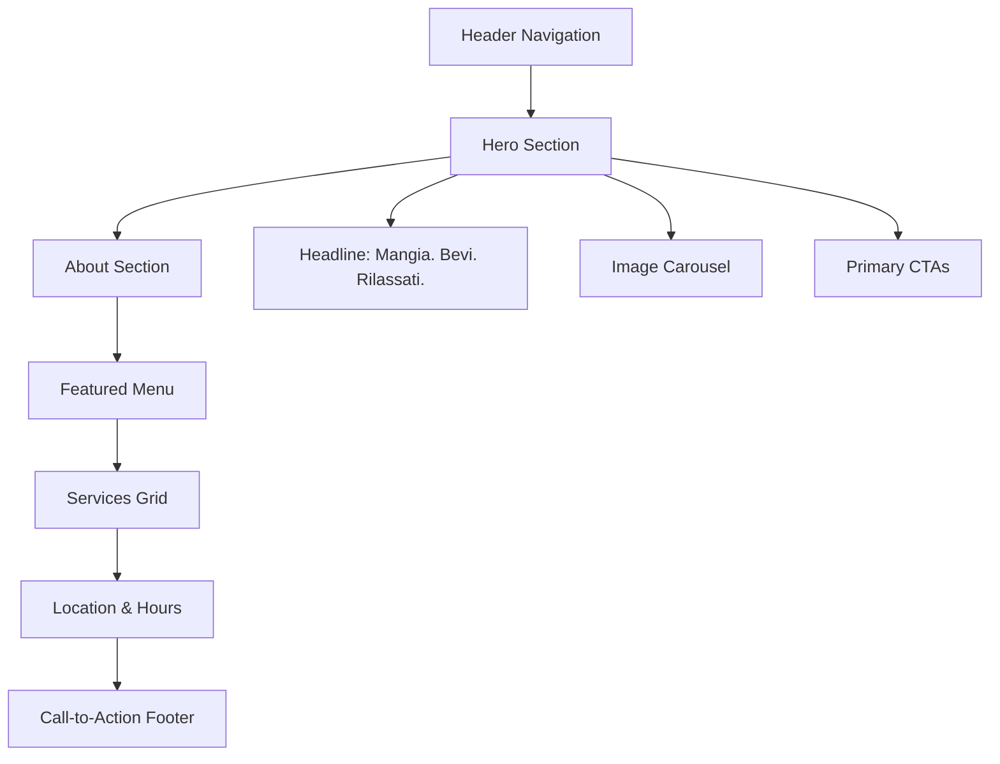

# Pizzeria Il Carrobbio - Homepage UI/UX Redesign

## Overview

This document outlines the comprehensive UI/UX redesign strategy for the Pizzeria Il Carrobbio homepage, aimed at enhancing user experience, improving visual appeal, and optimizing conversion rates for reservations and engagement. The redesign focuses on creating an authentic Italian dining atmosphere while maintaining modern usability standards.

### Project Context
- **Current Framework**: React + TypeScript with Tailwind CSS
- **Existing Components**: Button, Card, SEO components with red-themed design system
- **Target Users**: Local customers, tourists, food enthusiasts seeking authentic Italian dining
- **Business Goals**: Increase reservations, showcase menu offerings, promote e-bike rental service

## Technology Stack & Dependencies

### Current Implementation
- **Frontend**: React 18.3.1 with TypeScript
- **Styling**: Tailwind CSS 3.4.17 with custom design system
- **State Management**: Zustand for menu data
- **Routing**: React Router DOM 7.8.1
- **Icons**: Lucide React for consistent iconography
- **Image Optimization**: Unsplash integration for high-quality visuals

### Design System Enhancement
```typescript
// Enhanced color palette for authentic Italian restaurant atmosphere
const enhancedColorSystem = {
  // Primary: Warm terracotta inspired by Italian pottery
  primary: {
    50: '#fef7f0',
    100: '#fdeee0',
    200: '#fad4b8',
    300: '#f7b88a',
    400: '#f2965c',
    500: '#d97706', // Warm terracotta base
    600: '#c2671d',
    700: '#a55a1a',
    800: '#8b4d1b',
    900: '#744019'
  },
  
  // Secondary: Deep forest green for natural, fresh feeling
  secondary: {
    50: '#f0f9f4',
    100: '#dcf4e3',
    200: '#bde8cc',
    300: '#8dd5aa',
    400: '#58bc82',
    500: '#22c55e', // Fresh herb green
    600: '#15803d',
    700: '#166534',
    800: '#14532d',
    900: '#0f3f23'
  },
  
  // Accent: Warm brick red for call-to-action elements
  accent: {
    50: '#fef2f2',
    100: '#fee2e2',
    200: '#fecaca',
    300: '#fca5a5',
    400: '#f87171',
    500: '#dc2626', // Classic Italian red
    600: '#b91c1c',
    700: '#991b1b',
    800: '#7f1d1d',
    900: '#701a1a'
  },
  
  // Neutral: Warm cream tones
  neutral: {
    50: '#fefdfb',
    100: '#fefaf6',
    200: '#fcf5ec',
    300: '#f9f0e3',
    400: '#f5e6d3',
    500: '#e7d2b8', // Warm cream
    600: '#d4b896',
    700: '#b5967a',
    800: '#957a63',
    900: '#6b5a4f'
  }
}
```

## Component Architecture

### Enhanced Homepage Structure

```mermaid
graph TD
    A[Homepage Container] --> B[Hero Section]
    A --> C[About Section]
    A --> D[Location Section]
    A --> E[Featured Dishes]
    A --> F[Services Section]
    A --> G[Hours & Contact]
    A --> H[Call-to-Action Footer]
    
    B --> B1[Hero Image Carousel]
    B --> B2[Primary CTA Buttons]
    B --> B3[Ambient Video Background]
    
    C --> C1[Story Content]
    C --> C2[Chef/Restaurant Images]
    C --> C3[Values Grid]
    
    D --> D1[Interactive Map]
    D --> D2[Directions Widget]
    D --> D3[Parking Information]
    
    E --> E1[Featured Menu Cards]
    E --> E2[Price Display]
    E --> E3[Image Gallery]
    
    F --> F1[E-bike Rental Card]
    F --> F2[Event Hosting]
    F --> F3[Catering Services]
    
    G --> G1[Opening Hours Widget]
    G --> G2[Contact Information]
    G --> G3[Reservation Form]
```


### Component Hierarchy


## Routing & Navigation

### Enhanced Navigation Structure


### Navigation Enhancement
- **Sticky Header**: Transparent on hero, solid background on scroll
- **Mobile-First**: Hamburger menu with smooth slide animations
- **Breadcrumb Navigation**: Clear path indication for deeper pages
- **Quick Actions**: Floating reservation button, phone call link

## Styling Strategy

### Typography System
```css
/* Enhanced typography for Italian restaurant ambiance */
.heading-primary {
  font-family: 'Playfair Display', serif; /* Elegant serif for headers */
  font-weight: 700;
  letter-spacing: -0.02em;
  line-height: 1.2;
}

.heading-secondary {
  font-family: 'Montserrat', sans-serif; /* Clean sans-serif for subheadings */
  font-weight: 600;
  letter-spacing: -0.01em;
  line-height: 1.3;
}

.body-text {
  font-family: 'Source Sans Pro', sans-serif; /* Readable body text */
  font-weight: 400;
  line-height: 1.6;
  letter-spacing: 0.01em;
}

.accent-text {
  font-family: 'Dancing Script', cursive; /* Handwritten style for special elements */
  font-weight: 500;
}
```

### Responsive Design Strategy
```css
/* Mobile-first responsive breakpoints */
.container {
  @apply px-4 mx-auto;
}

@media (min-width: 640px) {
  .container { @apply px-6 max-w-lg; }
}

@media (min-width: 768px) {
  .container { @apply px-8 max-w-2xl; }
}

@media (min-width: 1024px) {
  .container { @apply px-12 max-w-4xl; }
}

@media (min-width: 1280px) {
  .container { @apply px-16 max-w-6xl; }
}
```

### Animation Framework
```css
/* Smooth micro-interactions */
.fade-in-up {
  animation: fadeInUp 0.6s ease-out forwards;
  opacity: 0;
  transform: translateY(30px);
}

.parallax-scroll {
  transform: translateY(calc(var(--scroll-progress) * -50px));
}

.hover-lift {
  transition: transform 0.3s ease, box-shadow 0.3s ease;
}

.hover-lift:hover {
  transform: translateY(-8px);
  box-shadow: 0 20px 40px rgba(0, 0, 0, 0.15);
}
```

## State Management

### Enhanced Menu Data Flow


### State Structure Enhancement
```typescript
interface HomepageState {
  hero: {
    currentSlide: number;
    autoplay: boolean;
    slides: HeroSlide[];
  };
  
  menu: {
    featured: MenuItem[];
    categories: Category[];
    loading: boolean;
    error: string | null;
  };
  
  reservation: {
    isModalOpen: boolean;
    selectedDate: Date | null;
    partySize: number;
    specialRequests: string;
  };
  
  ui: {
    scrollProgress: number;
    sectionInView: string;
    mobileMenuOpen: boolean;
  };
}
```

## API Integration Layer

### Enhanced Data Fetching Strategy
```typescript
// Optimized API calls for homepage performance
const useHomepageData = () => {
  const [data, setData] = useState({
    featured: [],
    openingHours: null,
    specialOffers: [],
    loading: true
  });

  useEffect(() => {
    // Parallel data fetching for optimal performance
    Promise.allSettled([
      fetchFeaturedDishes(3),
      fetchOpeningHours(),
      fetchSpecialOffers(),
      fetchRestaurantInfo()
    ]).then(results => {
      setData({
        featured: results[0].status === 'fulfilled' ? results[0].value : [],
        openingHours: results[1].status === 'fulfilled' ? results[1].value : null,
        specialOffers: results[2].status === 'fulfilled' ? results[2].value : [],
        loading: false
      });
    });
  }, []);

  return data;
};
```

### Performance Optimization
```typescript
// Lazy loading and code splitting for better performance
const FeaturedDishes = lazy(() => import('./FeaturedDishes'));
const LocationSection = lazy(() => import('./LocationSection'));
const ServicesGrid = lazy(() => import('./ServicesGrid'));

// Image optimization with progressive loading
const OptimizedImage = ({ src, alt, className }) => {
  const [loaded, setLoaded] = useState(false);
  const [inView, setInView] = useState(false);
  const imgRef = useRef(null);

  useEffect(() => {
    const observer = new IntersectionObserver(
      ([entry]) => setInView(entry.isIntersecting),
      { threshold: 0.1 }
    );
    
    if (imgRef.current) observer.observe(imgRef.current);
    return () => observer.disconnect();
  }, []);

  return (
    <div ref={imgRef} className={`relative ${className}`}>
      {inView && (
         setLoaded(true)}
          className={`transition-opacity duration-500 ${loaded ? 'opacity-100' : 'opacity-0'}`}
        />
      )}
    </div>
  );
};
```

## Testing Strategy

### Component Testing Approach
```typescript
// Example test for enhanced homepage components
describe('Homepage UI/UX Components', () => {
  describe('HeroSection', () => {
    it('displays primary call-to-action buttons', () => {
      render(<HeroSection />);
      expect(screen.getByText('Prenota un Tavolo')).toBeInTheDocument();
      expect(screen.getByText('Scopri il Menu')).toBeInTheDocument();
    });

    it('cycles through hero images automatically', async () => {
      render(<HeroSection autoplay={true} />);
      // Test auto-advance functionality
      await waitFor(() => {
        expect(screen.getByTestId('hero-slide-2')).toHaveClass('active');
      }, { timeout: 5000 });
    });
  });

  describe('FeaturedDishes', () => {
    it('displays featured dishes with pricing', () => {
      const mockDishes = [
        { id: 1, name: 'Pizza Margherita', price: 12.50, image_url: 'test.jpg' }
      ];
      render(<FeaturedDishes dishes={mockDishes} />);
      expect(screen.getByText('€12,50')).toBeInTheDocument();
    });

    it('handles loading and error states gracefully', () => {
      render(<FeaturedDishes loading={true} />);
      expect(screen.getByTestId('loading-spinner')).toBeInTheDocument();
    });
  });

  describe('AccessibilityFeatures', () => {
    it('supports keyboard navigation', () => {
      render(<Homepage />);
      const firstButton = screen.getByRole('button', { name: /prenota/i });
      firstButton.focus();
      expect(firstButton).toHaveFocus();
    });

    it('provides proper ARIA labels', () => {
      render(<LocationSection />);
      expect(screen.getByRole('region', { name: /dove siamo/i })).toBeInTheDocument();
    });
  });
});
```

### Visual Regression Testing
```typescript
// Storybook stories for visual testing
export default {
  title: 'Pages/Homepage',
  component: Homepage,
  parameters: {
    layout: 'fullscreen',
  },
};

export const Default = () => <Homepage />;
export const MobileView = () => <Homepage />;
MobileView.parameters = {
  viewport: { defaultViewport: 'mobile1' },
};

export const DarkTheme = () => <Homepage />;
DarkTheme.decorators = [
  (Story) => (
    <div className="dark">
      <Story />
    </div>
  ),
];
```

### Performance Testing
```typescript
// Lighthouse CI configuration for performance monitoring
const lighthouseConfig = {
  ci: {
    collect: {
      url: ['http://localhost:3000/'],
      numberOfRuns: 3,
    },
    assert: {
      assertions: {
        'categories:performance': ['warn', { minScore: 0.9 }],
        'categories:accessibility': ['error', { minScore: 0.95 }],
        'categories:best-practices': ['warn', { minScore: 0.9 }],
        'categories:seo': ['error', { minScore: 0.95 }],
      },
    },
  },
};
```

## Layout e Organizzazione

### Struttura Gerarchica della Homepage



### Griglia Responsive e Sezioni Principali

| Sezione | Priorità | Obiettivo | Metriche |
|---------|----------|-----------|----------|
| Hero | Alta | Prima impressione, conversione immediata | CTR su prenotazioni |
| Menu Featured | Alta | Showcase prodotti, appetite appeal | Tempo di permanenza |
| About/Storia | Media | Brand connection, storytelling | Scroll depth |
| Servizi | Media | Differenziazione (e-bike), up-selling | Click su servizi |
| Location | Alta | Facilitare visite, ridurre bounce | Click su mappe |
| Contact/Hours | Alta | Informazioni essenziali, conversione | Call-to-action |

## Design Visivo

### Palette Colori Italiana Autentica

```css
:root {
  /* Colori primari - Terracotta toscana */
  --color-primary-50: #fef7f0;
  --color-primary-500: #d97706;
  --color-primary-700: #a55a1a;
  
  /* Colori secondari - Verde basilico */
  --color-secondary-500: #22c55e;
  --color-secondary-700: #166534;
  
  /* Accento - Rosso pomodoro */
  --color-accent-500: #dc2626;
  --color-accent-700: #991b1b;
}
```

### Sistema Tipografico

```css
.typography-h1 {
  font-family: 'Playfair Display', serif;
  font-size: clamp(2.5rem, 8vw, 4rem);
  font-weight: 700;
  line-height: 1.1;
}

.typography-body {
  font-family: 'Source Sans Pro', sans-serif;
  font-size: clamp(1rem, 2.5vw, 1.125rem);
  line-height: 1.6;
}
```

## Elementi Interattivi

### Pulsanti Call-to-Action

```css
.btn-primary {
  background: linear-gradient(135deg, var(--color-accent-500), var(--color-accent-600));
  color: white;
  padding: 1rem 2rem;
  border-radius: 0.75rem;
  font-weight: 600;
  transition: all 0.3s cubic-bezier(0.4, 0, 0.2, 1);
  box-shadow: 0 4px 12px rgba(220, 38, 38, 0.3);
}

.btn-primary:hover {
  transform: translateY(-2px);
  box-shadow: 0 8px 20px rgba(220, 38, 38, 0.4);
}
```

### Animazioni Fluide

```css
@keyframes fadeInUp {
  from {
    opacity: 0;
    transform: translateY(30px);
  }
  to {
    opacity: 1;
    transform: translateY(0);
  }
}

.card-hover:hover {
  transform: translateY(-8px) scale(1.02);
  box-shadow: 0 20px 40px rgba(0, 0, 0, 0.15);
}
```

## Accessibilità

### Contrasto e Struttura Semantica

```css
/* WCAG 2.1 AA compliance */
.text-high-contrast {
  color: var(--color-neutral-800); /* 7.2:1 contrast ratio */
  background: var(--color-neutral-50);
}
```

```html
<!-- Screen reader optimized -->
<main role="main" aria-label="Homepage Il Carrobbio">
  <section aria-labelledby="hero-heading">
    <h1 id="hero-heading">Mangia. Bevi. Rilassati.</h1>
  </section>
</main>
```

## Contenuti Strategici

### Sezione Orari Prominente

```typescript
const HoursWidget = () => {
  const currentHours = useOpeningHours();
  
  return (
    <div className="hours-widget bg-gradient-to-br from-primary-50 to-secondary-50 p-6 rounded-xl">
      <h3 className="text-xl font-semibold mb-4 flex items-center">
        <Clock className="mr-2" size={24} />
        Orari di Apertura
      </h3>
      
      <div className="space-y-2">
        {currentHours.map(({ day, hours, isToday, isOpen }) => (
          <div 
            key={day} 
            className={`flex justify-between items-center p-2 rounded ${
              isToday ? 'bg-accent-100 font-semibold' : ''
            }`}
          >
            <span>{day}</span>
            <span className={`flex items-center ${
              isToday && isOpen ? 'text-green-600' : ''
            }`}>
              {hours}
              {isToday && (
                <span className={`ml-2 w-2 h-2 rounded-full ${
                  isOpen ? 'bg-green-500' : 'bg-red-500'
                }`} />
              )}
            </span>
          </div>
        ))}
      </div>
    </div>
  );
};
```

### Servizio E-bike e Call-to-Action

```typescript
const EBikeSection = () => {
  return (
    <Card className="relative overflow-hidden bg-gradient-to-r from-green-50 to-blue-50">
      <CardHeader>
        <h3 className="text-2xl font-bold text-green-700">
          Noleggio E-Bike
        </h3>
        <p className="text-green-600">
          Esplora il territorio emiliano in modo eco-sostenibile
        </p>
      </CardHeader>
      
      <CardContent>
        <ul className="space-y-2 text-sm">
          <li className="flex items-center">
            <CheckCircle className="w-4 h-4 text-green-500 mr-2" />
            Percorsi guidati attraverso le colline
          </li>
          <li className="flex items-center">
            <CheckCircle className="w-4 h-4 text-green-500 mr-2" />
            Biciclette elettriche di ultima generazione
          </li>
        </ul>
        
        <Button className="mt-4 w-full" variant="outline">
          Scopri i Tour
        </Button>
      </CardContent>
    </Card>
  );
};
```

```css
/* Floating action button per prenotazioni */
.floating-cta {
  position: fixed;
  bottom: 2rem;
  right: 2rem;
  z-index: 1000;
  background: linear-gradient(135deg, var(--color-accent-500), var(--color-accent-600));
  color: white;
  padding: 1rem;
  border-radius: 50%;
  box-shadow: 0 8px 24px rgba(220, 38, 38, 0.4);
  animation: pulse 2s infinite;
}

@keyframes pulse {
  0%, 100% { transform: scale(1); }
  50% { transform: scale(1.1); }
}
```