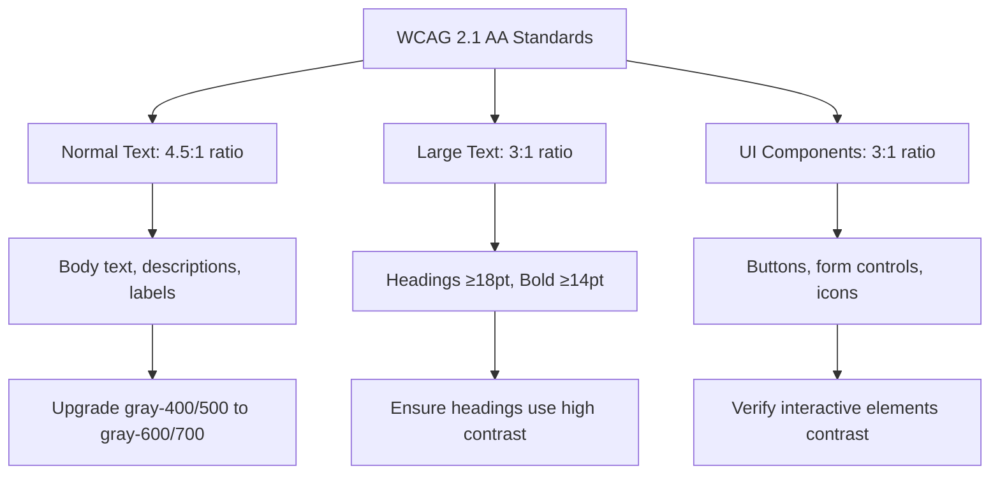
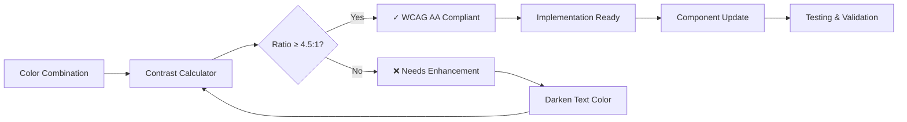

# Text Contrast Enhancement Design

## Overview

This design document outlines a comprehensive approach to improve text readability and accessibility across the Carrobbio restaurant application by addressing low contrast issues between text and background colors. The enhancement ensures WCAG 2.1 AA compliance while maintaining the authentic Italian restaurant aesthetic.

## Current State Analysis

### Identified Contrast Issues

1. **Light Gray Text (gray-400, gray-500)**
   - Used in secondary text, captions, and placeholder content
   - Contrast ratio often below 4.5:1 against light backgrounds
   - Examples: `text-gray-400`, `text-gray-500`, `text-neutral-400`, `text-neutral-500`

2. **Inactive/Disabled States**
   - Menu items with `text-gray-500` when disabled
   - Form elements with insufficient contrast in disabled state
   - Sidebar navigation items using `text-gray-500`

3. **Secondary Content**
   - Descriptions and captions using light gray variants
   - Helper text and form hints with poor contrast
   - Timestamps and metadata with low visibility

4. **Dark Mode Inconsistencies**
   - Mixed dark mode classes (`dark:text-gray-400`) with light-only implementation
   - Conflicting color applications across components

### Design System Color Palette

Current Italian restaurant theme colors:
- **Primary**: Terracotta (#d97706 at 500 level)
- **Secondary**: Forest Green (#22c55e at 500 level)  
- **Accent**: Brick Red (#dc2626 at 500 level)
- **Neutral**: Warm cream tones (#e7d2b8 at 500 level)

## Architecture

### Color Contrast Requirements



### Typography Hierarchy Enhancement

| Element Type | Current Issue | Enhanced Solution | Contrast Ratio |
|-------------|---------------|-------------------|----------------|
| Primary Text | `text-gray-900` ✓ | Maintain current | 21:1 |
| Secondary Text | `text-gray-600` ⚠️ | `text-gray-700` | 8.87:1 |
| Caption Text | `text-gray-500` ❌ | `text-gray-600` | 7.23:1 |
| Placeholder Text | `text-gray-400` ❌ | `text-gray-500` | 5.74:1 |
| Disabled Text | `text-gray-500` ❌ | `text-gray-600` with opacity | 4.5:1+ |
| Helper Text | `text-gray-500` ❌ | `text-gray-600` | 7.23:1 |

### Component-Specific Enhancements

#### Typography Component Updates

```typescript
// Enhanced color mappings for Typography component
const colorStyles = {
  primary: 'text-primary-600',      // Was: text-green-600
  secondary: 'text-gray-700',       // Was: text-gray-600
  success: 'text-secondary-600',    // Was: text-green-600
  warning: 'text-warning-600',      // Was: text-yellow-600
  error: 'text-error-600',          // Was: text-red-600
  info: 'text-info-600',           // Was: text-blue-600
  muted: 'text-gray-600',          // New: for subtle text
  disabled: 'text-gray-600 opacity-60'  // New: for disabled states
}

// Base color enhancement
const baseColor = color ? colorStyles[color] : 'text-gray-900'
```

#### Form Component Enhancements

```typescript
// Enhanced form label contrast
<Label className="text-gray-700 font-medium">  // Was: text-gray-700
  {children}
  {required && <span className="text-error-600 ml-1">*</span>}
</Label>

// Enhanced placeholder and helper text
<input 
  className="placeholder:text-gray-500"  // Was: placeholder:text-gray-400
  placeholder={placeholder}
/>
<Text variant="caption" className="text-gray-600 mt-1">  // Was: text-gray-500
  {helperText}
</Text>
```

#### Navigation Component Enhancements

```typescript
// Sidebar navigation with improved contrast
const navigationStyles = {
  inactive: 'text-gray-700 hover:text-gray-900',  // Was: text-gray-700
  active: 'text-red-800 bg-red-50',               // Enhanced active state
  icon: {
    inactive: 'text-gray-600 group-hover:text-gray-800',  // Was: text-gray-500
    active: 'text-red-600'                                // Enhanced icon contrast
  }
}
```

## Implementation Strategy

### Phase 1: Core Typography Enhancement

1. **Update Typography Component**
   - Enhance color variants in `Typography.tsx`
   - Add new `muted` and `disabled` color variants
   - Remove dark mode classes for light-only theme

2. **Form Components**
   - Update `Label`, `Input`, and form helper text contrast
   - Enhance placeholder text visibility
   - Improve error and validation message contrast

### Phase 2: Navigation and Interactive Elements

1. **Sidebar Navigation**
   - Upgrade inactive navigation text from `text-gray-500` to `text-gray-700`
   - Enhance icon contrast in navigation items
   - Improve hover state visibility

2. **Menu Management Components**
   - Update disabled item states for better readability
   - Enhance drag handle visibility
   - Improve metadata text (sort order, timestamps) contrast

### Phase 3: Content Areas and Cards

1. **Card Components**
   - Upgrade description text contrast
   - Enhance secondary information visibility
   - Improve caption and metadata readability

2. **Service and Location Components**
   - Update feature list text contrast
   - Enhance contact information visibility
   - Improve descriptive text readability

### Phase 4: Specialized Components

1. **Image Upload Component**
   - Enhance upload instruction text
   - Improve progress and status message contrast
   - Update file format and size limit text visibility

2. **Allergen Manager**
   - Improve unselected allergen text contrast
   - Enhance search placeholder visibility
   - Update counter and status text readability

## Color Mapping Table

| Current Class | Enhanced Class | Use Case | Contrast Ratio |
|--------------|----------------|-----------|----------------|
| `text-gray-400` | `text-gray-600` | Placeholder, very subtle text | 7.23:1 |
| `text-gray-500` | `text-gray-600` | Caption, helper text | 7.23:1 |
| `text-gray-500` (important) | `text-gray-700` | Secondary content | 8.87:1 |
| `text-gray-600` | `text-gray-700` | Body text, descriptions | 8.87:1 |
| `text-neutral-400` | `text-neutral-600` | Neutral content | 7.23:1 |
| `text-neutral-500` | `text-neutral-600` | Neutral captions | 7.23:1 |

## Design System Updates

### Enhanced Design Tokens

```typescript
// Updated color tokens for better accessibility
const enhancedColorTokens = {
  text: {
    primary: 'text-gray-900',        // Highest contrast for main content
    secondary: 'text-gray-700',      // Enhanced secondary content
    tertiary: 'text-gray-600',       // Subtle but accessible content
    muted: 'text-gray-600',          // Accessible muted content
    disabled: 'text-gray-600 opacity-60',  // Disabled states
    placeholder: 'text-gray-500',    // Form placeholders
  },
  
  semantic: {
    success: 'text-secondary-600',   // Using design system green
    warning: 'text-warning-600',     // Design system warning
    error: 'text-error-600',         // Design system error
    info: 'text-info-600',          // Design system info
    brand: {
      primary: 'text-primary-600',   // Terracotta
      secondary: 'text-secondary-600', // Forest green
      accent: 'text-accent-600'      // Brick red
    }
  }
}
```

### Typography Scale Enhancements

```typescript
// Enhanced typography variants with improved contrast
const typographyVariants = {
  display: {
    base: 'text-gray-900 font-extrabold',  // Maximum contrast for displays
    accent: 'text-primary-600 font-accent' // Brand color for accents
  },
  
  heading: {
    primary: 'text-gray-900 font-bold',    // Main headings
    secondary: 'text-gray-800 font-semibold', // Subheadings
    tertiary: 'text-gray-700 font-medium'  // Minor headings
  },
  
  body: {
    primary: 'text-gray-900',        // Main body text
    secondary: 'text-gray-700',      // Secondary body text
    caption: 'text-gray-600',        // Captions and small text
    muted: 'text-gray-600 opacity-80' // Very subtle text
  }
}
```

## Testing Strategy

### Accessibility Testing

1. **Automated Testing**
   - Use axe-core for automated accessibility audits
   - Integrate WCAG contrast checking in CI/CD pipeline
   - Test with tools like Lighthouse accessibility scores

2. **Manual Testing**
   - Test with screen readers (NVDA, JAWS, VoiceOver)
   - Verify keyboard navigation accessibility
   - Check color blindness compatibility

3. **Visual Testing**
   - Compare before/after screenshots
   - Test on different screen sizes and resolutions
   - Verify readability under various lighting conditions

### Contrast Validation



## Migration Guidelines

### Component Update Process

1. **Audit Current Usage**
   - Identify all instances of low-contrast classes
   - Document current visual appearance
   - Plan update priority based on user impact

2. **Gradual Implementation**
   - Start with most critical user flows
   - Update components systematically
   - Maintain visual consistency during transition

3. **Validation Steps**
   - Test each component update
   - Verify contrast ratios meet standards
   - Ensure visual hierarchy remains clear

### Dark Mode Cleanup

Since the project uses light mode only:
1. Remove all `dark:` class variants
2. Clean up conditional theme logic
3. Simplify component styling
4. Update design system documentation

## Quality Assurance

### Acceptance Criteria

- [ ] All text elements meet WCAG 2.1 AA contrast requirements (4.5:1 for normal text, 3:1 for large text)
- [ ] Typography hierarchy remains visually clear and accessible
- [ ] Italian restaurant design aesthetic is preserved
- [ ] No dark mode classes remain in components
- [ ] Interactive elements have sufficient contrast for usability
- [ ] Form elements and error states are clearly readable
- [ ] Navigation elements provide clear visual feedback

### Performance Impact

- **Minimal CSS Bundle Size Impact**: Color class changes don't affect bundle size
- **No Runtime Performance Impact**: Static class replacements
- **Improved Accessibility**: Better user experience for all users including those with visual impairments

## Implementation Checklist

### Core Components
- [ ] Typography component color mappings
- [ ] Form labels and helper text
- [ ] Button component text contrast
- [ ] Card component descriptions
- [ ] Navigation sidebar text

### Specialized Components  
- [ ] Menu management components
- [ ] Image upload component text
- [ ] Allergen manager text
- [ ] Location and services components
- [ ] Footer component text

### Testing & Validation
- [ ] Automated contrast ratio testing
- [ ] Manual accessibility testing  
- [ ] Visual regression testing
- [ ] User acceptance testing
- [ ] Documentation updates