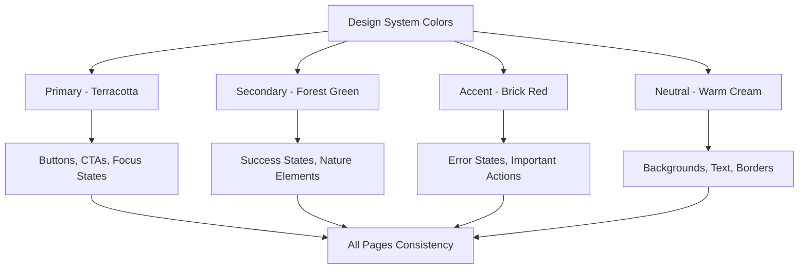

# Web App Styling Alignment Design

## Overview

This design document outlines the systematic revision of all web application pages to align with the Home page's UI/UX design. The goal is to ensure perfect consistency in colors, visual effects, typography, and styling across every section of the Carrobbio restaurant application, creating a unified and harmonized design experience.

## Current Analysis

### Home Page Design Baseline

The Home page establishes the authentic Italian restaurant design language with:

- **Color Palette**: Warm terracotta primary (`#d97706`), forest green secondary (`#22c55e`), brick red accent (`#dc2626`)
- **Typography**: Multi-font system with Playfair Display, Montserrat, Source Sans Pro, and Dancing Script
- **Visual Effects**: Gradient backgrounds, animated elements, layered sections, shadow effects
- **Layout Patterns**: Hero sections, sectional backgrounds, floating elements, responsive grids

### Inconsistencies Identified

#### 1. Menu Page Issues
- Uses generic gray color scheme instead of brand colors
- Missing gradient backgrounds and visual depth
- Category filters lack brand styling
- Loading states use incorrect color (`border-red-800` instead of `border-primary-500`)

#### 2. Admin Page Issues  
- Dark/light theme focus overshadows brand identity
- Inconsistent color usage in forms and cards
- Missing authentic Italian restaurant atmosphere
- Generic styling in dashboard components

#### 3. Contacts Page Issues
- Standard form styling without brand personality
- Missing visual hierarchy and depth
- Contact info cards lack brand styling
- Generic error/success message styling

## Design System Alignment

### Color Implementation Strategy



### Typography Hierarchy Standardization

| Element | Font Family | Weight | Size | Usage Context |
|---------|-------------|--------|------|---------------|
| Page Titles | Playfair Display | Bold (700) | 4xl-5xl | All main page headings |
| Section Headers | Montserrat | SemiBold (600) | 2xl-3xl | Section titles across pages |
| Body Text | Source Sans Pro | Normal (400) | base-lg | All body content |
| Accent Text | Dancing Script | Normal (400) | 2xl-6xl | Special emphasis elements |

### Visual Effects Standards

#### Background Patterns
```css
/* Primary gradient for hero sections */
background: linear-gradient(135deg, from-primary-50 to-secondary-50)

/* Secondary gradient for content sections */
background: linear-gradient(135deg, from-neutral-50 to-primary-50)

/* Accent gradient for CTAs */
background: linear-gradient(135deg, from-accent-50 to-accent-100)
```

#### Animation Standards
- **Fade-in-up**: Entry animations with 0.1s-0.4s delays
- **Scale transform**: Hover effects on images (scale-105)
- **Transition duration**: 200ms for interactions, 700ms for transforms

## Page-Specific Redesign

### Menu Page Transformation

#### Header Section Redesign
```typescript
// From generic styling to brand-aligned
<div className="text-center mb-12 py-20 bg-gradient-to-br from-neutral-50 to-primary-50">
  <h1 className="font-display text-4xl md:text-5xl font-bold mb-6 text-neutral-800 leading-tight">
    Il Nostro{' '}
    <span className="text-primary-600 font-accent text-5xl md:text-6xl">
      Menu
    </span>
  </h1>
  <div className="w-24 h-1 bg-primary-500 rounded-full mx-auto mb-8"></div>
  <p className="font-body text-lg leading-relaxed text-neutral-700 max-w-2xl mx-auto">
    Scopri i sapori autentici della cucina italiana, preparati con ingredienti 
    freschi e ricette tradizionali
  </p>
</div>
```

#### Category Filter Enhancement
```typescript
// Brand-aligned category buttons
<Button
  variant={selectedCategory === category ? 'primary' : 'outline'}
  className="px-6 py-3 rounded-xl font-heading font-semibold transition-all duration-200 
             hover:shadow-md hover:scale-105 border-2 border-primary-200"
>
  {category === 'all' ? 'Tutti' : categoryNames[category as Category]}
</Button>
```

#### Menu Cards Redesign
```typescript
<Card className="overflow-hidden rounded-2xl shadow-lg hover:shadow-xl 
                 transition-all duration-300 hover:scale-102 border border-primary-100">
  <div className="relative">
    
    <div className="absolute inset-0 bg-gradient-to-t from-primary-900/30 to-transparent" />
  </div>
  <CardHeader className="bg-gradient-to-br from-neutral-50 to-primary-50">
    <span className="inline-block px-3 py-1 text-sm font-medium bg-primary-100 
                     text-primary-800 rounded-full mb-2 font-heading">
      {categoryNames[item.category]}
    </span>
  </CardHeader>
</Card>
```

### Admin Page Transformation

#### Dashboard Layout Enhancement
```typescript
// Brand-aligned admin interface
<div className="min-h-screen bg-gradient-to-br from-neutral-50 to-primary-50">
  <div className="bg-white/80 backdrop-blur-sm border-b border-primary-100">
    <div className="px-6 py-4">
      <h1 className="font-display text-2xl font-bold text-neutral-800">
        Pannello{' '}
        <span className="text-primary-600 font-accent">
          Amministrativo
        </span>
      </h1>
    </div>
  </div>
</div>
```

#### Statistics Cards Redesign
```typescript
<Card className="bg-gradient-to-br from-white to-primary-50 border border-primary-100 
                 rounded-xl shadow-md hover:shadow-lg transition-all duration-200">
  <CardContent className="p-6">
    <div className="flex items-center justify-between">
      <div>
        <p className="font-heading text-sm font-medium text-neutral-600">
          Prenotazioni Totali
        </p>
        <p className="font-display text-3xl font-bold text-primary-600">
          {stats.totalReservations}
        </p>
      </div>
      <div className="p-3 bg-primary-100 rounded-xl">
        <CalendarIcon className="h-6 w-6 text-primary-600" />
      </div>
    </div>
  </CardContent>
</Card>
```

### Contacts Page Transformation

#### Hero Section Alignment
```typescript
<div className="py-20 bg-gradient-to-br from-neutral-50 to-primary-50">
  <div className="text-center mb-16">
    <h1 className="font-display text-4xl md:text-5xl font-bold mb-6 text-neutral-800">
      Contattaci{' '}
      <span className="text-primary-600 font-accent text-5xl md:text-6xl">
        Subito
      </span>
    </h1>
    <div className="w-24 h-1 bg-primary-500 rounded-full mx-auto mb-8"></div>
    <p className="font-body text-lg leading-relaxed text-neutral-700 max-w-2xl mx-auto">
      Siamo qui per rispondere alle tue domande e accogliere le tue richieste. 
      Non esitare a contattarci!
    </p>
  </div>
</div>
```

#### Contact Information Cards
```typescript
<div className="bg-gradient-to-br from-white to-secondary-50 rounded-xl p-6 
                border border-secondary-100 shadow-md hover:shadow-lg transition-all duration-200">
  <div className="flex items-start space-x-4">
    <div className="p-3 bg-secondary-100 rounded-xl flex-shrink-0">
      <IconComponent className="h-6 w-6 text-secondary-600" />
    </div>
    <div>
      <h3 className="font-heading text-lg font-semibold text-neutral-800 mb-2">
        {info.title}
      </h3>
      <p className="font-body text-neutral-700 leading-relaxed">
        {info.content}
      </p>
    </div>
  </div>
</div>
```

#### Form Enhancement
```typescript
<Card className="bg-gradient-to-br from-white to-accent-50 border border-accent-100 
                 rounded-2xl shadow-lg">
  <CardHeader className="bg-gradient-to-r from-accent-50 to-primary-50">
    <h2 className="font-display text-2xl font-bold text-neutral-800">
      Inviaci un{' '}
      <span className="text-accent-600 font-accent">
        Messaggio
      </span>
    </h2>
  </CardHeader>
</Card>
```

## Component Library Updates

### Button Component Enhancement

```typescript
const buttonVariants = {
  primary: `
    bg-gradient-to-r from-primary-500 to-primary-600 
    hover:from-primary-600 hover:to-primary-700
    text-white font-heading font-semibold
    shadow-md hover:shadow-lg
    transform hover:scale-105 transition-all duration-200
  `,
  secondary: `
    bg-gradient-to-r from-secondary-500 to-secondary-600
    hover:from-secondary-600 hover:to-secondary-700
    text-white font-heading font-semibold
    shadow-md hover:shadow-lg
    transform hover:scale-105 transition-all duration-200
  `,
  outline: `
    border-2 border-primary-300 hover:border-primary-500
    text-primary-700 hover:text-primary-800
    hover:bg-primary-50 font-heading font-semibold
    transition-all duration-200
  `
}
```

### Card Component Enhancement

```typescript
const cardVariants = {
  default: `
    bg-gradient-to-br from-white to-neutral-50 
    border border-neutral-200 rounded-2xl shadow-md
    hover:shadow-lg transition-all duration-300
  `,
  primary: `
    bg-gradient-to-br from-white to-primary-50 
    border border-primary-100 rounded-2xl shadow-md
    hover:shadow-lg transition-all duration-300
  `,
  featured: `
    bg-gradient-to-br from-primary-50 to-secondary-50 
    border border-primary-200 rounded-2xl shadow-lg
    hover:shadow-xl transition-all duration-300 hover:scale-102
  `
}
```

### Loading States Standardization

```typescript
const LoadingSpinner = () => (
  <div className="animate-spin rounded-full h-12 w-12 border-4 border-primary-100 
                  border-t-primary-500 mx-auto">
  </div>
)

const SectionLoader = () => (
  <div className="py-20 flex justify-center items-center bg-gradient-to-br from-neutral-50 to-primary-50">
    <div className="text-center">
      <LoadingSpinner />
      <p className="mt-4 font-body text-neutral-600">Caricamento...</p>
    </div>
  </div>
)
```

## Implementation Strategy

### Phase 1: Core Component Updates
1. Update Button component variants
2. Enhance Card component styling
3. Standardize Typography components
4. Update loading states

### Phase 2: Page-by-Page Implementation
1. **Menu Page**: Header, filters, cards, CTA section
2. **Contacts Page**: Hero, contact info, form styling
3. **Admin Page**: Dashboard, statistics, forms
4. **Reservations Page**: Form styling, confirmation states

### Phase 3: Cross-Page Elements
1. Navigation consistency
2. Footer alignment
3. Error/success message styling
4. Modal and overlay styling

### Phase 4: Interactive Elements
1. Hover effects standardization
2. Animation timing consistency
3. Focus states alignment
4. Mobile responsiveness

## Quality Assurance

### Design Consistency Checklist

#### Visual Elements
- [ ] All pages use design system color palette
- [ ] Typography hierarchy consistent across pages
- [ ] Gradient backgrounds applied uniformly
- [ ] Shadow effects standardized
- [ ] Border radius consistent

#### Interactive Elements
- [ ] Button styles unified
- [ ] Hover effects consistent
- [ ] Focus states accessible
- [ ] Loading states branded
- [ ] Error/success messages styled

#### Layout Patterns
- [ ] Section spacing uniform
- [ ] Grid layouts consistent
- [ ] Responsive breakpoints aligned
- [ ] Header/footer patterns unified

### Testing Strategy

#### Visual Regression Testing
```typescript
// Component visual consistency tests
describe('Brand Consistency', () => {
  test('All pages use primary color palette', () => {
    // Test color usage across pages
  })
  
  test('Typography hierarchy consistent', () => {
    // Test font usage and sizing
  })
  
  test('Button variants match design system', () => {
    // Test button styling consistency
  })
})
```

#### Cross-Browser Compatibility
- Chrome/Edge: Full gradient and animation support
- Firefox: Fallback for complex gradients
- Safari: WebKit-specific optimizations
- Mobile browsers: Touch-friendly interactions

## Maintenance Guidelines

### Design Token Management
- All colors defined in `design-system.ts`
- Typography scales centralized
- Component variants documented
- CSS custom properties generated

### Style Updates Process
1. Update design system tokens
2. Test component variations
3. Verify cross-page consistency
4. Update documentation

### Performance Considerations
- Lazy load non-critical animations
- Optimize gradient rendering
- Minimize layout shifts
- Use efficient CSS selectors

This design ensures that every page in the Carrobbio web application reflects the authentic Italian restaurant atmosphere established by the Home page, creating a cohesive and memorable user experience that reinforces the brand identity throughout the entire application.