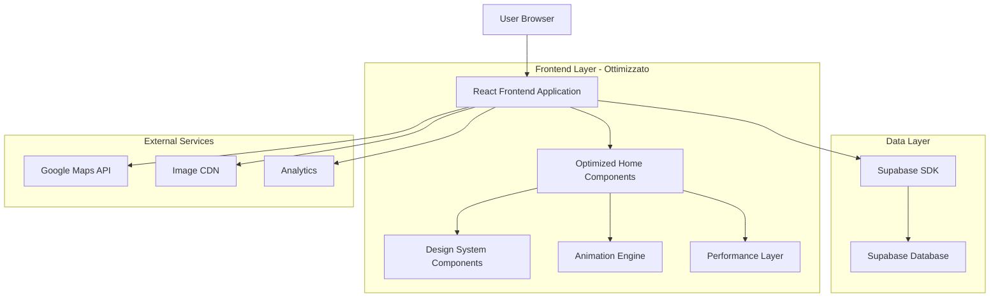
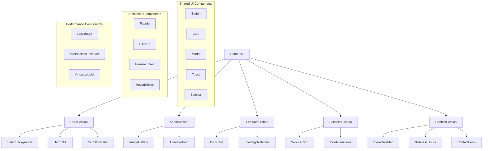
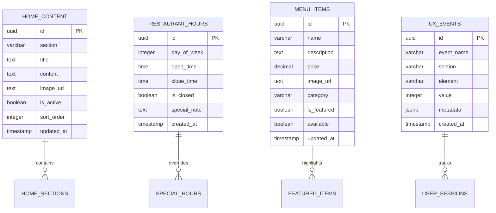

# Architettura Tecnica - Ottimizzazione Home Pizzeria Il Carrobbio

## 1. Architettura Design



## 2. Descrizione Tecnologie

### Frontend Stack Ottimizzato
- **React@18**: Framework principale con Concurrent Features
- **TypeScript@5**: Type safety e developer experience
- **Tailwind CSS@3**: Utility-first CSS con design tokens personalizzati
- **Framer Motion@10**: Libreria animazioni performanti
- **React Query@4**: State management e caching per dati server
- **React Intersection Observer**: Lazy loading e scroll animations
- **Vite@4**: Build tool ottimizzato per performance

### Backend Services
- **Supabase**: Database PostgreSQL e autenticazione
- **Supabase Storage**: Gestione immagini ottimizzate
- **Supabase Edge Functions**: Logica server-side quando necessaria

### Performance & Monitoring
- **Web Vitals**: Monitoraggio Core Web Vitals
- **Lighthouse CI**: Audit automatizzati
- **Sentry**: Error tracking e performance monitoring

## 3. Definizioni Route

| Route | Scopo | Componenti Principali | Ottimizzazioni |
|-------|-------|----------------------|----------------|
| / | Home page ottimizzata | HeroSection, AboutSection, FeaturedDishes, ServicesSection, ContactSection | Lazy loading, code splitting, image optimization |
| /menu | Menu completo | MenuGrid, FilterBar, DishModal | Virtual scrolling, search optimization |
| /prenotazioni | Sistema prenotazioni | BookingForm, AvailabilityCalendar | Real-time validation, conflict prevention |
| /contatti | Contatti e mappa | ContactForm, InteractiveMap, BusinessHours | Maps lazy loading, form optimization |
| /storia | Storia del ristorante | StoryTimeline, PhotoGallery | Progressive image loading |

## 4. Definizioni API

### 4.1 API Core - Contenuti Home

#### Recupero contenuti dinamici home
```typescript
// Supabase Query
const { data: homeContent } = useQuery({
  queryKey: ['home-content'],
  queryFn: () => supabase
    .from('home_content')
    .select('*')
    .eq('is_active', true)
    .order('sort_order')
})
```

**Response Type:**
```typescript
interface HomeContent {
  id: string
  section: 'hero' | 'about' | 'dishes' | 'services' | 'contact'
  title: string
  content: string
  image_url?: string
  is_active: boolean
  sort_order: number
  updated_at: string
}
```

#### Gestione orari ristorante
```typescript
// Supabase Query
const { data: restaurantHours } = useQuery({
  queryKey: ['restaurant-hours'],
  queryFn: () => supabase
    .from('restaurant_hours')
    .select('*')
    .order('day_of_week')
})
```

**Response Type:**
```typescript
interface RestaurantHours {
  id: string
  day_of_week: number // 0-6 (Domenica-Sabato)
  open_time: string | null
  close_time: string | null
  is_closed: boolean
  special_note?: string
  created_at: string
}
```

#### Piatti in evidenza
```typescript
// Supabase Query con ottimizzazione
const { data: featuredDishes } = useQuery({
  queryKey: ['featured-dishes'],
  queryFn: () => supabase
    .from('menu_items')
    .select(`
      id,
      name,
      description,
      price,
      image_url,
      category,
      is_featured,
      available
    `)
    .eq('is_featured', true)
    .eq('available', true)
    .limit(6),
  staleTime: 5 * 60 * 1000, // 5 minuti cache
})
```

### 4.2 API Ottimizzazioni Performance

#### Image Optimization Service
```typescript
// Utility per ottimizzazione immagini
interface ImageOptimizationParams {
  url: string
  width?: number
  height?: number
  quality?: number
  format?: 'webp' | 'avif' | 'jpg'
}

const optimizeImage = (params: ImageOptimizationParams): string => {
  const { url, width = 800, height, quality = 80, format = 'webp' } = params
  
  // Supabase Storage transformation
  return `${url}?width=${width}${height ? `&height=${height}` : ''}&quality=${quality}&format=${format}`
}
```

#### Analytics Events
```typescript
// Tracking eventi UX
interface AnalyticsEvent {
  event_name: string
  section: string
  element: string
  value?: number
  metadata?: Record<string, any>
}

const trackUXEvent = async (event: AnalyticsEvent) => {
  // Invio a Supabase per analytics
  await supabase.from('ux_events').insert({
    ...event,
    timestamp: new Date().toISOString(),
    user_agent: navigator.userAgent,
    viewport_width: window.innerWidth,
    viewport_height: window.innerHeight
  })
}
```

## 5. Architettura Componenti



## 6. Modello Dati Ottimizzato

### 6.1 Schema Database



### 6.2 DDL Ottimizzato

```sql
-- Tabella contenuti home page
CREATE TABLE home_content (
    id UUID PRIMARY KEY DEFAULT gen_random_uuid(),
    section VARCHAR(50) NOT NULL CHECK (section IN ('hero', 'about', 'dishes', 'services', 'contact')),
    title TEXT NOT NULL,
    content TEXT,
    image_url TEXT,
    is_active BOOLEAN DEFAULT true,
    sort_order INTEGER DEFAULT 0,
    updated_at TIMESTAMP WITH TIME ZONE DEFAULT NOW()
);

-- Indici per performance
CREATE INDEX idx_home_content_section ON home_content(section);
CREATE INDEX idx_home_content_active ON home_content(is_active, sort_order);

-- Trigger per updated_at
CREATE OR REPLACE FUNCTION update_updated_at_column()
RETURNS TRIGGER AS $$
BEGIN
    NEW.updated_at = NOW();
    RETURN NEW;
END;
$$ language 'plpgsql';

CREATE TRIGGER update_home_content_updated_at
    BEFORE UPDATE ON home_content
    FOR EACH ROW
    EXECUTE FUNCTION update_updated_at_column();

-- Tabella orari ristorante
CREATE TABLE restaurant_hours (
    id UUID PRIMARY KEY DEFAULT gen_random_uuid(),
    day_of_week INTEGER NOT NULL CHECK (day_of_week >= 0 AND day_of_week <= 6),
    open_time TIME,
    close_time TIME,
    is_closed BOOLEAN DEFAULT false,
    special_note TEXT,
    created_at TIMESTAMP WITH TIME ZONE DEFAULT NOW()
);

-- Constraint per unicità giorno
CREATE UNIQUE INDEX idx_restaurant_hours_day ON restaurant_hours(day_of_week);

-- Tabella eventi UX per analytics
CREATE TABLE ux_events (
    id UUID PRIMARY KEY DEFAULT gen_random_uuid(),
    event_name VARCHAR(100) NOT NULL,
    section VARCHAR(50) NOT NULL,
    element VARCHAR(100) NOT NULL,
    value INTEGER,
    metadata JSONB,
    user_agent TEXT,
    viewport_width INTEGER,
    viewport_height INTEGER,
    timestamp TIMESTAMP WITH TIME ZONE DEFAULT NOW()
);

-- Indici per analytics
CREATE INDEX idx_ux_events_timestamp ON ux_events(timestamp DESC);
CREATE INDEX idx_ux_events_section ON ux_events(section, event_name);
CREATE INDEX idx_ux_events_metadata ON ux_events USING GIN(metadata);

-- Aggiornamento tabella menu_items per featured
ALTER TABLE menu_items ADD COLUMN IF NOT EXISTS is_featured BOOLEAN DEFAULT false;
CREATE INDEX idx_menu_items_featured ON menu_items(is_featured, available);

-- Dati iniziali orari
INSERT INTO restaurant_hours (day_of_week, open_time, close_time, is_closed) VALUES
(0, NULL, NULL, true), -- Domenica chiuso
(1, '18:00', '23:00', false), -- Lunedì
(2, '18:00', '23:00', false), -- Martedì
(3, '18:00', '23:00', false), -- Mercoledì
(4, '18:00', '23:00', false), -- Giovedì
(5, '18:00', '23:30', false), -- Venerdì
(6, '12:00', '14:30', false); -- Sabato pranzo

-- Inserimento sabato sera
INSERT INTO restaurant_hours (day_of_week, open_time, close_time, is_closed, special_note) 
VALUES (6, '18:00', '23:30', false, 'Sabato sera');

-- Contenuti iniziali home page
INSERT INTO home_content (section, title, content, sort_order) VALUES
('hero', 'Mangia. Bevi. Rilassati.', 'Il piacere della cucina italiana e del forno a legna nel cuore di Casina', 1),
('about', 'Chi Siamo', 'Il Carrobbio è più di un semplice ristorante: è un luogo dove la tradizione culinaria italiana si fonde con l''ospitalità genuina dell''Emilia-Romagna.', 2),
('dishes', 'I Nostri Piatti', 'Scopri alcuni dei nostri piatti più amati, preparati con ingredienti freschi e ricette tradizionali', 3),
('services', 'I Nostri Servizi', 'Oltre alla ristorazione, offriamo servizi speciali per rendere la tua esperienza ancora più completa', 4),
('contact', 'Dove Siamo', 'Vieni a trovarci nel suggestivo Santuario della Beata Vergine del Carrobbio', 5);

-- Permissions per accesso pubblico
GRANT SELECT ON home_content TO anon;
GRANT SELECT ON restaurant_hours TO anon;
GRANT SELECT ON menu_items TO anon;
GRANT INSERT ON ux_events TO anon;

-- Permissions per utenti autenticati
GRANT ALL PRIVILEGES ON home_content TO authenticated;
GRANT ALL PRIVILEGES ON restaurant_hours TO authenticated;
GRANT ALL PRIVILEGES ON ux_events TO authenticated;
```

## 7. Ottimizzazioni Performance

### 7.1 Code Splitting Strategy

```typescript
// Lazy loading componenti pesanti
const HeroSection = lazy(() => import('./components/home/HeroSection'))
const AboutSection = lazy(() => import('./components/home/AboutSection'))
const FeaturedDishes = lazy(() => import('./components/home/FeaturedDishes'))
const ServicesSection = lazy(() => import('./components/home/ServicesSection'))
const ContactSection = lazy(() => import('./components/home/ContactSection'))

// Preload componenti critici
const preloadComponents = () => {
  import('./components/home/HeroSection')
  import('./components/home/AboutSection')
}

// Preload al mouse hover su link home
useEffect(() => {
  const homeLink = document.querySelector('a[href="/"]')
  homeLink?.addEventListener('mouseenter', preloadComponents)
  return () => homeLink?.removeEventListener('mouseenter', preloadComponents)
}, [])
```

### 7.2 Image Optimization

```typescript
// Componente immagine ottimizzata
interface OptimizedImageProps {
  src: string
  alt: string
  width?: number
  height?: number
  priority?: boolean
  className?: string
}

const OptimizedImage: React.FC<OptimizedImageProps> = ({
  src,
  alt,
  width = 800,
  height,
  priority = false,
  className
}) => {
  const [isLoaded, setIsLoaded] = useState(false)
  const [error, setError] = useState(false)
  
  // Genera URL ottimizzate per diversi formati
  const webpSrc = optimizeImage({ url: src, width, height, format: 'webp' })
  const avifSrc = optimizeImage({ url: src, width, height, format: 'avif' })
  const fallbackSrc = optimizeImage({ url: src, width, height, format: 'jpg' })
  
  return (
    <picture className={className}>
      <source srcSet={avifSrc} type="image/avif" />
      <source srcSet={webpSrc} type="image/webp" />
       setIsLoaded(true)}
        onError={() => setError(true)}
        className={`transition-opacity duration-300 ${
          isLoaded ? 'opacity-100' : 'opacity-0'
        }`}
      />
    </picture>
  )
}
```

### 7.3 Animation Performance

```typescript
// Hook per animazioni performanti
const useScrollAnimation = () => {
  const [ref, inView] = useInView({
    threshold: 0.1,
    triggerOnce: true,
    rootMargin: '-50px 0px'
  })
  
  const controls = useAnimation()
  
  useEffect(() => {
    if (inView) {
      controls.start('visible')
    }
  }, [controls, inView])
  
  const variants = {
    hidden: { 
      opacity: 0, 
      y: 50,
      transition: { duration: 0.3 }
    },
    visible: { 
      opacity: 1, 
      y: 0,
      transition: { 
        duration: 0.6,
        ease: 'easeOut'
      }
    }
  }
  
  return { ref, controls, variants }
}
```

### 7.4 Caching Strategy

```typescript
// Service Worker per caching risorse
const CACHE_NAME = 'carrobbio-v1'
const STATIC_ASSETS = [
  '/',
  '/static/css/main.css',
  '/static/js/main.js',
  '/images/logo.svg'
]

// Cache first per risorse statiche
self.addEventListener('fetch', (event) => {
  if (STATIC_ASSETS.includes(event.request.url)) {
    event.respondWith(
      caches.match(event.request)
        .then(response => response || fetch(event.request))
    )
  }
})

// Network first per dati dinamici
if (event.request.url.includes('/api/')) {
  event.respondWith(
    fetch(event.request)
      .then(response => {
        const responseClone = response.clone()
        caches.open(CACHE_NAME)
          .then(cache => cache.put(event.request, responseClone))
        return response
      })
      .catch(() => caches.match(event.request))
  )
}
```

## 8. Monitoring e Analytics

### 8.1 Performance Monitoring

```typescript
// Web Vitals tracking
import { getCLS, getFID, getFCP, getLCP, getTTFB } from 'web-vitals'

const sendToAnalytics = (metric: any) => {
  // Invio metriche a Supabase
  supabase.from('performance_metrics').insert({
    name: metric.name,
    value: metric.value,
    rating: metric.rating,
    delta: metric.delta,
    id: metric.id,
    timestamp: new Date().toISOString(),
    url: window.location.href
  })
}

// Inizializzazione monitoring
getCLS(sendToAnalytics)
getFID(sendToAnalytics)
getFCP(sendToAnalytics)
getLCP(sendToAnalytics)
getTTFB(sendToAnalytics)
```

### 8.2 User Experience Tracking

```typescript
// Hook per tracking interazioni UX
const useUXTracking = () => {
  const trackEvent = useCallback((eventName: string, section: string, element: string, value?: number) => {
    trackUXEvent({
      event_name: eventName,
      section,
      element,
      value,
      metadata: {
        timestamp: Date.now(),
        page: window.location.pathname,
        referrer: document.referrer
      }
    })
  }, [])
  
  return { trackEvent }
}

// Utilizzo nel componente
const HeroSection = () => {
  const { trackEvent } = useUXTracking()
  
  const handleCTAClick = (ctaType: string) => {
    trackEvent('cta_click', 'hero', ctaType)
    // Logica CTA
  }
  
  return (
    <section>
      <Button onClick={() => handleCTAClick('menu')}>Scopri il Menu</Button>
      <Button onClick={() => handleCTAClick('booking')}>Prenota</Button>
    </section>
  )
}
```

## 9. Testing Strategy

### 9.1 Performance Testing

```typescript
// Test Lighthouse automatizzati
import lighthouse from 'lighthouse'
import chromeLauncher from 'chrome-launcher'

const runLighthouseTest = async (url: string) => {
  const chrome = await chromeLauncher.launch({ chromeFlags: ['--headless'] })
  const options = {
    logLevel: 'info',
    output: 'json',
    onlyCategories: ['performance', 'accessibility', 'seo'],
    port: chrome.port
  }
  
  const runnerResult = await lighthouse(url, options)
  await chrome.kill()
  
  return runnerResult.lhr
}

// Test automatico su deploy
test('Home page performance', async () => {
  const result = await runLighthouseTest('https://carrobbio.com')
  expect(result.categories.performance.score).toBeGreaterThan(0.9)
  expect(result.categories.accessibility.score).toBeGreaterThan(0.95)
})
```

### 9.2 Visual Regression Testing

```typescript
// Test visual con Playwright
import { test, expect } from '@playwright/test'

test('Home page visual regression', async ({ page }) => {
  await page.goto('/')
  
  // Attendi caricamento completo
  await page.waitForLoadState('networkidle')
  
  // Screenshot sezioni principali
  await expect(page.locator('[data-testid="hero-section"]')).toHaveScreenshot('hero-section.png')
  await expect(page.locator('[data-testid="about-section"]')).toHaveScreenshot('about-section.png')
  await expect(page.locator('[data-testid="dishes-section"]')).toHaveScreenshot('dishes-section.png')
})
```

## 10. Deployment e CI/CD

### 10.1 Build Optimization

```typescript
// vite.config.ts ottimizzato
export default defineConfig({
  plugins: [
    react(),
    // Preload critical resources
    {
      name: 'preload-critical',
      generateBundle(options, bundle) {
        // Genera preload per risorse critiche
      }
    }
  ],
  build: {
    rollupOptions: {
      output: {
        manualChunks: {
          vendor: ['react', 'react-dom'],
          animations: ['framer-motion'],
          utils: ['date-fns', 'lodash']
        }
      }
    },
    // Ottimizzazioni build
    minify: 'terser',
    terserOptions: {
      compress: {
        drop_console: true,
        drop_debugger: true
      }
    }
  },
  // Ottimizzazioni dev
  server: {
    hmr: {
      overlay: false
    }
  }
})
```

### 10.2 GitHub Actions Workflow

```yaml
name: Deploy Optimized Home

on:
  push:
    branches: [main]
    paths: ['src/pages/Home.tsx', 'src/components/home/**']

jobs:
  test-and-deploy:
    runs-on: ubuntu-latest
    steps:
      - uses: actions/checkout@v3
      
      - name: Setup Node.js
        uses: actions/setup-node@v3
        with:
          node-version: '18'
          cache: 'pnpm'
      
      - name: Install dependencies
        run: pnpm install
      
      - name: Run Lighthouse CI
        run: pnpm lhci autorun
      
      - name: Build optimized
        run: pnpm build
        env:
          NODE_ENV: production
      
      - name: Deploy to Vercel
        uses: vercel/action@v1
        with:
          vercel-token: ${{ secrets.VERCEL_TOKEN }}
          vercel-org-id: ${{ secrets.ORG_ID }}
          vercel-project-id: ${{ secrets.PROJECT_ID }}
```