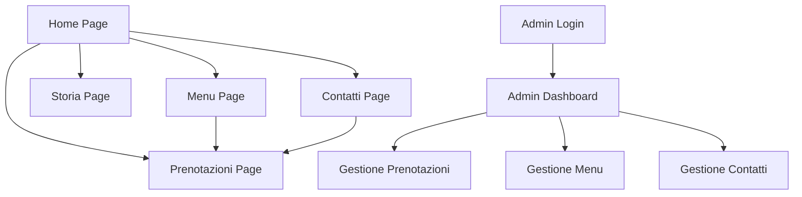

# Il Carrobbio - Sito Web Ristorante/Pizzeria
## Documento dei Requisiti di Prodotto (PRD)

## 1. Product Overview
Sito web moderno e completo per il ristorante/pizzeria "Il Carrobbio" situato presso il Santuario della Beata Vergine del Carrobbio a Casina (RE). Il sito offre un'esperienza digitale elegante e funzionale per presentare il ristorante, gestire prenotazioni online e fornire un pannello amministrativo completo.

Il prodotto mira a digitalizzare l'esperienza del cliente e semplificare la gestione operativa del ristorante attraverso una piattaforma web moderna e responsive.

## 2. Core Features

### 2.1 User Roles
| Role | Registration Method | Core Permissions |
|------|---------------------|------------------|
| Visitatore | Nessuna registrazione | Può navigare, visualizzare menu, inviare messaggi di contatto |
| Cliente | Email registration (opzionale) | Può effettuare prenotazioni online, salvare preferenze |
| Amministratore | Credenziali predefinite | Accesso completo al pannello admin, gestione prenotazioni e menu |

### 2.2 Feature Module
Il sito web del ristorante Il Carrobbio è composto dalle seguenti pagine principali:

1. **Home**: hero section con CTA, sezione chi siamo, anteprima piatti, footer informativo
2. **Menu**: categorie di piatti (Antipasti, Pizza, Pasta, Pesce, Dolci, Bevande), dettagli e prezzi
3. **Storia**: timeline del ristorante, foto location e staff, citazione fondatore
4. **Contatti**: informazioni di contatto, mappa Google Maps, form contatti, orari apertura
5. **Prenotazioni**: form prenotazione online con validazione, conferma automatica
6. **Admin Dashboard**: login protetto, gestione prenotazioni, gestione menu, analytics

### 2.3 Page Details
| Page Name | Module Name | Feature description |
|-----------|-------------|---------------------|
| Home | Hero Section | Display hero image, main title "Mangia. Bevi. Rilassati.", subtitle, CTA buttons for menu and reservations |
| Home | Chi Siamo | Show restaurant description, history summary, featured image |
| Home | Anteprima Piatti | Display 3-4 featured dishes with images, names, brief descriptions |
| Home | Footer | Show opening hours, contact info, social links, copyright |
| Menu | Categorie Menu | Display food categories (Antipasti, Pizza, Pasta, Pesce, Dolci, Bevande) with filtering |
| Menu | Dettagli Piatti | Show dish name, description, price, image for each menu item |
| Menu | Azioni Cliente | Add "Aggiungi alla prenotazione" button for logged-in users |
| Storia | Timeline | Display restaurant history timeline with key dates and milestones |
| Storia | Galleria Foto | Show location and staff photos in responsive grid |
| Storia | Citazione | Display founder quote with styling |
| Contatti | Informazioni | Show address, phone numbers, email, opening hours |
| Contatti | Mappa | Embed Google Maps with restaurant location |
| Contatti | Form Contatti | Contact form with Nome, Email, Messaggio fields and validation |
| Prenotazioni | Form Prenotazione | Reservation form with Nome, Telefono, Email, Data, Orario, Coperti fields |
| Prenotazioni | Validazione | Client-side validation, available time slots, confirmation message |
| Admin | Login | Secure admin login with email/password authentication |
| Admin | Dashboard | Overview with reservation stats, quick actions, weekly charts |
| Admin | Gestione Prenotazioni | View, approve, cancel reservations with filtering and search |
| Admin | Gestione Menu | Add, edit, delete menu items with image upload |
| Admin | Gestione Contatti | View and manage contact form submissions |

## 3. Core Process

**Flusso Visitatore/Cliente:**
1. L'utente accede alla homepage e visualizza hero section e informazioni principali
2. Naviga attraverso le sezioni Menu, Storia, Contatti usando la navbar sticky
3. Può inviare messaggi tramite il form contatti
4. Può effettuare prenotazioni online compilando il form dedicato
5. Riceve conferma della prenotazione via email/messaggio

**Flusso Amministratore:**
1. Accede al pannello admin tramite login protetto
2. Visualizza dashboard con statistiche e prenotazioni recenti
3. Gestisce prenotazioni (approva, modifica, cancella)
4. Aggiorna il menu (aggiunge, modifica, rimuove piatti)
5. Visualizza e risponde ai messaggi di contatto
6. Monitora analytics e report settimanali

## 4. User Interface Design

### 4.1 Design Style
- **Colori primari**: Bianco (#FFFFFF), Nero/Grigio scuro (#111111)
- **Colore di accento**: Rosso vino (#8B0000) per CTA e elementi importanti
- **Tipografia**: Sans-serif moderna (Inter, Poppins) con dimensioni 16px base, 24px+ per headings
- **Stile pulsanti**: Arrotondati con transizioni smooth, hover states evidenti
- **Layout**: Mobile-first responsive, griglia CSS/Flexbox, card-based design
- **Icone**: Moderne e minimali, preferibilmente Heroicons o Lucide
- **Animazioni**: Transizioni morbide (300ms), fade-in per elementi, hover effects

### 4.2 Page Design Overview
| Page Name | Module Name | UI Elements |
|-----------|-------------|-------------|
| Home | Hero Section | Full-width background image, overlay dark, centered white text, two CTA buttons (primary red, secondary outline) |
| Home | Chi Siamo | Two-column layout, text left, image right, card styling with subtle shadow |
| Home | Anteprima Piatti | 3-column grid (responsive to 1 column mobile), image cards with overlay text, hover effects |
| Menu | Categorie | Horizontal scrollable tabs, active state in red accent, smooth transitions |
| Menu | Piatti | Card grid layout, image top, content below, price highlighted in red |
| Storia | Timeline | Vertical timeline with alternating left/right content, connecting line in red |
| Contatti | Form | Clean form styling, floating labels, red focus states, validation messages |
| Prenotazioni | Form | Multi-step form appearance, date/time pickers, dropdown selects |
| Admin | Dashboard | Clean admin interface, card-based metrics, data tables, charts integration |

### 4.3 Responsiveness
Design mobile-first con breakpoints:
- Mobile: 320px-768px (single column, hamburger menu)
- Tablet: 768px-1024px (two columns, condensed navigation)
- Desktop: 1024px+ (full layout, sticky navigation)

Touch-friendly con pulsanti min 44px, ottimizzazione per swipe gestures su mobile.