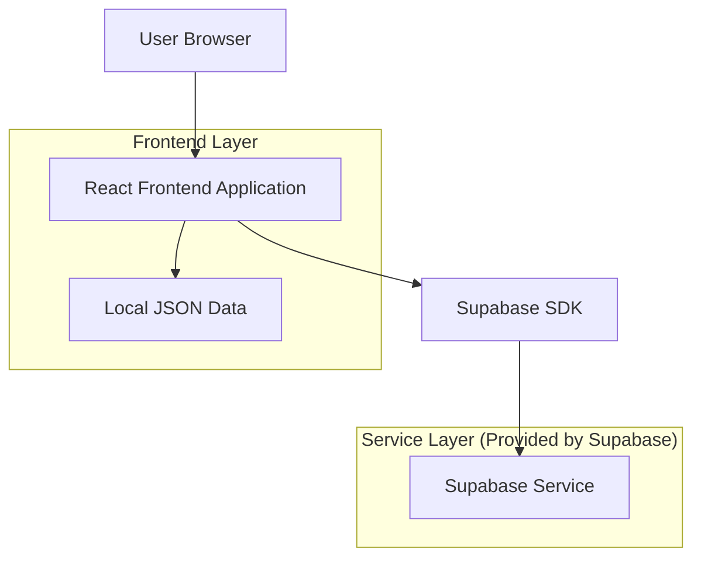
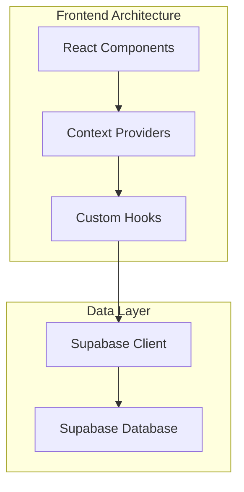
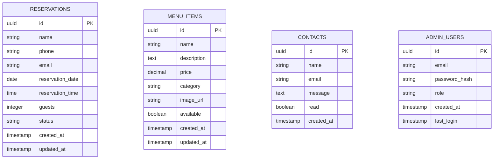

# Il Carrobbio - Architettura Tecnica
## Documento di Architettura del Sistema

## 1. Architecture Design



## 2. Technology Description

- **Frontend**: React@18 + TailwindCSS@3 + Vite + React Router@6
- **Backend**: Supabase (Authentication, Database, Storage)
- **State Management**: React Context API + useState
- **Form Validation**: React Hook Form + Zod
- **Charts**: Recharts
- **Icons**: Heroicons
- **Maps**: Google Maps Embed API
- **Deployment**: Vercel/Netlify

## 3. Route Definitions

| Route | Purpose |
|-------|----------|
| / | Home page con hero, chi siamo, anteprima piatti |
| /menu | Pagina menu completo con categorie e filtri |
| /storia | Storia del ristorante con timeline e foto |
| /contatti | Informazioni di contatto, mappa e form |
| /prenotazioni | Form prenotazione online |
| /admin | Login amministratore |
| /admin/dashboard | Dashboard amministrativo principale |
| /admin/prenotazioni | Gestione prenotazioni |
| /admin/menu | Gestione menu |
| /admin/contatti | Gestione messaggi di contatto |

## 4. API Definitions

### 4.1 Core API

**Autenticazione Admin**
```
POST /auth/v1/token
```

Request:
| Param Name | Param Type | isRequired | Description |
|------------|------------|------------|-------------|
| email | string | true | Email amministratore |
| password | string | true | Password amministratore |

Response:
| Param Name | Param Type | Description |
|------------|------------|-------------|
| access_token | string | JWT token per autenticazione |
| user | object | Dati utente amministratore |

**Gestione Prenotazioni**
```
POST /rest/v1/reservations
GET /rest/v1/reservations
PATCH /rest/v1/reservations?id=eq.{id}
DELETE /rest/v1/reservations?id=eq.{id}
```

Request (POST):
| Param Name | Param Type | isRequired | Description |
|------------|------------|------------|-------------|
| name | string | true | Nome cliente |
| phone | string | true | Telefono cliente |
| email | string | true | Email cliente |
| date | string | true | Data prenotazione (YYYY-MM-DD) |
| time | string | true | Orario prenotazione (HH:MM) |
| guests | number | true | Numero coperti |
| status | string | false | Stato prenotazione (pending/confirmed/cancelled) |

**Gestione Menu**
```
GET /rest/v1/menu_items
POST /rest/v1/menu_items
PATCH /rest/v1/menu_items?id=eq.{id}
DELETE /rest/v1/menu_items?id=eq.{id}
```

Request (POST):
| Param Name | Param Type | isRequired | Description |
|------------|------------|------------|-------------|
| name | string | true | Nome piatto |
| description | string | true | Descrizione piatto |
| price | number | true | Prezzo in euro |
| category | string | true | Categoria (antipasti/pizza/pasta/pesce/dolci/bevande) |
| image_url | string | false | URL immagine piatto |
| available | boolean | false | Disponibilità piatto |

**Gestione Contatti**
```
POST /rest/v1/contacts
GET /rest/v1/contacts
```

Request (POST):
| Param Name | Param Type | isRequired | Description |
|------------|------------|------------|-------------|
| name | string | true | Nome mittente |
| email | string | true | Email mittente |
| message | string | true | Messaggio |
| created_at | timestamp | false | Data invio (auto-generata) |

## 5. Server Architecture Diagram



## 6. Data Model

### 6.1 Data Model Definition



### 6.2 Data Definition Language

**Tabella Prenotazioni (reservations)**
```sql
-- Crea tabella prenotazioni
CREATE TABLE reservations (
  id UUID PRIMARY KEY DEFAULT gen_random_uuid(),
  name VARCHAR(100) NOT NULL,
  phone VARCHAR(20) NOT NULL,
  email VARCHAR(255) NOT NULL,
  reservation_date DATE NOT NULL,
  reservation_time TIME NOT NULL,
  guests INTEGER NOT NULL CHECK (guests > 0 AND guests <= 20),
  status VARCHAR(20) DEFAULT 'pending' CHECK (status IN ('pending', 'confirmed', 'cancelled')),
  created_at TIMESTAMP WITH TIME ZONE DEFAULT NOW(),
  updated_at TIMESTAMP WITH TIME ZONE DEFAULT NOW()
);

-- Crea indici
CREATE INDEX idx_reservations_date ON reservations(reservation_date DESC);
CREATE INDEX idx_reservations_status ON reservations(status);
CREATE INDEX idx_reservations_email ON reservations(email);

-- Permessi Supabase
GRANT SELECT ON reservations TO anon;
GRANT ALL PRIVILEGES ON reservations TO authenticated;
```

**Tabella Menu (menu_items)**
```sql
-- Crea tabella menu
CREATE TABLE menu_items (
  id UUID PRIMARY KEY DEFAULT gen_random_uuid(),
  name VARCHAR(100) NOT NULL,
  description TEXT NOT NULL,
  price DECIMAL(6,2) NOT NULL CHECK (price > 0),
  category VARCHAR(20) NOT NULL CHECK (category IN ('antipasti', 'pizza', 'pasta', 'pesce', 'dolci', 'bevande')),
  image_url TEXT,
  available BOOLEAN DEFAULT true,
  created_at TIMESTAMP WITH TIME ZONE DEFAULT NOW(),
  updated_at TIMESTAMP WITH TIME ZONE DEFAULT NOW()
);

-- Crea indici
CREATE INDEX idx_menu_category ON menu_items(category);
CREATE INDEX idx_menu_available ON menu_items(available);

-- Permessi Supabase
GRANT SELECT ON menu_items TO anon;
GRANT ALL PRIVILEGES ON menu_items TO authenticated;

-- Dati iniziali menu
INSERT INTO menu_items (name, description, price, category, image_url) VALUES
('Antipasto della Casa', 'Selezione di salumi e formaggi locali con miele e mostarda', 12.00, 'antipasti', 'https://images.unsplash.com/photo-1544025162-d76694265947?w=400'),
('Bruschette Miste', 'Bruschette con pomodoro, burrata e prosciutto crudo', 8.50, 'antipasti', 'https://images.unsplash.com/photo-1572441713132-51c75654db73?w=400'),
('Crudo di Ricciola', 'Ricciola marinata con agrumi e olio extravergine', 15.00, 'antipasti', 'https://images.unsplash.com/photo-1559847844-d721426d6edc?w=400'),
('Pizza Margherita', 'Pomodoro, mozzarella di bufala, basilico fresco', 8.00, 'pizza', 'https://images.unsplash.com/photo-1513104890138-7c749659a591?w=400'),
('Pizza Diavola', 'Pomodoro, mozzarella, salame piccante, olive nere', 10.00, 'pizza', 'https://images.unsplash.com/photo-1565299624946-b28f40a0ca4b?w=400'),
('Pizza Marinara', 'Pomodoro, aglio, origano, olio extravergine', 6.50, 'pizza', 'https://images.unsplash.com/photo-1571407970349-bc81e7e96d47?w=400'),
('Pizza Quattro Stagioni', 'Pomodoro, mozzarella, prosciutto, funghi, carciofi, olive', 12.00, 'pizza', 'https://images.unsplash.com/photo-1593560708920-61dd98c46a4e?w=400'),
('Pizza Capricciosa', 'Pomodoro, mozzarella, prosciutto cotto, funghi, carciofi', 11.00, 'pizza', 'https://images.unsplash.com/photo-1628840042765-356cda07504e?w=400'),
('Spaghetti alle Vongole', 'Spaghetti con vongole veraci, aglio, prezzemolo e vino bianco', 14.00, 'pasta', 'https://images.unsplash.com/photo-1621996346565-e3dbc353d2e5?w=400'),
('Risotto ai Porcini', 'Risotto cremoso con funghi porcini e parmigiano', 16.00, 'pasta', 'https://images.unsplash.com/photo-1476124369491-e7addf5db371?w=400'),
('Branzino in Crosta', 'Branzino fresco in crosta di sale con verdure di stagione', 22.00, 'pesce', 'https://images.unsplash.com/photo-1544943910-4c1dc44aab44?w=400'),
('Grigliata Mista di Pesce', 'Selezione di pesce fresco alla griglia con contorno', 25.00, 'pesce', 'https://images.unsplash.com/photo-1559847844-d721426d6edc?w=400'),
('Tiramisù della Casa', 'Tiramisù tradizionale preparato al momento', 6.00, 'dolci', 'https://images.unsplash.com/photo-1571877227200-a0d98ea607e9?w=400'),
('Panna Cotta ai Frutti di Bosco', 'Panna cotta con coulis di frutti di bosco freschi', 5.50, 'dolci', 'https://images.unsplash.com/photo-1488477181946-6428a0291777?w=400'),
('Vino della Casa Rosso', 'Vino rosso locale, bottiglia 750ml', 18.00, 'bevande', 'https://images.unsplash.com/photo-1506377247377-2a5b3b417ebb?w=400'),
('Acqua Naturale', 'Acqua naturale 1L', 2.50, 'bevande', 'https://images.unsplash.com/photo-1559839734-2b71ea197ec2?w=400');
```

**Tabella Contatti (contacts)**
```sql
-- Crea tabella contatti
CREATE TABLE contacts (
  id UUID PRIMARY KEY DEFAULT gen_random_uuid(),
  name VARCHAR(100) NOT NULL,
  email VARCHAR(255) NOT NULL,
  message TEXT NOT NULL,
  read BOOLEAN DEFAULT false,
  created_at TIMESTAMP WITH TIME ZONE DEFAULT NOW()
);

-- Crea indici
CREATE INDEX idx_contacts_created_at ON contacts(created_at DESC);
CREATE INDEX idx_contacts_read ON contacts(read);

-- Permessi Supabase
GRANT INSERT ON contacts TO anon;
GRANT ALL PRIVILEGES ON contacts TO authenticated;
```

**Configurazione Row Level Security (RLS)**
```sql
-- Abilita RLS
ALTER TABLE reservations ENABLE ROW LEVEL SECURITY;
ALTER TABLE menu_items ENABLE ROW LEVEL SECURITY;
ALTER TABLE contacts ENABLE ROW LEVEL SECURITY;

-- Policy per prenotazioni
CREATE POLICY "Allow public read access" ON reservations FOR SELECT TO anon USING (true);
CREATE POLICY "Allow public insert" ON reservations FOR INSERT TO anon WITH CHECK (true);
CREATE POLICY "Allow authenticated full access" ON reservations FOR ALL TO authenticated USING (true);

-- Policy per menu
CREATE POLICY "Allow public read menu" ON menu_items FOR SELECT TO anon USING (available = true);
CREATE POLICY "Allow authenticated full menu access" ON menu_items FOR ALL TO authenticated USING (true);

-- Policy per contatti
CREATE POLICY "Allow public insert contacts" ON contacts FOR INSERT TO anon WITH CHECK (true);
CREATE POLICY "Allow authenticated read contacts" ON contacts FOR SELECT TO authenticated USING (true);
```