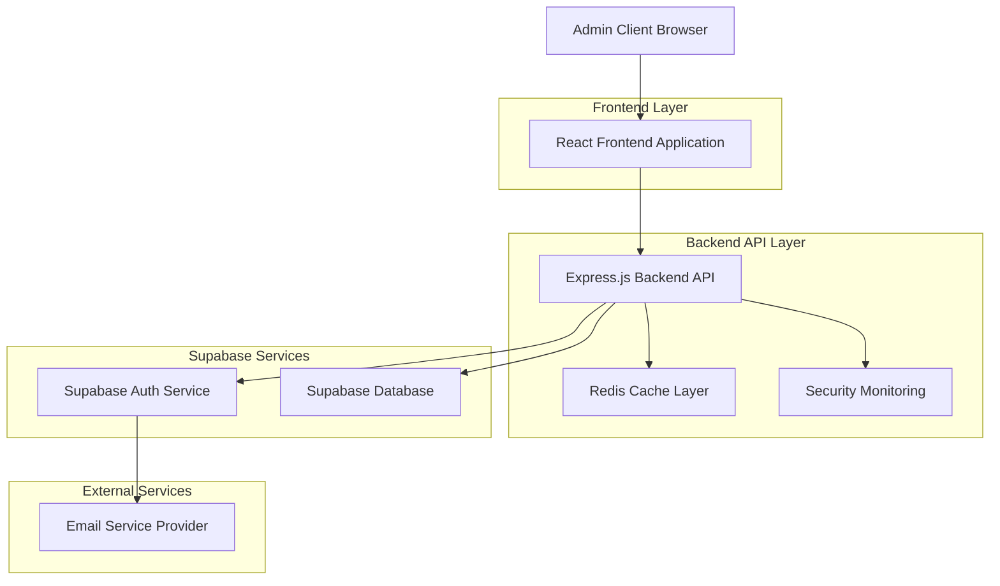
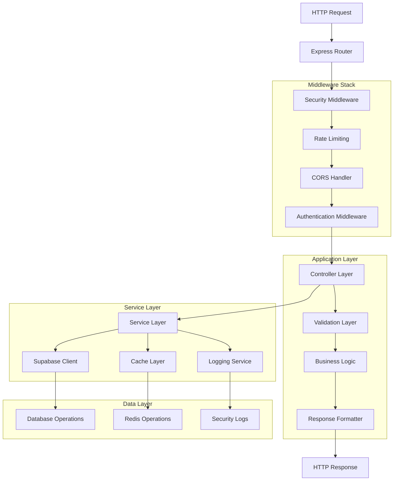
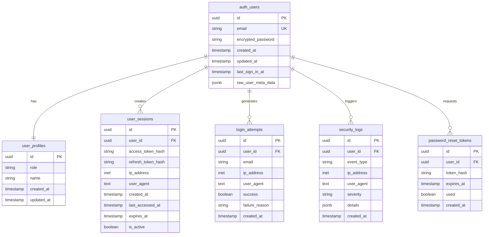

# Architettura Tecnica - Sistema di Autenticazione Supabase

## 1. Architecture Design



## 2. Technology Description

- **Frontend**: React@18 + TypeScript + Tailwind CSS + Vite
- **Backend**: Express.js@4 + TypeScript + Node.js@18+
- **Authentication**: Supabase Auth + JWT tokens
- **Database**: Supabase (PostgreSQL) + Row Level Security
- **Caching**: Redis@7 per session management
- **Security**: Helmet.js + Rate limiting + CORS
- **Monitoring**: Winston logging + Custom security middleware
- **Email**: Nodemailer + SMTP provider

## 3. Route Definitions

| Route | Method | Purpose | Authentication |
|-------|--------|---------|----------------|
| `/api/auth/login` | POST | Autenticazione utente admin | None |
| `/api/auth/logout` | POST | Terminazione sessione | Required |
| `/api/auth/verify` | GET | Verifica stato autenticazione | Required |
| `/api/auth/refresh` | POST | Rinnovo token JWT | Required |
| `/api/auth/forgot-password` | POST | Richiesta reset password | None |
| `/api/auth/reset-password` | POST | Reset password con token | None |
| `/api/auth/change-password` | POST | Cambio password autenticato | Required |
| `/api/auth/sessions` | GET | Lista sessioni attive | Required |
| `/api/auth/sessions/:id` | DELETE | Terminazione sessione specifica | Required |
| `/api/security/events` | GET | Log eventi di sicurezza | Required |
| `/api/security/stats` | GET | Statistiche sicurezza | Required |

## 4. API Definitions

### 4.1 Authentication APIs

**Login Endpoint**
```
POST /api/auth/login
```

Request:
| Param Name | Param Type | isRequired | Description |
|------------|------------|------------|-------------|
| email | string | true | Email amministratore (formato valido) |
| password | string | true | Password (minimo 8 caratteri) |

Response:
| Param Name | Param Type | Description |
|------------|------------|-------------|
| success | boolean | Stato operazione |
| message | string | Messaggio descrittivo |
| data.access_token | string | JWT token per autenticazione |
| data.refresh_token | string | Token per rinnovo sessione |
| data.user | UserProfile | Dati profilo utente |
| data.expires_in | number | Secondi alla scadenza token |

Example Request:
```json
{
  "email": "admin@carrobbio.com",
  "password": "SecurePass123!"
}
```

Example Response:
```json
{
  "success": true,
  "message": "Login effettuato con successo",
  "data": {
    "access_token": "eyJhbGciOiJIUzI1NiIsInR5cCI6IkpXVCJ9...",
    "refresh_token": "v1.MR5twSNGrfLd1YGACVKjPQ...",
    "user": {
      "id": "550e8400-e29b-41d4-a716-446655440000",
      "email": "admin@carrobbio.com",
      "role": "admin",
      "name": "Administrator",
      "last_sign_in_at": "2024-01-15T10:30:00Z"
    },
    "expires_in": 3600
  }
}
```

**Logout Endpoint**
```
POST /api/auth/logout
```

Headers:
| Header Name | Header Type | isRequired | Description |
|-------------|-------------|------------|-------------|
| Authorization | string | true | Bearer {access_token} |

Response:
| Param Name | Param Type | Description |
|------------|------------|-------------|
| success | boolean | Stato operazione |
| message | string | Messaggio conferma logout |

**Session Verification**
```
GET /api/auth/verify
```

Headers:
| Header Name | Header Type | isRequired | Description |
|-------------|-------------|------------|-------------|
| Authorization | string | true | Bearer {access_token} |

Response:
| Param Name | Param Type | Description |
|------------|------------|-------------|
| success | boolean | Stato verifica |
| data.user | UserProfile | Dati utente autenticato |
| data.session | SessionInfo | Informazioni sessione corrente |

**Token Refresh**
```
POST /api/auth/refresh
```

Request:
| Param Name | Param Type | isRequired | Description |
|------------|------------|------------|-------------|
| refresh_token | string | true | Token di refresh valido |

Response:
| Param Name | Param Type | Description |
|------------|------------|-------------|
| success | boolean | Stato operazione |
| data.access_token | string | Nuovo JWT token |
| data.expires_in | number | Secondi alla scadenza |

### 4.2 Password Management APIs

**Forgot Password**
```
POST /api/auth/forgot-password
```

Request:
| Param Name | Param Type | isRequired | Description |
|------------|------------|------------|-------------|
| email | string | true | Email per reset password |

Response:
| Param Name | Param Type | Description |
|------------|------------|-------------|
| success | boolean | Stato richiesta |
| message | string | Messaggio conferma invio email |

**Reset Password**
```
POST /api/auth/reset-password
```

Request:
| Param Name | Param Type | isRequired | Description |
|------------|------------|------------|-------------|
| token | string | true | Token reset da email |
| password | string | true | Nuova password |

Response:
| Param Name | Param Type | Description |
|------------|------------|-------------|
| success | boolean | Stato reset |
| message | string | Messaggio conferma |

### 4.3 Security APIs

**Security Events**
```
GET /api/security/events
```

Query Parameters:
| Param Name | Param Type | isRequired | Description |
|------------|------------|------------|-------------|
| limit | number | false | Numero eventi (default: 50) |
| offset | number | false | Offset paginazione |
| severity | string | false | Filtro per severità |
| event_type | string | false | Filtro per tipo evento |

Response:
| Param Name | Param Type | Description |
|------------|------------|-------------|
| success | boolean | Stato richiesta |
| data.events | SecurityEvent[] | Array eventi sicurezza |
| data.total | number | Totale eventi |
| data.pagination | PaginationInfo | Info paginazione |

## 5. Server Architecture Diagram



## 6. Data Model

### 6.1 Data Model Definition



### 6.2 Data Definition Language

**User Profiles Table**
```sql
-- Estende auth.users con informazioni profilo
CREATE TABLE public.user_profiles (
    id UUID REFERENCES auth.users(id) ON DELETE CASCADE PRIMARY KEY,
    role TEXT NOT NULL DEFAULT 'user' CHECK (role IN ('admin', 'user', 'system')),
    name TEXT NOT NULL,
    created_at TIMESTAMP WITH TIME ZONE DEFAULT NOW(),
    updated_at TIMESTAMP WITH TIME ZONE DEFAULT NOW()
);

-- Trigger per aggiornamento automatico updated_at
CREATE OR REPLACE FUNCTION update_updated_at_column()
RETURNS TRIGGER AS $$
BEGIN
    NEW.updated_at = NOW();
    RETURN NEW;
END;
$$ language 'plpgsql';

CREATE TRIGGER update_user_profiles_updated_at
    BEFORE UPDATE ON public.user_profiles
    FOR EACH ROW
    EXECUTE FUNCTION update_updated_at_column();

-- RLS Policies
ALTER TABLE public.user_profiles ENABLE ROW LEVEL SECURITY;

CREATE POLICY "Users can view own profile" ON public.user_profiles
    FOR SELECT USING (auth.uid() = id);

CREATE POLICY "Admins can view all profiles" ON public.user_profiles
    FOR SELECT USING (
        EXISTS (
            SELECT 1 FROM public.user_profiles
            WHERE id = auth.uid() AND role = 'admin'
        )
    );

CREATE POLICY "Admins can update profiles" ON public.user_profiles
    FOR UPDATE USING (
        EXISTS (
            SELECT 1 FROM public.user_profiles
            WHERE id = auth.uid() AND role = 'admin'
        )
    );

-- Indici per performance
CREATE INDEX idx_user_profiles_role ON public.user_profiles(role);
CREATE INDEX idx_user_profiles_created_at ON public.user_profiles(created_at DESC);
```

**User Sessions Table**
```sql
-- Tracking sessioni utente per audit e sicurezza
CREATE TABLE public.user_sessions (
    id UUID PRIMARY KEY DEFAULT gen_random_uuid(),
    user_id UUID REFERENCES auth.users(id) ON DELETE CASCADE NOT NULL,
    access_token_hash TEXT NOT NULL,
    refresh_token_hash TEXT,
    ip_address INET,
    user_agent TEXT,
    created_at TIMESTAMP WITH TIME ZONE DEFAULT NOW(),
    last_accessed_at TIMESTAMP WITH TIME ZONE DEFAULT NOW(),
    expires_at TIMESTAMP WITH TIME ZONE NOT NULL,
    is_active BOOLEAN DEFAULT true
);

-- Indici per performance
CREATE INDEX idx_user_sessions_user_id ON public.user_sessions(user_id);
CREATE INDEX idx_user_sessions_active ON public.user_sessions(is_active, expires_at);
CREATE INDEX idx_user_sessions_token_hash ON public.user_sessions(access_token_hash);
CREATE INDEX idx_user_sessions_created_at ON public.user_sessions(created_at DESC);

-- RLS Policies
ALTER TABLE public.user_sessions ENABLE ROW LEVEL SECURITY;

CREATE POLICY "Users can view own sessions" ON public.user_sessions
    FOR SELECT USING (auth.uid() = user_id);

CREATE POLICY "Admins can view all sessions" ON public.user_sessions
    FOR SELECT USING (
        EXISTS (
            SELECT 1 FROM public.user_profiles
            WHERE id = auth.uid() AND role = 'admin'
        )
    );

-- Funzione per cleanup sessioni scadute
CREATE OR REPLACE FUNCTION cleanup_expired_sessions()
RETURNS INTEGER AS $$
DECLARE
    deleted_count INTEGER;
BEGIN
    UPDATE public.user_sessions
    SET is_active = false
    WHERE expires_at < NOW() AND is_active = true;
    
    GET DIAGNOSTICS deleted_count = ROW_COUNT;
    RETURN deleted_count;
END;
$$ LANGUAGE plpgsql;

-- Scheduled job per cleanup (da configurare con pg_cron)
-- SELECT cron.schedule('cleanup-sessions', '0 */6 * * *', 'SELECT cleanup_expired_sessions();');
```

**Login Attempts Table**
```sql
-- Tracking tentativi di login per sicurezza
CREATE TABLE public.login_attempts (
    id UUID PRIMARY KEY DEFAULT gen_random_uuid(),
    user_id UUID REFERENCES auth.users(id) ON DELETE SET NULL,
    email TEXT NOT NULL,
    ip_address INET NOT NULL,
    user_agent TEXT,
    success BOOLEAN NOT NULL DEFAULT false,
    failure_reason TEXT,
    created_at TIMESTAMP WITH TIME ZONE DEFAULT NOW()
);

-- Indici per performance e sicurezza
CREATE INDEX idx_login_attempts_email ON public.login_attempts(email);
CREATE INDEX idx_login_attempts_ip ON public.login_attempts(ip_address);
CREATE INDEX idx_login_attempts_created_at ON public.login_attempts(created_at DESC);
CREATE INDEX idx_login_attempts_success ON public.login_attempts(success, created_at DESC);

-- RLS Policies
ALTER TABLE public.login_attempts ENABLE ROW LEVEL SECURITY;

CREATE POLICY "Admins can view all login attempts" ON public.login_attempts
    FOR SELECT USING (
        EXISTS (
            SELECT 1 FROM public.user_profiles
            WHERE id = auth.uid() AND role = 'admin'
        )
    );

-- Funzione per analisi rate limiting
CREATE OR REPLACE FUNCTION check_rate_limit(
    p_ip_address INET,
    p_window_minutes INTEGER DEFAULT 15,
    p_max_attempts INTEGER DEFAULT 5
)
RETURNS BOOLEAN AS $$
DECLARE
    attempt_count INTEGER;
BEGIN
    SELECT COUNT(*)
    INTO attempt_count
    FROM public.login_attempts
    WHERE ip_address = p_ip_address
        AND success = false
        AND created_at > NOW() - INTERVAL '1 minute' * p_window_minutes;
    
    RETURN attempt_count < p_max_attempts;
END;
$$ LANGUAGE plpgsql;
```

**Security Logs Table**
```sql
-- Log eventi di sicurezza
CREATE TABLE public.security_logs (
    id UUID PRIMARY KEY DEFAULT gen_random_uuid(),
    user_id UUID REFERENCES auth.users(id) ON DELETE SET NULL,
    event_type TEXT NOT NULL,
    ip_address INET NOT NULL,
    user_agent TEXT,
    severity TEXT NOT NULL DEFAULT 'low' CHECK (severity IN ('low', 'medium', 'high', 'critical')),
    details JSONB,
    created_at TIMESTAMP WITH TIME ZONE DEFAULT NOW()
);

-- Indici per performance
CREATE INDEX idx_security_logs_event_type ON public.security_logs(event_type);
CREATE INDEX idx_security_logs_severity ON public.security_logs(severity);
CREATE INDEX idx_security_logs_created_at ON public.security_logs(created_at DESC);
CREATE INDEX idx_security_logs_ip ON public.security_logs(ip_address);
CREATE INDEX idx_security_logs_user_id ON public.security_logs(user_id);

-- Indice GIN per ricerca in JSONB
CREATE INDEX idx_security_logs_details ON public.security_logs USING GIN (details);

-- RLS Policies
ALTER TABLE public.security_logs ENABLE ROW LEVEL SECURITY;

CREATE POLICY "Admins can view all security logs" ON public.security_logs
    FOR SELECT USING (
        EXISTS (
            SELECT 1 FROM public.user_profiles
            WHERE id = auth.uid() AND role = 'admin'
        )
    );

-- Constraint per event_type validi
ALTER TABLE public.security_logs
ADD CONSTRAINT check_event_type
CHECK (event_type IN (
    'login_success', 'login_failure', 'logout',
    'password_reset_request', 'password_reset_success', 'password_change',
    'token_refresh', 'session_expired', 'session_terminated',
    'suspicious_activity', 'rate_limit_exceeded', 'unauthorized_access',
    'brute_force_attempt', 'sql_injection_attempt', 'xss_attempt'
));
```

**Password Reset Tokens Table**
```sql
-- Token per reset password
CREATE TABLE public.password_reset_tokens (
    id UUID PRIMARY KEY DEFAULT gen_random_uuid(),
    user_id UUID REFERENCES auth.users(id) ON DELETE CASCADE NOT NULL,
    token_hash TEXT NOT NULL UNIQUE,
    expires_at TIMESTAMP WITH TIME ZONE NOT NULL,
    used BOOLEAN DEFAULT false,
    created_at TIMESTAMP WITH TIME ZONE DEFAULT NOW()
);

-- Indici per performance
CREATE INDEX idx_password_reset_tokens_user_id ON public.password_reset_tokens(user_id);
CREATE INDEX idx_password_reset_tokens_hash ON public.password_reset_tokens(token_hash);
CREATE INDEX idx_password_reset_tokens_expires ON public.password_reset_tokens(expires_at);

-- RLS Policies
ALTER TABLE public.password_reset_tokens ENABLE ROW LEVEL SECURITY;

CREATE POLICY "Service role can manage reset tokens" ON public.password_reset_tokens
    FOR ALL USING (auth.role() = 'service_role');

-- Funzione per cleanup token scaduti
CREATE OR REPLACE FUNCTION cleanup_expired_reset_tokens()
RETURNS INTEGER AS $$
DECLARE
    deleted_count INTEGER;
BEGIN
    DELETE FROM public.password_reset_tokens
    WHERE expires_at < NOW() OR used = true;
    
    GET DIAGNOSTICS deleted_count = ROW_COUNT;
    RETURN deleted_count;
END;
$$ LANGUAGE plpgsql;
```

**Initial Data Setup**
```sql
-- Crea profilo admin di default
INSERT INTO auth.users (id, email, encrypted_password, email_confirmed_at, created_at, updated_at)
VALUES (
    gen_random_uuid(),
    'admin@carrobbio.com',
    crypt('AdminPassword123!', gen_salt('bf')),
    NOW(),
    NOW(),
    NOW()
) ON CONFLICT (email) DO NOTHING;

-- Crea profilo admin corrispondente
INSERT INTO public.user_profiles (id, role, name)
SELECT id, 'admin', 'Administrator'
FROM auth.users
WHERE email = 'admin@carrobbio.com'
ON CONFLICT (id) DO UPDATE SET
    role = EXCLUDED.role,
    name = EXCLUDED.name,
    updated_at = NOW();

-- Configura RLS per auth.users (se necessario)
-- ALTER TABLE auth.users ENABLE ROW LEVEL SECURITY;

-- Funzioni di utilità per gestione utenti
CREATE OR REPLACE FUNCTION create_admin_user(
    p_email TEXT,
    p_password TEXT,
    p_name TEXT
)
RETURNS UUID AS $$
DECLARE
    new_user_id UUID;
BEGIN
    -- Crea utente in auth.users
    INSERT INTO auth.users (id, email, encrypted_password, email_confirmed_at, created_at, updated_at)
    VALUES (
        gen_random_uuid(),
        p_email,
        crypt(p_password, gen_salt('bf')),
        NOW(),
        NOW(),
        NOW()
    )
    RETURNING id INTO new_user_id;
    
    -- Crea profilo admin
    INSERT INTO public.user_profiles (id, role, name)
    VALUES (new_user_id, 'admin', p_name);
    
    RETURN new_user_id;
END;
$$ LANGUAGE plpgsql SECURITY DEFINER;
```

## 7. Security Implementation Details

### 7.1 JWT Token Management

```typescript
// JWT Configuration
const JWT_CONFIG = {
  algorithm: 'HS256' as const,
  expiresIn: '1h',
  issuer: 'carrobbio-admin',
  audience: 'admin-panel',
  clockTolerance: 30, // seconds
  maxAge: '1h'
};

// Token generation with Supabase
const generateTokens = async (user: User): Promise<TokenPair> => {
  const { data, error } = await supabase.auth.signInWithPassword({
    email: user.email,
    password: user.password
  });
  
  if (error || !data.session) {
    throw new Error('Token generation failed');
  }
  
  return {
    access_token: data.session.access_token,
    refresh_token: data.session.refresh_token,
    expires_in: data.session.expires_in
  };
};

// Token verification
const verifyToken = async (token: string): Promise<TokenVerificationResult> => {
  try {
    const { data: { user }, error } = await supabase.auth.getUser(token);
    
    if (error || !user) {
      return { isValid: false, error: 'Invalid token' };
    }
    
    // Check user role
    const { data: profile } = await supabase
      .from('user_profiles')
      .select('role, name')
      .eq('id', user.id)
      .single();
    
    if (profile?.role !== 'admin') {
      return { isValid: false, error: 'Insufficient permissions' };
    }
    
    return {
      isValid: true,
      user: {
        id: user.id,
        email: user.email!,
        role: profile.role,
        name: profile.name
      }
    };
  } catch (error) {
    return { isValid: false, error: 'Token verification failed' };
  }
};
```

### 7.2 Rate Limiting Implementation

```typescript
import rateLimit from 'express-rate-limit';
import RedisStore from 'rate-limit-redis';
import Redis from 'ioredis';

// Redis client for rate limiting
const redis = new Redis({
  host: process.env.REDIS_HOST || 'localhost',
  port: parseInt(process.env.REDIS_PORT || '6379'),
  password: process.env.REDIS_PASSWORD,
  retryDelayOnFailover: 100,
  maxRetriesPerRequest: 3
});

// Login rate limiter
export const loginRateLimit = rateLimit({
  store: new RedisStore({
    sendCommand: (...args: string[]) => redis.call(...args),
  }),
  windowMs: 15 * 60 * 1000, // 15 minutes
  max: 5, // 5 attempts per window
  message: {
    success: false,
    error: 'Troppi tentativi di login. Riprova tra 15 minuti.',
    retryAfter: 15 * 60
  },
  standardHeaders: true,
  legacyHeaders: false,
  skipSuccessfulRequests: true,
  keyGenerator: (req) => {
    return `login:${req.ip}:${req.body.email || 'unknown'}`;
  },
  onLimitReached: async (req, res, options) => {
    // Log rate limit exceeded
    await logSecurityEvent({
      event_type: 'rate_limit_exceeded',
      ip_address: req.ip,
      user_agent: req.get('User-Agent') || 'unknown',
      severity: 'medium',
      details: {
        endpoint: '/api/auth/login',
        limit: options.max,
        windowMs: options.windowMs
      }
    });
  }
});

// Password reset rate limiter
export const passwordResetRateLimit = rateLimit({
  store: new RedisStore({
    sendCommand: (...args: string[]) => redis.call(...args),
  }),
  windowMs: 60 * 60 * 1000, // 1 hour
  max: 3, // 3 requests per hour
  message: {
    success: false,
    error: 'Troppi tentativi di reset password. Riprova tra 1 ora.',
    retryAfter: 60 * 60
  },
  keyGenerator: (req) => `password-reset:${req.ip}`,
  skipSuccessfulRequests: false
});

// General API rate limiter
export const generalRateLimit = rateLimit({
  windowMs: 15 * 60 * 1000, // 15 minutes
  max: 100, // 100 requests per window
  message: {
    success: false,
    error: 'Troppi richieste. Riprova più tardi.',
    retryAfter: 15 * 60
  },
  standardHeaders: true,
  legacyHeaders: false
});
```

### 7.3 Security Middleware Stack

```typescript
import helmet from 'helmet';
import cors from 'cors';
import compression from 'compression';

// Security headers configuration
const securityHeaders = helmet({
  contentSecurityPolicy: {
    directives: {
      defaultSrc: ["'self'"],
      styleSrc: ["'self'", "'unsafe-inline'"],
      scriptSrc: ["'self'"],
      imgSrc: ["'self'", "data:", "https:"],
      connectSrc: ["'self'", process.env.VITE_SUPABASE_URL!],
      fontSrc: ["'self'"],
      objectSrc: ["'none'"],
      mediaSrc: ["'self'"],
      frameSrc: ["'none'"]
    }
  },
  crossOriginEmbedderPolicy: false,
  hsts: {
    maxAge: 31536000,
    includeSubDomains: true,
    preload: true
  }
});

// CORS configuration
const corsOptions = {
  origin: [
    process.env.FRONTEND_URL || 'http://localhost:5173',
    'https://carrobbio.com',
    'https://www.carrobbio.com'
  ],
  credentials: true,
  methods: ['GET', 'POST', 'PUT', 'DELETE', 'OPTIONS'],
  allowedHeaders: [
    'Origin',
    'X-Requested-With',
    'Content-Type',
    'Accept',
    'Authorization',
    'X-CSRF-Token'
  ],
  exposedHeaders: ['X-RateLimit-Limit', 'X-RateLimit-Remaining']
};

// Apply middleware stack
export const applySecurityMiddleware = (app: Express) => {
  app.use(compression());
  app.use(securityHeaders);
  app.use(cors(corsOptions));
  app.use(express.json({ limit: '10mb' }));
  app.use(express.urlencoded({ extended: true, limit: '10mb' }));
  
  // Trust proxy for accurate IP addresses
  app.set('trust proxy', 1);
  
  // Disable X-Powered-By header
  app.disable('x-powered-by');
};
```

### 7.4 Input Validation

```typescript
import Joi from 'joi';
import validator from 'validator';

// Validation schemas
const loginSchema = Joi.object({
  email: Joi.string()
    .email({ tlds: { allow: false } })
    .max(254)
    .required()
    .messages({
      'string.email': 'Formato email non valido',
      'string.max': 'Email troppo lunga',
      'any.required': 'Email richiesta'
    }),
  password: Joi.string()
    .min(8)
    .max(128)
    .required()
    .messages({
      'string.min': 'Password deve essere di almeno 8 caratteri',
      'string.max': 'Password troppo lunga',
      'any.required': 'Password richiesta'
    })
});

const passwordSchema = Joi.string()
  .min(8)
  .max(128)
  .pattern(/^(?=.*[a-z])(?=.*[A-Z])(?=.*\d)(?=.*[!@#$%^&*(),.?":{}|<>]).*$/)
  .required()
  .messages({
    'string.pattern.base': 'Password deve contenere almeno: 1 minuscola, 1 maiuscola, 1 numero, 1 carattere speciale',
    'string.min': 'Password deve essere di almeno 8 caratteri',
    'string.max': 'Password troppo lunga'
  });

// Validation middleware
export const validateLogin = (req: Request, res: Response, next: NextFunction) => {
  const { error } = loginSchema.validate(req.body);
  
  if (error) {
    return res.status(400).json({
      success: false,
      error: error.details[0].message,
      field: error.details[0].path[0]
    });
  }
  
  // Additional security checks
  const { email, password } = req.body;
  
  // Sanitize email
  req.body.email = validator.normalizeEmail(email, {
    gmail_remove_dots: false,
    gmail_remove_subaddress: false,
    outlookdotcom_remove_subaddress: false,
    yahoo_remove_subaddress: false,
    icloud_remove_subaddress: false
  });
  
  // Check for common attack patterns
  if (containsSqlInjection(password) || containsXSS(password)) {
    logSecurityEvent({
      event_type: 'suspicious_activity',
      ip_address: req.ip,
      user_agent: req.get('User-Agent') || 'unknown',
      severity: 'high',
      details: {
        reason: 'Malicious input detected',
        field: 'password'
      }
    });
    
    return res.status(400).json({
      success: false,
      error: 'Input non valido'
    });
  }
  
  next();
};

// Security pattern detection
const containsSqlInjection = (input: string): boolean => {
  const sqlPatterns = [
    /('|(\-\-)|(;)|(\||\|)|(\*|\*))/i,
    /(union|select|insert|delete|update|drop|create|alter|exec|execute)/i,
    /(script|javascript|vbscript|onload|onerror|onclick)/i
  ];
  
  return sqlPatterns.some(pattern => pattern.test(input));
};

const containsXSS = (input: string): boolean => {
  const xssPatterns = [
    /<script[^>]*>.*?<\/script>/gi,
    /<iframe[^>]*>.*?<\/iframe>/gi,
    /javascript:/gi,
    /on\w+\s*=/gi
  ];
  
  return xssPatterns.some(pattern => pattern.test(input));
};
```

## 8. Performance Optimization

### 8.1 Caching Strategy

```typescript
// Redis caching for session data
class SessionCache {
  private redis: Redis;
  private ttl: number = 3600; // 1 hour
  
  constructor() {
    this.redis = new Redis({
      host: process.env.REDIS_HOST,
      port: parseInt(process.env.REDIS_PORT || '6379'),
      password: process.env.REDIS_PASSWORD,
      retryDelayOnFailover: 100,
      lazyConnect: true
    });
  }
  
  async setSession(sessionId: string, data: SessionData): Promise<void> {
    const key = `session:${sessionId}`;
    await this.redis.setex(key, this.ttl, JSON.stringify(data));
  }
  
  async getSession(sessionId: string): Promise<SessionData | null> {
    const key = `session:${sessionId}`;
    const data = await this.redis.get(key);
    return data ? JSON.parse(data) : null;
  }
  
  async deleteSession(sessionId: string): Promise<void> {
    const key = `session:${sessionId}`;
    await this.redis.del(key);
  }
  
  async extendSession(sessionId: string): Promise<void> {
    const key = `session:${sessionId}`;
    await this.redis.expire(key, this.ttl);
  }
}

// Database connection pooling
const supabaseConfig = {
  auth: {
    autoRefreshToken: true,
    persistSession: false,
    detectSessionInUrl: false
  },
  db: {
    schema: 'public'
  },
  global: {
    headers: {
      'x-application-name': 'carrobbio-admin'
    }
  }
};
```

### 8.2 Database Optimization

```sql
-- Query optimization indexes
CREATE INDEX CONCURRENTLY idx_user_sessions_composite 
ON public.user_sessions(user_id, is_active, expires_at) 
WHERE is_active = true;

CREATE INDEX CONCURRENTLY idx_login_attempts_rate_limit 
ON public.login_attempts(ip_address, created_at) 
WHERE success = false;

CREATE INDEX CONCURRENTLY idx_security_logs_analysis 
ON public.security_logs(event_type, severity, created_at DESC);

-- Partitioning for large tables
CREATE TABLE public.security_logs_y2024m01 
PARTITION OF public.security_logs 
FOR VALUES FROM ('2024-01-01') TO ('2024-02-01');

-- Materialized view for security statistics
CREATE MATERIALIZED VIEW security_stats AS
SELECT 
    DATE_TRUNC('hour', created_at) as hour,
    event_type,
    severity,
    COUNT(*) as event_count,
    COUNT(DISTINCT ip_address) as unique_ips
FROM public.security_logs
WHERE created_at >= NOW() - INTERVAL '7 days'
GROUP BY DATE_TRUNC('hour', created_at), event_type, severity;

CREATE UNIQUE INDEX ON security_stats (hour, event_type, severity);

-- Auto-refresh materialized view
CREATE OR REPLACE FUNCTION refresh_security_stats()
RETURNS void AS $$
BEGIN
    REFRESH MATERIALIZED VIEW CONCURRENTLY security_stats;
END;
$$ LANGUAGE plpgsql;
```

## 9. Monitoring and Observability

### 9.1 Logging Configuration

```typescript
import winston from 'winston';
import 'winston-daily-rotate-file';

// Winston logger configuration
const logger = winston.createLogger({
  level: process.env.LOG_LEVEL || 'info',
  format: winston.format.combine(
    winston.format.timestamp(),
    winston.format.errors({ stack: true }),
    winston.format.json()
  ),
  defaultMeta: {
    service: 'carrobbio-auth',
    version: process.env.APP_VERSION || '1.0.0'
  },
  transports: [
    // Console transport for development
    new winston.transports.Console({
      format: winston.format.combine(
        winston.format.colorize(),
        winston.format.simple()
      )
    }),
    
    // File transport for production
    new winston.transports.DailyRotateFile({
      filename: 'logs/auth-%DATE%.log',
      datePattern: 'YYYY-MM-DD',
      maxSize: '20m',
      maxFiles: '14d',
      zippedArchive: true
    }),
    
    // Error file transport
    new winston.transports.DailyRotateFile({
      filename: 'logs/auth-error-%DATE%.log',
      datePattern: 'YYYY-MM-DD',
      level: 'error',
      maxSize: '20m',
      maxFiles: '30d',
      zippedArchive: true
    })
  ]
});

// Security event logger
export const logSecurityEvent = async (event: SecurityEvent): Promise<void> => {
  // Log to Winston
  logger.warn('Security Event', {
    type: 'security',
    ...event
  });
  
  // Store in database
  try {
    await supabase
      .from('security_logs')
      .insert({
        event_type: event.event_type,
        user_id: event.user_id,
        ip_address: event.ip_address,
        user_agent: event.user_agent,
        severity: event.severity,
        details: event.details
      });
  } catch (error) {
    logger.error('Failed to store security event', { error, event });
  }
};
```

### 9.2 Health Checks

```typescript
// Health check endpoint
export const healthCheck = async (req: Request, res: Response): Promise<void> => {
  const checks = {
    timestamp: new Date().toISOString(),
    status: 'healthy',
    version: process.env.APP_VERSION || '1.0.0',
    uptime: process.uptime(),
    checks: {
      database: 'unknown',
      redis: 'unknown',
      supabase: 'unknown'
    }
  };
  
  try {
    // Check Supabase connection
    const { error: supabaseError } = await supabase
      .from('user_profiles')
      .select('count')
      .limit(1);
    
    checks.checks.supabase = supabaseError ? 'unhealthy' : 'healthy';
    
    // Check Redis connection
    try {
      await redis.ping();
      checks.checks.redis = 'healthy';
    } catch (redisError) {
      checks.checks.redis = 'unhealthy';
    }
    
    // Overall status
    const isHealthy = Object.values(checks.checks).every(status => status === 'healthy');
    checks.status = isHealthy ? 'healthy' : 'degraded';
    
    res.status(isHealthy ? 200 : 503).json(checks);
  } catch (error) {
    checks.status = 'unhealthy';
    res.status(503).json(checks);
  }
};
```

Questa architettura tecnica fornisce una base solida per implementare il nuovo sistema di autenticazione con Supabase, garantendo sicurezza, performance e manutenibilità del codice.