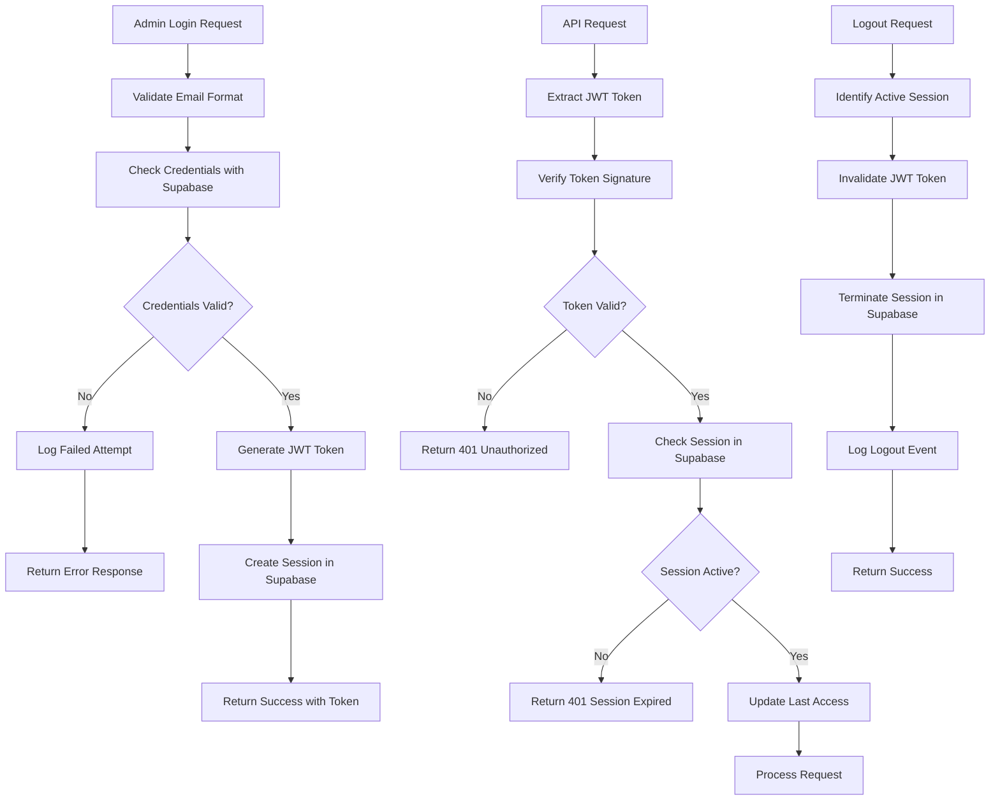

# Sistema di Autenticazione Lato Server con Supabase - Documentazione Tecnica

## 1. Product Overview

Sistema di autenticazione completamente rinnovato per il backend della pagina admin, basato su Supabase Auth per garantire sicurezza, scalabilità e conformità alle migliori pratiche OWASP. Il sistema sostituisce completamente l'implementazione esistente con un'architettura moderna e sicura.

Il nuovo sistema risolve le vulnerabilità dell'implementazione precedente e introduce funzionalità avanzate di sicurezza, gestione sessioni ottimizzata e integrazione nativa con Supabase per l'autenticazione e autorizzazione degli utenti admin.

## 2. Core Features

### 2.1 User Roles

| Role | Registration Method | Core Permissions |
|------|---------------------|------------------|
| Admin | Creazione manuale tramite Supabase Dashboard | Accesso completo al pannello amministrativo, gestione contenuti, visualizzazione analytics |
| System | Account di servizio | Operazioni di sistema e manutenzione automatica |

### 2.2 Feature Module

Il nuovo sistema di autenticazione comprende i seguenti moduli principali:

1. **Authentication Module**: gestione login/logout, verifica credenziali, generazione token JWT
2. **Session Management Module**: creazione, validazione e terminazione sessioni utente
3. **Security Module**: rate limiting, rilevamento attacchi, logging eventi di sicurezza
4. **Password Management Module**: reset password, validazione complessità, gestione token temporanei
5. **Authorization Module**: verifica permessi, controllo accessi basato su ruoli

### 2.3 Page Details

| Module Name | Feature Name | Feature Description |
|-------------|--------------|--------------------|
| Authentication Module | Login Endpoint | Autentica utenti con email/password, genera JWT token, crea sessione sicura |
| Authentication Module | Logout Endpoint | Termina sessione attiva, invalida token JWT, registra evento logout |
| Authentication Module | Credential Validation | Valida formato email, verifica complessità password, controlla credenziali in database |
| Session Management Module | Session Creation | Crea nuova sessione con Supabase Auth, genera session token, imposta scadenza |
| Session Management Module | Session Verification | Verifica validità sessione, controlla scadenza, aggiorna ultimo accesso |
| Session Management Module | Session Termination | Termina sessioni specifiche o multiple, cleanup automatico sessioni scadute |
| Security Module | Rate Limiting | Limita tentativi login per IP, implementa backoff esponenziale, blocco temporaneo |
| Security Module | Attack Detection | Rileva pattern brute force, monitora attività sospette, genera alert sicurezza |
| Security Module | Security Logging | Registra eventi autenticazione, traccia accessi, mantiene audit trail completo |
| Password Management Module | Password Reset | Genera token reset sicuri, invia email notifica, valida token temporanei |
| Password Management Module | Password Validation | Verifica complessità password, controlla policy sicurezza, previene password comuni |
| Authorization Module | Role Verification | Verifica ruolo utente, controlla permessi specifici, gestisce accessi basati su ruoli |

## 3. Core Process

### 3.1 Flusso di Autenticazione Admin

1. **Login Process**: L'admin inserisce credenziali → Sistema valida formato email → Verifica credenziali con Supabase → Genera JWT token → Crea sessione sicura → Restituisce token e dati utente

2. **Session Verification**: Ogni richiesta API → Estrae JWT token da header Authorization → Verifica validità token → Controlla sessione in Supabase → Valida scadenza → Aggiorna ultimo accesso → Procede con richiesta

3. **Logout Process**: Admin richiede logout → Sistema identifica sessione attiva → Invalida token JWT → Termina sessione in Supabase → Registra evento logout → Conferma logout completato

4. **Password Reset Flow**: Admin richiede reset → Sistema valida email → Genera token temporaneo → Invia email con link reset → Admin clicca link → Valida token → Permette impostazione nuova password → Invalida token usato

### 3.2 Diagramma di Flusso



## 4. User Interface Design

### 4.1 Design Style

- **Primary Colors**: #1a365d (Navy Blue), #2d3748 (Dark Gray)
- **Secondary Colors**: #e53e3e (Error Red), #38a169 (Success Green), #d69e2e (Warning Yellow)
- **Button Style**: Rounded corners (8px), solid backgrounds, hover effects con transizioni smooth
- **Font**: Inter, system-ui, sans-serif con dimensioni 14px-16px per testo normale
- **Layout Style**: Clean minimal design, card-based components, consistent spacing (8px grid)
- **Icons**: Lucide React icons per consistenza e modernità

### 4.2 Page Design Overview

| Page Name | Module Name | UI Elements |
|-----------|-------------|-------------|
| Login Page | Authentication Form | Centered card layout, email input con validazione real-time, password input con toggle visibility, submit button con loading state, error messages con styling rosso |
| Admin Dashboard | Session Status | Header con user info, logout button, session timer, security status indicator |
| Security Dashboard | Security Monitoring | Cards per statistiche sicurezza, tabelle login attempts, grafici attività, alert panel per minacce |

### 4.3 Responsiveness

Il sistema è progettato mobile-first con breakpoints responsive per garantire usabilità su tutti i dispositivi. Touch interactions ottimizzate per tablet e smartphone con target touch di almeno 44px.

## 5. Technical Requirements

### 5.1 Security Requirements (OWASP Compliance)

- **A01 - Broken Access Control**: Implementazione RBAC con Supabase RLS policies
- **A02 - Cryptographic Failures**: JWT con algoritmi sicuri (RS256), password hashing con bcrypt
- **A03 - Injection**: Prepared statements, input validation, output encoding
- **A04 - Insecure Design**: Threat modeling, secure design patterns, fail-safe defaults
- **A05 - Security Misconfiguration**: Configurazioni sicure di default, headers di sicurezza
- **A06 - Vulnerable Components**: Dipendenze aggiornate, vulnerability scanning
- **A07 - Authentication Failures**: Rate limiting, account lockout, MFA ready
- **A08 - Software Integrity**: Code signing, secure CI/CD pipeline
- **A09 - Logging Failures**: Comprehensive logging, monitoring, alerting
- **A10 - Server-Side Request Forgery**: Input validation, allowlist approach

### 5.2 Performance Requirements

- **Response Time**: < 200ms per endpoint autenticazione
- **Throughput**: Supporto per 1000+ richieste concurrent
- **Availability**: 99.9% uptime con failover automatico
- **Scalability**: Auto-scaling basato su carico con Supabase

### 5.3 Compliance Requirements

- **GDPR**: Privacy by design, data minimization, right to erasure
- **ISO 27001**: Information security management system
- **SOC 2**: Security, availability, processing integrity

## 6. Implementation Specifications

### 6.1 Rimozione Implementazione Esistente

**File da Eliminare/Modificare:**
- `api/controllers/authController.ts` - Sostituire completamente
- `api/services/authService.ts` - Sostituire con integrazione Supabase
- `api/middleware/auth.ts` - Riscrivere per Supabase Auth
- `api/routes/auth.ts` - Aggiornare endpoint
- `api/controllers/passwordController.ts` - Integrare con Supabase Auth
- `api/services/securityService.ts` - Mantenere e integrare con nuovo sistema

**Tabelle Database da Modificare:**
- Rimuovere `admin_users` (sostituita da Supabase Auth)
- Mantenere `user_sessions` per tracking sessioni
- Mantenere `login_attempts` per security monitoring
- Mantenere `security_logs` per audit trail

### 6.2 Nuova Architettura con Supabase

**Componenti Principali:**
- **Supabase Auth**: Gestione utenti, autenticazione, autorizzazione
- **JWT Tokens**: Generati da Supabase, verificati lato server
- **RLS Policies**: Row Level Security per controllo accessi granulare
- **Real-time Subscriptions**: Per notifiche sicurezza in tempo reale
- **Edge Functions**: Per logica business complessa lato server

### 6.3 Endpoint RESTful Specifications

**Authentication Endpoints:**

```typescript
// POST /api/auth/login
interface LoginRequest {
  email: string;        // Formato email valido
  password: string;     // Minimo 8 caratteri, complessità alta
}

interface LoginResponse {
  success: boolean;
  message: string;
  data?: {
    access_token: string;     // JWT token da Supabase
    refresh_token: string;    // Per rinnovo token
    user: {
      id: string;
      email: string;
      role: string;
      last_sign_in_at: string;
    };
    expires_in: number;       // Secondi alla scadenza
  };
  error?: string;
}

// POST /api/auth/logout
interface LogoutResponse {
  success: boolean;
  message: string;
}

// GET /api/auth/verify
interface VerifyResponse {
  success: boolean;
  data?: {
    user: UserProfile;
    session: SessionInfo;
  };
  error?: string;
}

// POST /api/auth/refresh
interface RefreshRequest {
  refresh_token: string;
}

interface RefreshResponse {
  success: boolean;
  data?: {
    access_token: string;
    expires_in: number;
  };
  error?: string;
}
```

**Password Management Endpoints:**

```typescript
// POST /api/auth/forgot-password
interface ForgotPasswordRequest {
  email: string;
}

interface ForgotPasswordResponse {
  success: boolean;
  message: string;
}

// POST /api/auth/reset-password
interface ResetPasswordRequest {
  token: string;        // Token da email
  password: string;     // Nuova password
}

interface ResetPasswordResponse {
  success: boolean;
  message: string;
}

// POST /api/auth/change-password
interface ChangePasswordRequest {
  current_password: string;
  new_password: string;
}

interface ChangePasswordResponse {
  success: boolean;
  message: string;
}
```

### 6.4 Validazione Input

**Email Validation:**
```typescript
const emailRegex = /^[a-zA-Z0-9._%+-]+@[a-zA-Z0-9.-]+\.[a-zA-Z]{2,}$/;
const isValidEmail = (email: string): boolean => {
  return emailRegex.test(email) && email.length <= 254;
};
```

**Password Validation:**
```typescript
interface PasswordPolicy {
  minLength: 8;
  requireUppercase: true;
  requireLowercase: true;
  requireNumbers: true;
  requireSpecialChars: true;
  maxLength: 128;
}

const validatePassword = (password: string): ValidationResult => {
  const errors: string[] = [];
  
  if (password.length < 8) errors.push('Minimo 8 caratteri');
  if (password.length > 128) errors.push('Massimo 128 caratteri');
  if (!/[A-Z]/.test(password)) errors.push('Almeno una maiuscola');
  if (!/[a-z]/.test(password)) errors.push('Almeno una minuscola');
  if (!/\d/.test(password)) errors.push('Almeno un numero');
  if (!/[!@#$%^&*(),.?":{}|<>]/.test(password)) errors.push('Almeno un carattere speciale');
  
  return {
    isValid: errors.length === 0,
    errors
  };
};
```

### 6.5 Gestione JWT Token

**Token Configuration:**
```typescript
const JWT_CONFIG = {
  algorithm: 'HS256',           // Algoritmo sicuro
  expiresIn: '1h',             // Scadenza breve per sicurezza
  issuer: 'carrobbio-admin',   // Identificatore applicazione
  audience: 'admin-panel',     // Target audience
  clockTolerance: 30           // Tolleranza clock skew
};
```

**Token Verification:**
```typescript
const verifyJWTToken = async (token: string): Promise<TokenVerificationResult> => {
  try {
    // Verifica con Supabase
    const { data: { user }, error } = await supabase.auth.getUser(token);
    
    if (error || !user) {
      return { isValid: false, error: 'Token non valido' };
    }
    
    // Verifica ruolo admin
    const { data: profile } = await supabase
      .from('user_profiles')
      .select('role')
      .eq('id', user.id)
      .single();
    
    if (profile?.role !== 'admin') {
      return { isValid: false, error: 'Accesso non autorizzato' };
    }
    
    return {
      isValid: true,
      user: {
        id: user.id,
        email: user.email!,
        role: profile.role
      }
    };
  } catch (error) {
    return { isValid: false, error: 'Errore verifica token' };
  }
};
```

### 6.6 Rate Limiting Configuration

```typescript
const RATE_LIMITS = {
  login: {
    windowMs: 15 * 60 * 1000,    // 15 minuti
    max: 5,                       // 5 tentativi per IP
    skipSuccessfulRequests: true,
    standardHeaders: true,
    legacyHeaders: false
  },
  passwordReset: {
    windowMs: 60 * 60 * 1000,    // 1 ora
    max: 3,                       // 3 richieste per IP
    skipSuccessfulRequests: false
  },
  general: {
    windowMs: 15 * 60 * 1000,    // 15 minuti
    max: 100,                     // 100 richieste per IP
    standardHeaders: true
  }
};
```

### 6.7 Security Headers

```typescript
const SECURITY_HEADERS = {
  'Strict-Transport-Security': 'max-age=31536000; includeSubDomains',
  'X-Content-Type-Options': 'nosniff',
  'X-Frame-Options': 'DENY',
  'X-XSS-Protection': '1; mode=block',
  'Referrer-Policy': 'strict-origin-when-cross-origin',
  'Content-Security-Policy': "default-src 'self'; script-src 'self' 'unsafe-inline'; style-src 'self' 'unsafe-inline'",
  'Permissions-Policy': 'geolocation=(), microphone=(), camera=()'
};
```

## 7. Database Schema Updates

### 7.1 Supabase Auth Integration

```sql
-- Estendi auth.users con profilo admin
CREATE TABLE public.user_profiles (
  id UUID REFERENCES auth.users(id) ON DELETE CASCADE PRIMARY KEY,
  role TEXT NOT NULL DEFAULT 'user' CHECK (role IN ('admin', 'user')),
  name TEXT,
  created_at TIMESTAMP WITH TIME ZONE DEFAULT NOW(),
  updated_at TIMESTAMP WITH TIME ZONE DEFAULT NOW()
);

-- RLS Policy per user_profiles
ALTER TABLE public.user_profiles ENABLE ROW LEVEL SECURITY;

CREATE POLICY "Users can view own profile" ON public.user_profiles
  FOR SELECT USING (auth.uid() = id);

CREATE POLICY "Admins can view all profiles" ON public.user_profiles
  FOR SELECT USING (
    EXISTS (
      SELECT 1 FROM public.user_profiles
      WHERE id = auth.uid() AND role = 'admin'
    )
  );
```

### 7.2 Session Tracking

```sql
-- Tabella per tracking sessioni (mantenuta per audit)
CREATE TABLE public.user_sessions (
  id UUID PRIMARY KEY DEFAULT gen_random_uuid(),
  user_id UUID REFERENCES auth.users(id) ON DELETE CASCADE,
  access_token_hash TEXT NOT NULL,
  refresh_token_hash TEXT,
  ip_address INET,
  user_agent TEXT,
  created_at TIMESTAMP WITH TIME ZONE DEFAULT NOW(),
  last_accessed_at TIMESTAMP WITH TIME ZONE DEFAULT NOW(),
  expires_at TIMESTAMP WITH TIME ZONE,
  is_active BOOLEAN DEFAULT true
);

-- Indici per performance
CREATE INDEX idx_user_sessions_user_id ON public.user_sessions(user_id);
CREATE INDEX idx_user_sessions_active ON public.user_sessions(is_active, expires_at);
```

### 7.3 Security Logging

```sql
-- Mantieni tabelle esistenti per security logging
-- login_attempts, security_logs rimangono invariate
-- Aggiungi nuovi event_types per Supabase Auth

ALTER TABLE public.security_logs 
ADD CONSTRAINT check_event_type 
CHECK (event_type IN (
  'login_success', 'login_failure', 'logout',
  'password_reset_request', 'password_reset_success',
  'token_refresh', 'session_expired', 'suspicious_activity',
  'rate_limit_exceeded', 'unauthorized_access'
));
```

## 8. Deployment and Configuration

### 8.1 Environment Variables

```bash
# Supabase Configuration
VITE_SUPABASE_URL=https://your-project.supabase.co
VITE_SUPABASE_ANON_KEY=your-anon-key
SUPABASE_SERVICE_ROLE_KEY=your-service-role-key

# JWT Configuration (per compatibilità)
JWT_SECRET=your-super-secret-jwt-key-256-bits
JWT_EXPIRES_IN=1h

# Security Configuration
RATE_LIMIT_WINDOW_MS=900000
RATE_LIMIT_MAX_REQUESTS=5
SESSION_TIMEOUT_MS=3600000

# Email Configuration (per password reset)
SMTP_HOST=smtp.gmail.com
SMTP_PORT=587
SMTP_USER=your-email@gmail.com
SMTP_PASS=your-app-password

# Application Configuration
NODE_ENV=production
PORT=3001
FRONTEND_URL=https://your-domain.com
```

### 8.2 Supabase Configuration

```sql
-- Configurazione Auth in Supabase Dashboard
-- 1. Abilita Email Auth
-- 2. Configura Email Templates
-- 3. Imposta Site URL
-- 4. Configura Redirect URLs
-- 5. Abilita RLS su tutte le tabelle

-- Configurazione SMTP per email
-- Dashboard > Authentication > Settings > SMTP Settings
```

## 9. Testing Strategy

### 9.1 Unit Tests

- Test validazione input (email, password)
- Test generazione e verifica JWT
- Test rate limiting logic
- Test password hashing/comparison
- Test session management functions

### 9.2 Integration Tests

- Test endpoint login completo
- Test flusso password reset
- Test middleware autenticazione
- Test integrazione Supabase Auth
- Test security logging

### 9.3 Security Tests

- Penetration testing
- Vulnerability scanning
- Rate limiting effectiveness
- JWT token security
- SQL injection prevention
- XSS protection verification

### 9.4 Performance Tests

- Load testing endpoint autenticazione
- Stress testing rate limiting
- Database query performance
- Memory usage monitoring
- Response time benchmarking

## 10. Monitoring and Alerting

### 10.1 Key Metrics

- Login success/failure rates
- Token generation/verification times
- Session duration statistics
- Rate limiting triggers
- Security event frequencies
- Database query performance

### 10.2 Alerts Configuration

- Failed login attempts > 10/minute
- Rate limiting triggered > 5 times/hour
- JWT verification failures > 1%
- Database connection errors
- High response times > 500ms
- Suspicious IP activity

### 10.3 Logging Standards

```typescript
interface SecurityLogEntry {
  timestamp: string;
  level: 'info' | 'warn' | 'error' | 'critical';
  event_type: string;
  user_id?: string;
  ip_address: string;
  user_agent: string;
  details: Record<string, any>;
  trace_id: string;
}
```

## 11. Migration Plan

### 11.1 Phase 1: Preparation
- Setup Supabase project
- Configure authentication settings
- Create user profiles table
- Setup RLS policies
- Prepare migration scripts

### 11.2 Phase 2: Implementation
- Implement new authentication endpoints
- Update middleware for Supabase integration
- Migrate existing admin users
- Update frontend integration
- Deploy to staging environment

### 11.3 Phase 3: Testing
- Comprehensive testing suite
- Security audit
- Performance benchmarking
- User acceptance testing
- Load testing

### 11.4 Phase 4: Deployment
- Blue-green deployment
- Database migration
- DNS cutover
- Monitoring activation
- Rollback plan ready

### 11.5 Phase 5: Cleanup
- Remove old authentication code
- Clean up unused database tables
- Update documentation
- Team training
- Post-deployment review

## 12. Maintenance and Support

### 12.1 Regular Maintenance
- Security patches monthly
- Dependency updates quarterly
- Performance optimization reviews
- Security audit annually
- Backup verification weekly

### 12.2 Support Procedures
- 24/7 monitoring setup
- Incident response plan
- Escalation procedures
- Recovery time objectives
- Communication protocols

Questo documento fornisce una guida completa per l'implementazione del nuovo sistema di autenticazione con Supabase, garantendo sicurezza, scalabilità e conformità alle migliori pratiche di settore.