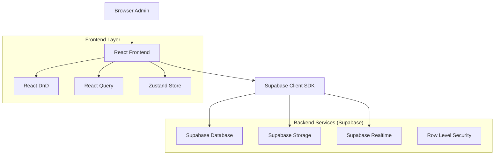
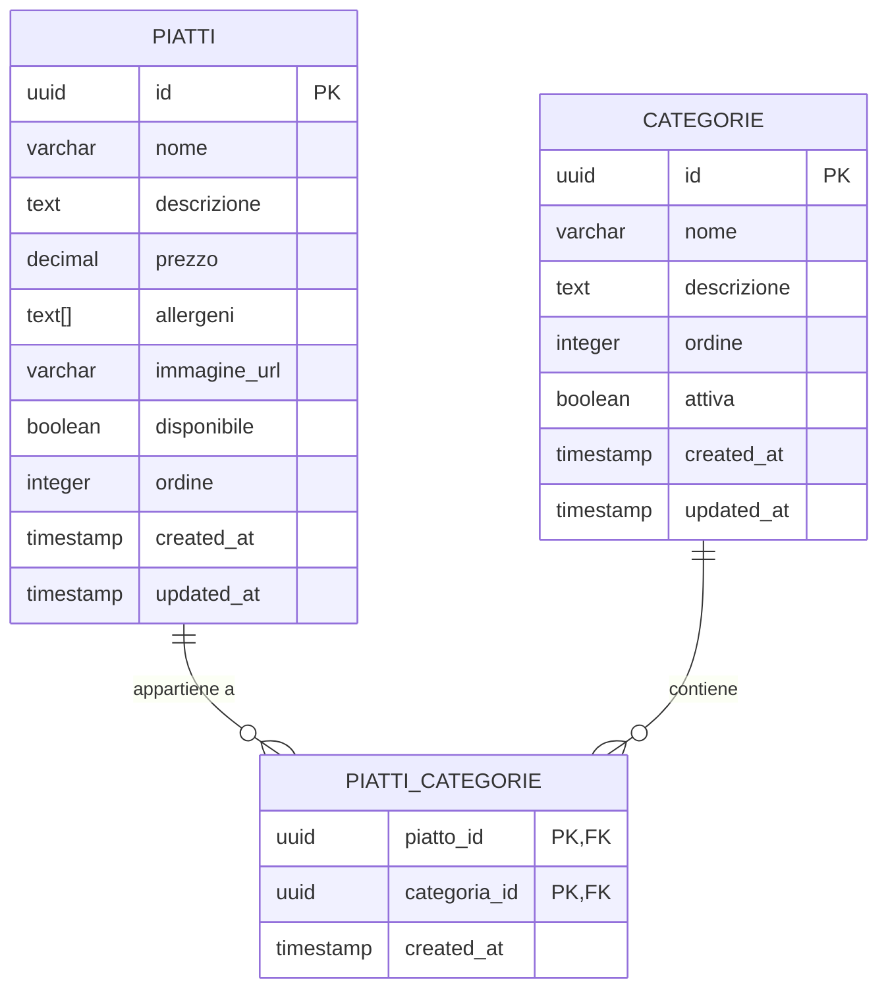

# Sistema di Gestione Menu Admin - Architettura Tecnica

## 1. Architettura del Sistema



## 2. Descrizione Tecnologie

* Frontend: React\@18 + TypeScript + Vite + TailwindCSS

* State Management: Zustand + React Query

* Drag & Drop: @dnd-kit/core + @dnd-kit/sortable

* Database: Supabase (PostgreSQL)

* Storage: Supabase Storage per immagini

* Real-time: Supabase Realtime subscriptions

* UI Components: Lucide React + Headless UI

## 3. Definizioni delle Route

| Route                    | Scopo                                          |
| ------------------------ | ---------------------------------------------- |
| /admin                   | Dashboard principale admin con panoramica menu |
| /admin/menu              | Gestione completa piatti e categorie           |
| /admin/menu/piatti       | Lista e CRUD piatti                            |
| /admin/menu/categorie    | Gestione categorie                             |
| /admin/menu/anteprima    | Anteprima menu in tempo reale                  |
| /admin/menu/impostazioni | Configurazioni avanzate sistema                |

## 4. Definizioni API

### 4.1 API Core

**Gestione Piatti**

```typescript
// Tipi TypeScript condivisi
interface Piatto {
  id: string;
  nome: string;
  descrizione: string;
  prezzo: number;
  allergeni: string[];
  immagine_url?: string;
  disponibile: boolean;
  ordine: number;
  categoria_ids: string[];
  created_at: string;
  updated_at: string;
}

interface Categoria {
  id: string;
  nome: string;
  descrizione?: string;
  ordine: number;
  attiva: boolean;
  created_at: string;
  updated_at: string;
}

interface PiattoCategoria {
  piatto_id: string;
  categoria_id: string;
  created_at: string;
}
```

**Operazioni Supabase**

```typescript
// Lettura piatti con categorie
const getPiattiConCategorie = () => {
  return supabase
    .from('piatti')
    .select(`
      *,
      piatti_categorie!inner(
        categoria_id,
        categorie!inner(*)
      )
    `)
    .order('ordine', { ascending: true });
};

// Creazione piatto
const createPiatto = (piatto: Omit<Piatto, 'id' | 'created_at' | 'updated_at'>) => {
  return supabase
    .from('piatti')
    .insert(piatto)
    .select();
};

// Aggiornamento ordine piatti
const updateOrdiniPiatti = (updates: { id: string; ordine: number }[]) => {
  return supabase
    .from('piatti')
    .upsert(updates, { onConflict: 'id' });
};
```

## 5. Modello Dati

### 5.1 Definizione Modello Dati



### 5.2 Data Definition Language

**Tabella Categorie**

```sql
-- Creazione tabella categorie
CREATE TABLE categorie (
    id UUID PRIMARY KEY DEFAULT gen_random_uuid(),
    nome VARCHAR(100) NOT NULL UNIQUE,
    descrizione TEXT,
    ordine INTEGER NOT NULL DEFAULT 0,
    attiva BOOLEAN DEFAULT true,
    created_at TIMESTAMP WITH TIME ZONE DEFAULT NOW(),
    updated_at TIMESTAMP WITH TIME ZONE DEFAULT NOW()
);

-- Indici per performance
CREATE INDEX idx_categorie_ordine ON categorie(ordine ASC);
CREATE INDEX idx_categorie_attiva ON categorie(attiva);

-- Trigger per updated_at
CREATE OR REPLACE FUNCTION update_updated_at_column()
RETURNS TRIGGER AS $$
BEGIN
    NEW.updated_at = NOW();
    RETURN NEW;
END;
$$ language 'plpgsql';

CREATE TRIGGER update_categorie_updated_at
    BEFORE UPDATE ON categorie
    FOR EACH ROW
    EXECUTE FUNCTION update_updated_at_column();

-- Dati iniziali
INSERT INTO categorie (nome, descrizione, ordine) VALUES
('Antipasti', 'Selezione di antipasti tradizionali', 1),
('Primi Piatti', 'Pasta e risotti della casa', 2),
('Secondi Piatti', 'Carni e pesci di stagione', 3),
('Contorni', 'Verdure e accompagnamenti', 4),
('Dolci', 'Dolci della tradizione', 5),
('Bevande', 'Vini, birre e bevande', 6);
```

**Tabella Piatti**

```sql
-- Creazione tabella piatti
CREATE TABLE piatti (
    id UUID PRIMARY KEY DEFAULT gen_random_uuid(),
    nome VARCHAR(150) NOT NULL,
    descrizione TEXT NOT NULL,
    prezzo DECIMAL(8,2) NOT NULL CHECK (prezzo > 0),
    allergeni TEXT[] DEFAULT '{}',
    immagine_url VARCHAR(500),
    disponibile BOOLEAN DEFAULT true,
    ordine INTEGER NOT NULL DEFAULT 0,
    created_at TIMESTAMP WITH TIME ZONE DEFAULT NOW(),
    updated_at TIMESTAMP WITH TIME ZONE DEFAULT NOW()
);

-- Indici per performance
CREATE INDEX idx_piatti_disponibile ON piatti(disponibile);
CREATE INDEX idx_piatti_ordine ON piatti(ordine ASC);
CREATE INDEX idx_piatti_nome ON piatti USING gin(to_tsvector('italian', nome));
CREATE INDEX idx_piatti_allergeni ON piatti USING gin(allergeni);

-- Trigger per updated_at
CREATE TRIGGER update_piatti_updated_at
    BEFORE UPDATE ON piatti
    FOR EACH ROW
    EXECUTE FUNCTION update_updated_at_column();

-- Dati di esempio
INSERT INTO piatti (nome, descrizione, prezzo, allergeni, disponibile, ordine) VALUES
('Bruschetta al Pomodoro', 'Pane tostato con pomodori freschi, basilico e aglio', 8.50, '{"glutine"}', true, 1),
('Spaghetti Carbonara', 'Pasta con uova, pecorino, guanciale e pepe nero', 14.00, '{"glutine", "uova", "latte"}', true, 2),
('Bistecca alla Fiorentina', 'Bistecca di manzo alla griglia con rosmarino', 28.00, '{}', true, 3);
```

**Tabella Relazione Piatti-Categorie**

```sql
-- Creazione tabella di relazione
CREATE TABLE piatti_categorie (
    piatto_id UUID REFERENCES piatti(id) ON DELETE CASCADE,
    categoria_id UUID REFERENCES categorie(id) ON DELETE CASCADE,
    created_at TIMESTAMP WITH TIME ZONE DEFAULT NOW(),
    PRIMARY KEY (piatto_id, categoria_id)
);

-- Indici per performance
CREATE INDEX idx_piatti_categorie_piatto ON piatti_categorie(piatto_id);
CREATE INDEX idx_piatti_categorie_categoria ON piatti_categorie(categoria_id);

-- Dati di esempio (collegamento piatti-categorie)
INSERT INTO piatti_categorie (piatto_id, categoria_id)
SELECT p.id, c.id
FROM piatti p, categorie c
WHERE 
    (p.nome = 'Bruschetta al Pomodoro' AND c.nome = 'Antipasti') OR
    (p.nome = 'Spaghetti Carbonara' AND c.nome = 'Primi Piatti') OR
    (p.nome = 'Bistecca alla Fiorentina' AND c.nome = 'Secondi Piatti');
```

**Row Level Security**

```sql
-- Abilitazione RLS
ALTER TABLE categorie ENABLE ROW LEVEL SECURITY;
ALTER TABLE piatti ENABLE ROW LEVEL SECURITY;
ALTER TABLE piatti_categorie ENABLE ROW LEVEL SECURITY;

-- Politiche per lettura pubblica
CREATE POLICY "Categorie leggibili da tutti" ON categorie
    FOR SELECT USING (attiva = true);

CREATE POLICY "Piatti leggibili da tutti" ON piatti
    FOR SELECT USING (disponibile = true);

CREATE POLICY "Relazioni leggibili da tutti" ON piatti_categorie
    FOR SELECT USING (true);

-- Politiche per admin autenticati
CREATE POLICY "Admin gestione completa categorie" ON categorie
    FOR ALL USING (auth.role() = 'authenticated');

CREATE POLICY "Admin gestione completa piatti" ON piatti
    FOR ALL USING (auth.role() = 'authenticated');

CREATE POLICY "Admin gestione relazioni" ON piatti_categorie
    FOR ALL USING (auth.role() = 'authenticated');

-- Permessi per ruoli
GRANT SELECT ON categorie TO anon;
GRANT SELECT ON piatti TO anon;
GRANT SELECT ON piatti_categorie TO anon;

GRANT ALL PRIVILEGES ON categorie TO authenticated;
GRANT ALL PRIVILEGES ON piatti TO authenticated;
GRANT ALL PRIVILEGES ON piatti_categorie TO authenticated;
```

**Storage per Immagini**

```sql
-- Creazione bucket per immagini menu
INSERT INTO storage.buckets (id, name, public)
VALUES ('menu-images', 'menu-images', true);

-- Politiche storage
CREATE POLICY "Immagini menu pubbliche" ON storage.objects
    FOR SELECT USING (bucket_id = 'menu-images');

CREATE POLICY "Admin upload immagini" ON storage.objects
    FOR INSERT WITH CHECK (
        bucket_id = 'menu-images' AND
        auth.role() = 'authenticated'
    );

CREATE POLICY "Admin gestione immagini" ON storage.objects
    FOR UPDATE USING (
        bucket_id = 'menu-images' AND
        auth.role() = 'authenticated'
    );

CREATE POLICY "Admin eliminazione immagini" ON storage.objects
    FOR DELETE USING (
        bucket_id = 'menu-images' AND
        auth.role() = 'authenticated'
    );
```

