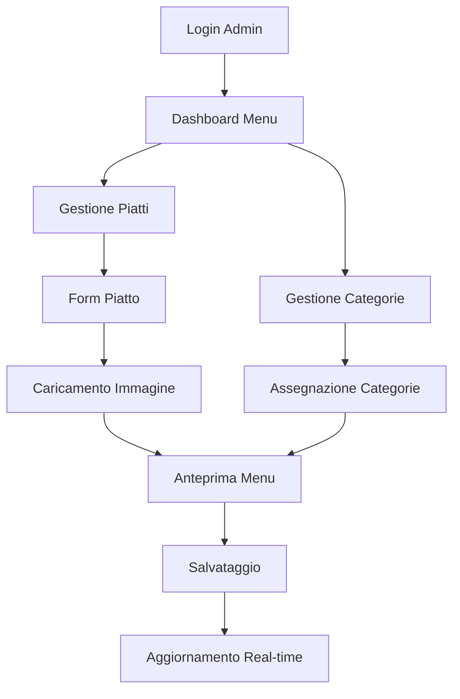

# Sistema di Gestione Menu Admin - Documento dei Requisiti di Prodotto

## 1. Panoramica del Prodotto

Sistema completo di gestione menu integrato nella pagina admin del ristorante Il Carrobbio, che consente agli amministratori di gestire piatti, categorie e disponibilità in tempo reale.

Il sistema risolve la necessità di aggiornare dinamicamente il menu del ristorante, permettendo modifiche immediate visibili ai clienti senza interruzioni del servizio.

Target: Amministratori del ristorante che necessitano di uno strumento efficiente per la gestione quotidiana del menu.

## 2. Funzionalità Principali

### 2.1 Ruoli Utente

| Ruolo | Metodo di Registrazione | Permessi Principali |
|-------|------------------------|--------------------|
| Admin | Accesso tramite sistema di autenticazione esistente | Gestione completa menu, categorie, disponibilità |
| Super Admin | Accesso privilegiato | Tutte le funzionalità admin + gestione utenti |

### 2.2 Moduli Funzionali

Il sistema di gestione menu è composto dalle seguenti pagine principali:

1. **Dashboard Menu**: panoramica generale, statistiche piatti, filtri rapidi
2. **Gestione Piatti**: CRUD completo piatti, caricamento immagini, gestione allergeni
3. **Gestione Categorie**: creazione/modifica categorie, assegnazione piatti
4. **Anteprima Menu**: visualizzazione in tempo reale delle modifiche
5. **Impostazioni Avanzate**: configurazione ordine visualizzazione, impostazioni sistema

### 2.3 Dettagli delle Pagine

| Nome Pagina | Nome Modulo | Descrizione Funzionalità |
|-------------|-------------|-------------------------|
| Dashboard Menu | Panoramica Generale | Visualizza statistiche piatti attivi/inattivi, categorie, ricerca rapida |
| Dashboard Menu | Filtri e Ricerca | Filtra per categoria, stato disponibilità, allergeni, ricerca testuale |
| Gestione Piatti | Form Creazione/Modifica | Inserisce nome, descrizione, prezzo, allergeni, carica immagine |
| Gestione Piatti | Lista Piatti | Visualizza tutti i piatti con azioni rapide (modifica, elimina, cambia stato) |
| Gestione Piatti | Gestione Disponibilità | Toggle disponibile/non disponibile con indicatori visivi |
| Gestione Piatti | Drag & Drop | Riordina piatti tramite trascinamento con salvataggio automatico |
| Gestione Categorie | CRUD Categorie | Crea, modifica, elimina categorie con validazione |
| Gestione Categorie | Assegnazione Piatti | Assegna/rimuovi piatti da categorie multiple |
| Anteprima Menu | Visualizzazione Live | Mostra anteprima menu come appare ai clienti |
| Anteprima Menu | Controllo Modifiche | Confronta versione corrente con modifiche non salvate |
| Impostazioni Avanzate | Configurazione Ordine | Imposta ordine predefinito categorie e piatti |
| Impostazioni Avanzate | Notifiche Real-time | Configura aggiornamenti automatici e notifiche |

## 3. Processo Principale

### Flusso Amministratore

1. **Accesso**: Login tramite sistema di autenticazione esistente
2. **Dashboard**: Visualizzazione panoramica stato menu
3. **Gestione Piatti**: Creazione/modifica piatti con tutti i dettagli
4. **Organizzazione**: Assegnazione a categorie e riordinamento
5. **Anteprima**: Controllo modifiche prima della pubblicazione
6. **Pubblicazione**: Salvataggio con aggiornamento in tempo reale

## 4. Design dell'Interfaccia Utente

### 4.1 Stile di Design

- **Colori Primari**: #8B4513 (marrone caldo), #D2691E (arancione terra)
- **Colori Secondari**: #F5F5DC (beige), #FFFFFF (bianco), #2F4F4F (grigio scuro)
- **Stile Pulsanti**: Arrotondati con effetti hover, design moderno
- **Font**: Inter per testi, Playfair Display per titoli, dimensioni 14px-24px
- **Layout**: Design a card con sidebar navigazione, layout responsive
- **Icone**: Lucide React per coerenza, stile outline

### 4.2 Panoramica Design Pagine

| Nome Pagina | Nome Modulo | Elementi UI |
|-------------|-------------|-------------|
| Dashboard Menu | Panoramica | Cards statistiche con colori #8B4513, grafici a torta, layout grid responsive |
| Dashboard Menu | Filtri | Dropdown categorie, toggle disponibilità, search bar con icona |
| Gestione Piatti | Form Piatto | Input strutturati, textarea descrizione, upload immagine drag-drop |
| Gestione Piatti | Lista Piatti | Tabella responsive, azioni inline, indicatori stato colorati |
| Gestione Piatti | Drag & Drop | Handles di trascinamento, feedback visivo, animazioni smooth |
| Gestione Categorie | CRUD | Modal per creazione/modifica, conferme eliminazione |
| Anteprima Menu | Live Preview | Layout identico al menu pubblico, aggiornamenti real-time |
| Impostazioni | Configurazione | Pannelli collassabili, switch toggle, salvataggio automatico |

### 4.3 Responsività

Design mobile-first con breakpoint:
- Mobile: 320px-768px (stack verticale, menu hamburger)
- Tablet: 768px-1024px (layout ibrido, sidebar collassabile)
- Desktop: 1024px+ (layout completo con sidebar fissa)

Ottimizzazione touch per dispositivi mobili con pulsanti di dimensione minima 44px.