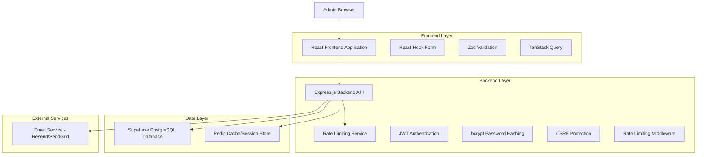
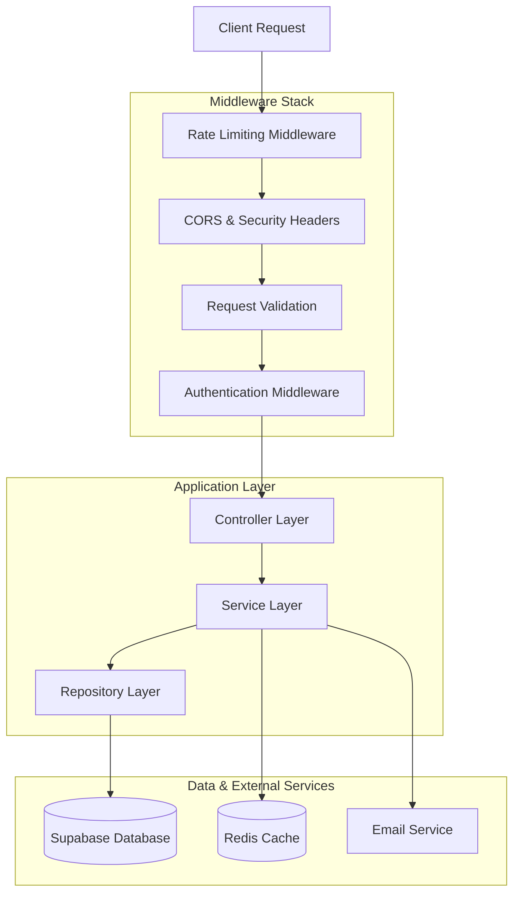
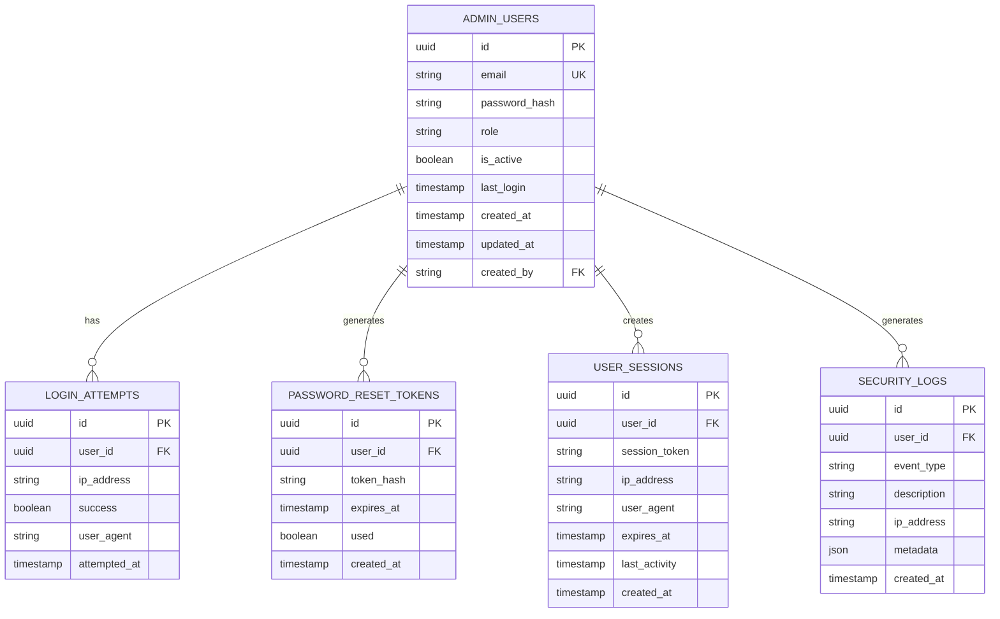

# Architettura Tecnica - Sistema Login Admin Avanzato

## 1. Architecture Design



## 2. Technology Description

- **Frontend**: React@18 + TypeScript + Vite + TailwindCSS@3
- **Backend**: Express@4 + TypeScript + Node.js@18
- **Database**: Supabase (PostgreSQL) + Redis per sessioni
- **Authentication**: JWT + bcrypt + express-rate-limit
- **Validation**: Zod (client/server) + React Hook Form
- **Email**: Resend API per recupero password
- **Security**: helmet, cors, express-validator, csrf

## 3. Route Definitions

| Route | Purpose |
|-------|----------|
| /admin/login | Pagina di login con form autenticazione |
| /admin/forgot-password | Pagina richiesta recupero password |
| /admin/reset-password/:token | Pagina reset password con token |
| /admin/dashboard | Dashboard principale post-login |
| /admin/profile | Gestione profilo e impostazioni sicurezza |
| /admin/users | Gestione utenti admin (solo super admin) |

## 4. API Definitions

### 4.1 Authentication APIs

**Login utente**
```
POST /api/auth/login
```

Request:
| Param Name | Param Type | isRequired | Description |
|------------|------------|------------|-------------|
| email | string | true | Email dell'amministratore |
| password | string | true | Password in chiaro |
| rememberMe | boolean | false | Mantieni sessione attiva |

Response:
| Param Name | Param Type | Description |
|------------|------------|-------------|
| success | boolean | Stato dell'operazione |
| token | string | JWT token per autenticazione |
| user | AdminUser | Dati utente (senza password) |
| expiresIn | number | Scadenza token in secondi |

Example:
```json
{
  "email": "admin@ilcarrobbio.com",
  "password": "SecurePass123!",
  "rememberMe": true
}
```

**Recupero password**
```
POST /api/auth/forgot-password
```

Request:
| Param Name | Param Type | isRequired | Description |
|------------|------------|------------|-------------|
| email | string | true | Email per recupero password |

Response:
| Param Name | Param Type | Description |
|------------|------------|-------------|
| success | boolean | Stato dell'operazione |
| message | string | Messaggio di conferma |

**Reset password**
```
POST /api/auth/reset-password
```

Request:
| Param Name | Param Type | isRequired | Description |
|------------|------------|------------|-------------|
| token | string | true | Token di reset ricevuto via email |
| newPassword | string | true | Nuova password |
| confirmPassword | string | true | Conferma nuova password |

Response:
| Param Name | Param Type | Description |
|------------|------------|-------------|
| success | boolean | Stato dell'operazione |
| message | string | Messaggio di conferma |

**Verifica token**
```
GET /api/auth/verify
```

Headers:
| Header Name | Header Type | isRequired | Description |
|-------------|-------------|------------|-------------|
| Authorization | string | true | Bearer JWT token |

Response:
| Param Name | Param Type | Description |
|------------|------------|-------------|
| valid | boolean | Validità del token |
| user | AdminUser | Dati utente se token valido |

### 4.2 User Management APIs

**Creazione nuovo admin**
```
POST /api/admin/users
```

Request:
| Param Name | Param Type | isRequired | Description |
|------------|------------|------------|-------------|
| email | string | true | Email del nuovo admin |
| role | string | true | Ruolo (admin/manager) |
| sendInvite | boolean | false | Invia email di invito |

**Gestione sessioni attive**
```
GET /api/admin/sessions
DELETE /api/admin/sessions/:sessionId
```

## 5. Server Architecture Diagram



## 6. Data Model

### 6.1 Data Model Definition



### 6.2 Data Definition Language

**Tabella admin_users (aggiornata)**
```sql
-- Aggiorna tabella esistente
ALTER TABLE admin_users 
ADD COLUMN IF NOT EXISTS is_active BOOLEAN DEFAULT true,
ADD COLUMN IF NOT EXISTS last_login TIMESTAMP WITH TIME ZONE,
ADD COLUMN IF NOT EXISTS created_by UUID REFERENCES admin_users(id),
ADD COLUMN IF NOT EXISTS updated_at TIMESTAMP WITH TIME ZONE DEFAULT NOW();

-- Crea indici
CREATE INDEX IF NOT EXISTS idx_admin_users_email ON admin_users(email);
CREATE INDEX IF NOT EXISTS idx_admin_users_active ON admin_users(is_active);
```

**Tabella login_attempts**
```sql
CREATE TABLE login_attempts (
    id UUID PRIMARY KEY DEFAULT gen_random_uuid(),
    user_id UUID REFERENCES admin_users(id) ON DELETE CASCADE,
    ip_address INET NOT NULL,
    success BOOLEAN NOT NULL DEFAULT false,
    user_agent TEXT,
    attempted_at TIMESTAMP WITH TIME ZONE DEFAULT NOW()
);

CREATE INDEX idx_login_attempts_user_id ON login_attempts(user_id);
CREATE INDEX idx_login_attempts_ip ON login_attempts(ip_address);
CREATE INDEX idx_login_attempts_time ON login_attempts(attempted_at DESC);
```

**Tabella password_reset_tokens**
```sql
CREATE TABLE password_reset_tokens (
    id UUID PRIMARY KEY DEFAULT gen_random_uuid(),
    user_id UUID NOT NULL REFERENCES admin_users(id) ON DELETE CASCADE,
    token_hash VARCHAR(255) NOT NULL,
    expires_at TIMESTAMP WITH TIME ZONE NOT NULL,
    used BOOLEAN DEFAULT false,
    created_at TIMESTAMP WITH TIME ZONE DEFAULT NOW()
);

CREATE INDEX idx_reset_tokens_user_id ON password_reset_tokens(user_id);
CREATE INDEX idx_reset_tokens_hash ON password_reset_tokens(token_hash);
CREATE INDEX idx_reset_tokens_expires ON password_reset_tokens(expires_at);
```

**Tabella user_sessions**
```sql
CREATE TABLE user_sessions (
    id UUID PRIMARY KEY DEFAULT gen_random_uuid(),
    user_id UUID NOT NULL REFERENCES admin_users(id) ON DELETE CASCADE,
    session_token VARCHAR(255) NOT NULL UNIQUE,
    ip_address INET NOT NULL,
    user_agent TEXT,
    expires_at TIMESTAMP WITH TIME ZONE NOT NULL,
    last_activity TIMESTAMP WITH TIME ZONE DEFAULT NOW(),
    created_at TIMESTAMP WITH TIME ZONE DEFAULT NOW()
);

CREATE INDEX idx_sessions_user_id ON user_sessions(user_id);
CREATE INDEX idx_sessions_token ON user_sessions(session_token);
CREATE INDEX idx_sessions_expires ON user_sessions(expires_at);
```

**Tabella security_logs**
```sql
CREATE TABLE security_logs (
    id UUID PRIMARY KEY DEFAULT gen_random_uuid(),
    user_id UUID REFERENCES admin_users(id) ON DELETE SET NULL,
    event_type VARCHAR(50) NOT NULL,
    description TEXT NOT NULL,
    ip_address INET,
    metadata JSONB,
    created_at TIMESTAMP WITH TIME ZONE DEFAULT NOW()
);

CREATE INDEX idx_security_logs_user_id ON security_logs(user_id);
CREATE INDEX idx_security_logs_event ON security_logs(event_type);
CREATE INDEX idx_security_logs_time ON security_logs(created_at DESC);
```

**Permessi e sicurezza**
```sql
-- Abilita RLS per nuove tabelle
ALTER TABLE login_attempts ENABLE ROW LEVEL SECURITY;
ALTER TABLE password_reset_tokens ENABLE ROW LEVEL SECURITY;
ALTER TABLE user_sessions ENABLE ROW LEVEL SECURITY;
ALTER TABLE security_logs ENABLE ROW LEVEL SECURITY;

-- Policy per accesso autenticato
CREATE POLICY "Allow authenticated access" ON login_attempts FOR ALL TO authenticated USING (true);
CREATE POLICY "Allow authenticated access" ON password_reset_tokens FOR ALL TO authenticated USING (true);
CREATE POLICY "Allow authenticated access" ON user_sessions FOR ALL TO authenticated USING (true);
CREATE POLICY "Allow authenticated access" ON security_logs FOR ALL TO authenticated USING (true);

-- Grants
GRANT ALL PRIVILEGES ON login_attempts TO authenticated;
GRANT ALL PRIVILEGES ON password_reset_tokens TO authenticated;
GRANT ALL PRIVILEGES ON user_sessions TO authenticated;
GRANT ALL PRIVILEGES ON security_logs TO authenticated;
```
