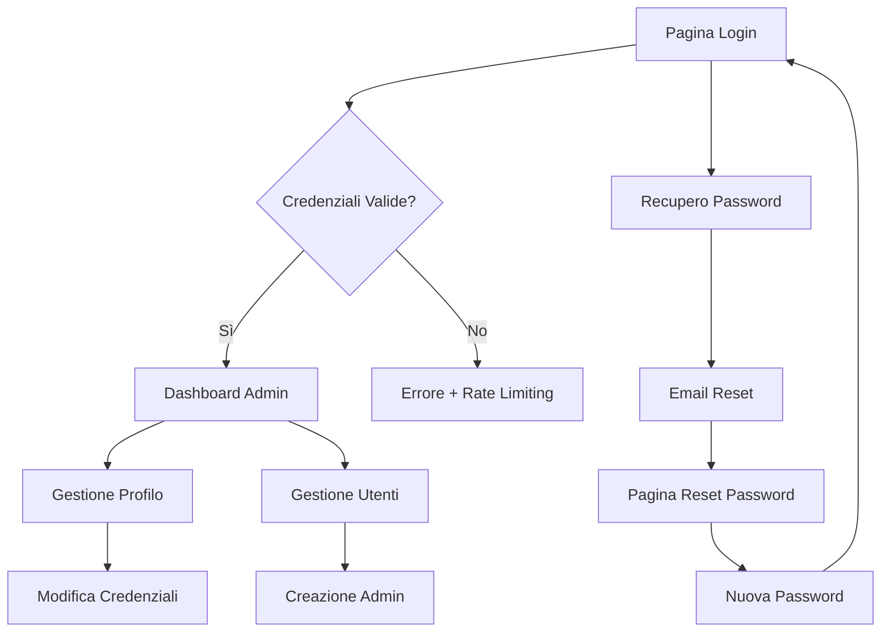

# Sistema di Login Admin Avanzato - Il Carrobbio

## 1. Product Overview

Riprogettazione completa del sistema di autenticazione per la pagina amministrativa del ristorante Il Carrobbio, sostituendo integralmente il sistema esistente con una soluzione moderna e sicura.

Il nuovo sistema risolve le vulnerabilità di sicurezza attuali e introduce funzionalità avanzate come il recupero password, rate limiting e protezione CSRF, garantendo un accesso sicuro e user-friendly per gli amministratori del ristorante.

## 2. Core Features

### 2.1 User Roles

| Role | Registration Method | Core Permissions |
|------|---------------------|------------------|
| Admin | Creazione manuale da parte di super admin | Accesso completo a tutte le funzionalità amministrative |
| Manager | Invito tramite email da admin esistente | Accesso limitato a prenotazioni e menu |
| Super Admin | Account predefinito del sistema | Gestione completa utenti admin e configurazioni sistema |

### 2.2 Feature Module

Il nuovo sistema di login admin è composto dalle seguenti pagine principali:

1. **Pagina di Login**: form di autenticazione, recupero password, validazione in tempo reale
2. **Pagina di Recupero Password**: richiesta reset, verifica email, impostazione nuova password
3. **Pagina di Gestione Profilo**: modifica credenziali, impostazioni sicurezza, cronologia accessi
4. **Dashboard Admin**: panoramica sistema, gestione sessioni attive, log di sicurezza

### 2.3 Page Details

| Page Name | Module Name | Feature description |
|-----------|-------------|---------------------|
| Pagina di Login | Form di Autenticazione | Campi email/username e password con validazione in tempo reale, remember me, captcha dopo tentativi falliti |
| Pagina di Login | Sistema di Sicurezza | Rate limiting (max 5 tentativi/15min), protezione CSRF, hashing bcrypt, blocco IP temporaneo |
| Pagina di Login | Gestione Errori | Messaggi di errore specifici, logging tentativi falliti, notifiche email per accessi sospetti |
| Recupero Password | Richiesta Reset | Form email con validazione, invio link sicuro con token temporaneo (15min scadenza) |
| Recupero Password | Verifica Token | Validazione token, controllo scadenza, form nuova password con criteri sicurezza |
| Recupero Password | Conferma Reset | Conferma cambio password, invalidazione token, notifica email successo |
| Gestione Profilo | Modifica Credenziali | Cambio email/password con verifica identità, autenticazione a due fattori opzionale |
| Gestione Profilo | Impostazioni Sicurezza | Gestione sessioni attive, cronologia login, impostazioni notifiche sicurezza |
| Dashboard Admin | Panoramica Sicurezza | Statistiche accessi, tentativi falliti, sessioni attive, alert sicurezza |
| Dashboard Admin | Gestione Utenti | Creazione/modifica/eliminazione admin, assegnazione ruoli, inviti via email |

## 3. Core Process

### Flusso di Login Standard
1. L'utente accede alla pagina di login
2. Inserisce email/username e password
3. Il sistema valida le credenziali lato client (formato) e server (autenticazione)
4. Se valide, crea sessione sicura e reindirizza al dashboard
5. Se non valide, mostra errore e incrementa contatore tentativi

### Flusso di Recupero Password
1. L'utente clicca "Password dimenticata" dalla pagina di login
2. Inserisce email e richiede reset
3. Il sistema invia email con link sicuro (token temporaneo)
4. L'utente clicca il link e accede alla pagina di reset
5. Inserisce nuova password rispettando i criteri di sicurezza
6. Il sistema aggiorna la password e invalida il token

### Flusso di Gestione Sessioni
1. Ad ogni login viene creata una sessione con JWT token
2. Il token viene memorizzato in httpOnly cookie
3. Ogni richiesta verifica validità token e rinnova se necessario
4. Logout invalida il token e pulisce la sessione
5. Scadenza automatica dopo inattività (2 ore)

## 4. User Interface Design

### 4.1 Design Style

- **Colori Primari**: Rosso #DC2626 (brand), Grigio scuro #1F2937 (testo)
- **Colori Secondari**: Grigio chiaro #F3F4F6 (background), Verde #10B981 (successo), Rosso #EF4444 (errore)
- **Stile Bottoni**: Arrotondati (8px border-radius), effetto hover con transizione smooth
- **Font**: Inter per testi, dimensioni 14px (body), 16px (input), 24px (titoli)
- **Layout**: Card-based con ombre sottili, design centrato, responsive mobile-first
- **Icone**: Lucide React per coerenza, stile outline, dimensione 20px

### 4.2 Page Design Overview

| Page Name | Module Name | UI Elements |
|-----------|-------------|-------------|
| Pagina di Login | Form Container | Card centrata 400px larghezza, sfondo bianco, ombra soft, padding 32px |
| Pagina di Login | Input Fields | Campi full-width con label sopra, border grigio, focus ring rosso, icone inline |
| Pagina di Login | Bottone Login | Bottone primario rosso, full-width, altezza 44px, loading spinner, disabled state |
| Pagina di Login | Link Recupero | Link sottile sotto il form, colore grigio, hover rosso, allineato a destra |
| Recupero Password | Email Form | Design simile al login, singolo campo email, bottone "Invia Link" |
| Recupero Password | Messaggio Successo | Alert verde con icona check, testo conferma invio email |
| Reset Password | Password Form | Due campi password (nuova + conferma), indicatore forza password, criteri visibili |
| Dashboard Admin | Header Sicurezza | Barra superiore con statistiche accessi, badge alert, menu profilo |
| Gestione Profilo | Tabs Navigation | Tab orizzontali per sezioni (Profilo, Sicurezza, Sessioni), active state rosso |

### 4.3 Responsiveness

Design mobile-first con breakpoint a 768px. Su mobile il form occupa 90% larghezza con padding ridotto. Touch-friendly con target minimi 44px per bottoni e link. Ottimizzazione per interazioni touch con feedback visivo immediato.
